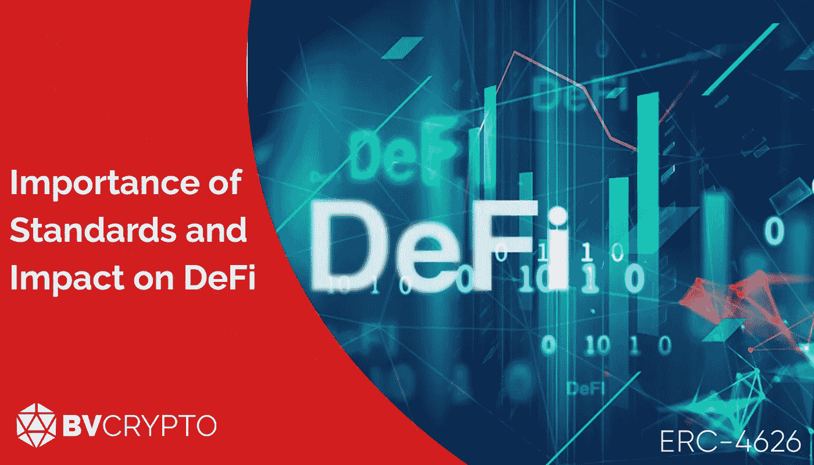
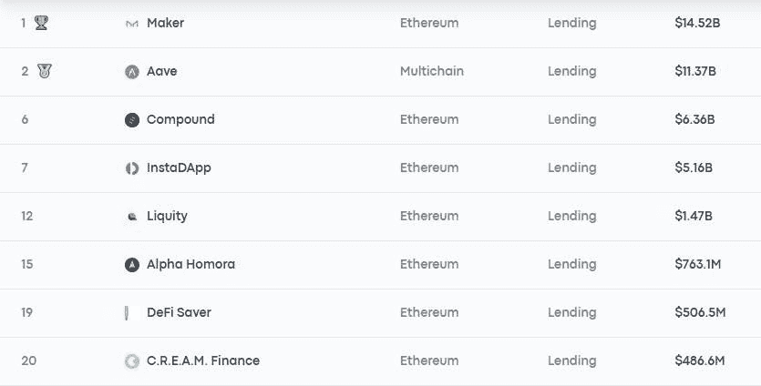

# 标准的重要性和对 DeFi 的影响

> 原文：<https://medium.com/coinmonks/importance-of-standards-and-impact-on-defi-6133e1b88e38?source=collection_archive---------57----------------------->

去年 3 月，一个名为 ERC-4626 的新令牌标准获得批准，并集成到以太坊网络中。令牌标准是各种编码的理想形式的现成交付，例如令牌的创建、正常运行和集成到网络中。这样，开发者就节省了时间。

令牌标准非常重要，因为它们对加密货币市场产生了巨大影响，可以创造新的领域。在本文中，我们将首先讨论为什么对于一个行业来说拥有标准是重要的，然后在 DeFi 中评估这个问题之后，我们将通过查看 ERC-4626 表单中的令牌的含义来举例说明这个问题。享受你的阅读。

# 检查站

一个人被称为标准人意味着他们很普通，这有一个负面的意义。尽管这对于行业来说有着相似的意义，但它确实意味着一些积极的东西。该部门采用的标准使以前运作不规则的系统变得正常，从而稳定了该部门。该部门继续以稳定的方式运作，被认为是可靠的。

尽管加密货币市场对业内人士来说增长速度令人难以置信，但这个只有 13 年历史的市场仍有许多地方需要证明自己并让人放心。我们可以定义为加密货币银行的 DeFi(分散金融)部门是应该给人信心的领域之一。虽然有许多令人放心的 DeFi 平台工作得非常稳定和成功，但很难说能看到这种可靠性和健康的流量，尤其是在新成立的平台上。随着时间的推移，有望变得更加稳定可靠的 DeFi 平台，不幸的是，随着时间的推移，开始出现更多的黑客事件。其中一个最重要的后果可以说是，市场中的资本储存在稳定运行的平台上，并使这些平台巨型化。尽管从回报成功的角度来看，这些健康运行的平台收到的兴趣是积极的，但在一个健康的市场中，值得一提的主要事情是 DeFi 部门在各方面都变得稳定可靠。通过这种方式，竞争可以在整个平台上更健康地发挥作用。

纵观目前的前景，我们经常看到想要从巨头平台中分一杯羹的新 DeFi 平台试图通过给出更高的回报率和增加不同的功能来吸引需求。这种反复试验的过程似乎也时不时地变得危险起来，导致创纪录数量的黑客攻击。因此，尽管竞争激烈，但可以注意到，由于一些平台的安全标准不佳或编码错误，安全标准并没有很好地发挥作用。

作为当前竞争形势的一个例子；下表最右侧的一列显示了锁定到贷方平台的加密货币大小。从表中可以看出，前 4 家平台拥有市场中的大部分资本，而后面的平台获得的份额相对较低。

尽管试错过程对于该行业的进一步发展极其重要，但在稳定性和普通性方面，基于某些安全标准进行也是极其重要的。令牌标准使通过智能合约执行复杂交易的 DeFi 平台能够在一定程度上轻松实现最终可能的解决方案。

例如，假设每个 DeFi 平台的开发人员在为他们的平台编写令牌时，在他们设置的系统上的得分在 1-10 之间。将 1-4 列为最不安全，4-7 列为中级，7-10 列为最佳。由于依赖于开发者的能力、财政手段和他们拥有的时间的原因，每个平台自己的令牌将具有不同的分数。随着令牌标准的出现，开发人员可以避免犯至少基本的错误，直接从第 4 级开始，通过研究过程 1-4 并找到最佳过程来节省时间，并因为节省时间而节省资金。因此，令牌标准充当了一种新的检查点。

# 需求的选择性

不了解软件，不能检查代码的 DeFi 用户，也就是大多数用户，如果他们想要低风险，就使用已知的 DeFi 平台，高风险，高回报则偏好新安装的平台。

事实上，在 100 个新安装的平台中，甚至有 1-2 个被黑客攻击过，这使得新平台对用户来说不安全。因此，很明显，用户会要求高于某个安全级别的平台，而不管他们喜欢的风险级别。令牌标准为这些令牌在其自己的平台内以及与其他平台提供了一定程度的交互。这样就不允许用户请求这个级别以下的平台。如果从上一题的例子继续，可以认为是这样一个事实，四级以下的平台无论提供多高的收益都不是首选。因此，这种技术标准的引入使得这种情况变得普通，因为它迫使平台上升到某个水平之上，并导致用户在这个方向上的需求的选择性。

# ERC-4626

提供抵押贷款的 DeFi 平台提供利息收入，以换取用户将其资产锁定在平台上。平台为用户定义了一个新的令牌，它也代表了您从锁定到平台的资产中获得的利息收入。比如你把你的 ETH 资产锁定到 Aave 平台，你会收到代表你资产+利息收入的 aETH 令牌。

平台的利率根据平台的余额上升或下降。有些平台设置了单独的池，金库，自动选择最合适的平台，因为有很多平台给兴趣。为此，他们还需要集成 aETH 风格的令牌，就像 Aave 一样。

ERC-4626 提供了代表资产+利息收入的 aETH 类令牌的标准化。那就是代表利息收入的代币的标准化。得益于这一标准，DeFi 平台与 Aave 等提供利息的平台的集成将会更快。开发人员不是单独工作来集成每个平台的令牌，可以说缩短集成期间花费的时间是主要目标，每个平台都符合 ERC-4626 标准。

从这个意义上说，迈出第一步的平台是向往金融。未来其他平台也有可能走上类似的道路。此外，区块链网络，如 BNB 链或创可以预期开始使用类似的令牌标准，由 DeFi 平台在这些网络上，因为他们复制这样的令牌标准，从以太网到自己的网络。

# 也许它不是 NFT，但是…

像 ERC-721 和 ERC-1155 这样的象征性标准可以导致像 NFT 这样的行业的形成和像梦一样的元宇宙的现实。ERC-4626 标准可能不是 NFT，但正如整篇文章中提到的那样，用这些步骤(或大或小)来标准化扇区是极其重要的。事实上，DeFi 平台在其服务的每个领域都提供超过一定水平的服务，这是该行业实现稳定上升趋势的最重要的基石之一。

编制人:Berkay Aybey

*此处表达的观点和评论归 BV Crypto 所有。BV Crypto 不能对基于此帖子的任何金融交易负责。每一次投资和交易都有风险。当你做决定时，你应该自己做调查。*

> 加入 Coinmonks [电报频道](https://t.me/coincodecap)和 [Youtube 频道](https://www.youtube.com/c/coinmonks/videos)了解加密交易和投资

# 另外，阅读

*   [WazirX vs coin dcx vs bit bns](/coinmonks/wazirx-vs-coindcx-vs-bitbns-149f4f19a2f1)|[block fi vs coin loan vs Nexo](/coinmonks/blockfi-vs-coinloan-vs-nexo-cb624635230d)
*   [本地比特币审核](/coinmonks/localbitcoins-review-6cc001c6ed56) | [加密货币储蓄账户](https://coincodecap.com/cryptocurrency-savings-accounts)
*   [什么是融资融券交易](https://coincodecap.com/margin-trading) | [美元成本平均法](https://coincodecap.com/dca)
*   [拥护卡审核](https://coincodecap.com/uphold-card-review) | [信任钱包 vs MetaMask](https://coincodecap.com/trust-wallet-vs-metamask)
*   [Exness 评测](https://coincodecap.com/exness-review)|[moon xbt Vs bit get Vs Bingbon](https://coincodecap.com/bingbon-vs-bitget-vs-moonxbt)