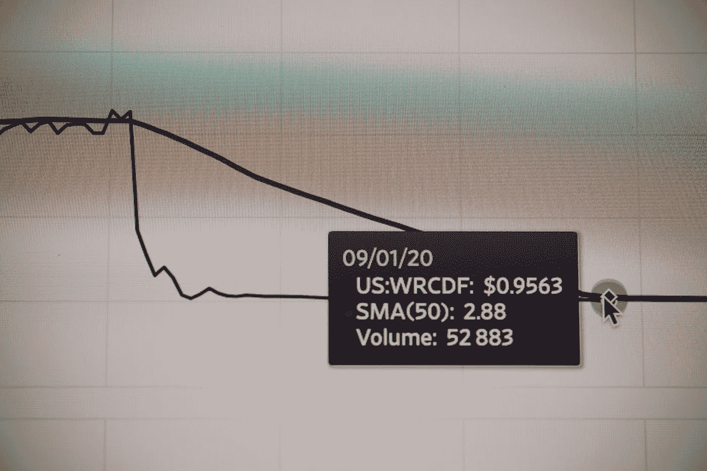

# 投资加密货币前的重要考虑事项

> 原文：<https://medium.com/coinmonks/important-considerations-before-investing-in-cryptocurrency-87e97d9b086a?source=collection_archive---------65----------------------->

**简介**

加密货币行业已经成长起来，许多人正在加入这个行业，因为它提供了许多东西。加密货币交易存在大量炒作，许多人渴望购买加密货币硬币，希望在未来获得利润。在你考虑购买加密货币之前，你应该退一步，试着了解加密货币交易的来龙去脉。数字货币可能是非常有利可图和有趣的投资，但如果你做错了，你就有损失的风险。这也是为什么 [**亚当·特雷西**](http://www.adamtracyscholarship.com) 向对区块链技术感兴趣的学生提供奖学金，以实现更好的交易和未来的加密货币创新的原因。在你开始之前，有许多重要的事情你必须考虑。以下是其中的一些

只投资你能承受损失的东西

你可能会被诱惑在加密货币上投入大量资金或一切，但这可能非常危险。尽管加密货币交易利润丰厚，但它也可能导致损失，尤其是当目标是计划不正确时。当你在投资加密货币时，知道你可能会失去它是非常重要的。这就是为什么你应该只投资你能承受损失的钱的原因。如果你是加密货币的初学者，把你的第一笔投资作为学习的一种方式。虽然你可能盈利，但也有可能亏损。

**做研究**

你不应该仅仅因为别人在做加密货币就开始投资。如果你想在加密货币交易中取得成功，你应该花些时间去研究。不要依赖别人所说的或别人使用的提示。永远记住，对别人有用的不一定对你有用。这就是为什么你应该花些时间来了解加密货币是如何工作的，以及它是如何有利可图的。此外，当涉及到你的钱的时候，你不应该相信别人。如果你在投资一种新硬币，这是研究非常重要的另一个原因。

**选择合适的加密货币**

目前市场上有许多加密货币。你可能渴望投资加密货币，但你不应该满足于我们遇到的第一种货币。每枚硬币都是独一无二的，市场变化也是独一无二的。如果你希望你的投资是有益的，你应该确定一种有潜力的加密货币，一种随时会飙升的货币。要做到这一点，你必须花些时间对趋势做些研究。

**考虑风险**

作为加密货币交易商，你应该知道这其中有风险。每项投资都有风险。有高风险的投资，也有低风险的投资。归根结底，你应该只投资于值得冒险的投资。

—
Adam s . Tracy 曾是一名职业橄榄球运动员，作为一名律师、顾问和交易撮合者，他拥有 20 多年的经验，尤其专注于加密货币、数字产品、支付和身临其境的企业结构。作为一名出色的高管和区块链商人及利益相关方的顾问，Adam 已经证明了自己是一名以结果为导向、果断的领导者，在为早期市场进入者、技术适应者以及区块链各垂直行业的既定参与者提供建议方面取得了公认的成功。Adam Tracy 的攻击第一型人格使他能够在动态、苛刻的环境中脱颖而出，包括复杂的公司谈判、困境和监管调查。

此外，Adam S. Tracy 还拥有成功的业绩记录，曾与他人共同创立区块链工业风险投资公司，建立并领导跨职能团队，并牵头开展各种企业交易。作为一名连续创业者，Adam 已经成功地启动并退出了众多市场，包括各种移动 SaaS 风险投资、加密货币、点对点支付系统和众多代币生成活动。此外，作为支付领域公认的专家，亚当·特雷西(Adam Tracy)自比特币早期以来一直是区块链和数字货币的传播者和影响者。

Adam S. Tracy 利用其专有的“Pre-Event Driven”决策策略，进一步利用其 20 多年的经验，为每个客户创造具有成本效益的增值解决方案。作为一名数据驱动的助手，Adam 根据实地研究和数据收集不断完善自己的策略。此外，Adam Tracy 通过与监管机构、流动性提供商、法律和合规专家、交易流经纪人、投资者和领先高风险行业企业的管理层积极沟通，进一步扩大了他的解决方案范围。

Adam S. Tracy 拥有圣母大学的计算机应用理学士学位和金融理学士学位。随后，他在德保罗凯尔施塔特商学院获得了工商管理硕士学位，同时在德保罗法学院获得了法学博士学位。亚当和他的妻子、儿子、四只狗和两只猫住在洛杉矶郊外。

在网络上:[https://linktr.ee/adamtracy](https://linktr.ee/adamtracy)
推特:[https://twitter.com/TracyFirm](https://twitter.com/TracyFirm)
Youtube:[http://www.youtube.com/c/AdamSTracy](http://www.youtube.com/c/AdamSTracy)
Linkedin:[https://www.linkedin.com/in/adamtracy/](https://www.linkedin.com/in/adamtracy/)
Facebook:[https://www.facebook.com/theadamtracy](https://www.facebook.com/theadamtracy)
Reddit:[https://www.reddit.com/user/bitattorney](https://www.reddit.com/user/bitattorney)
Medium:[https://theadamtracy.medium.com/](https://theadamtracy.medium.com/)
insta gram:@ theadam Tracy
电报:@ adamtracyesq
Skype:@ adamtracyesq