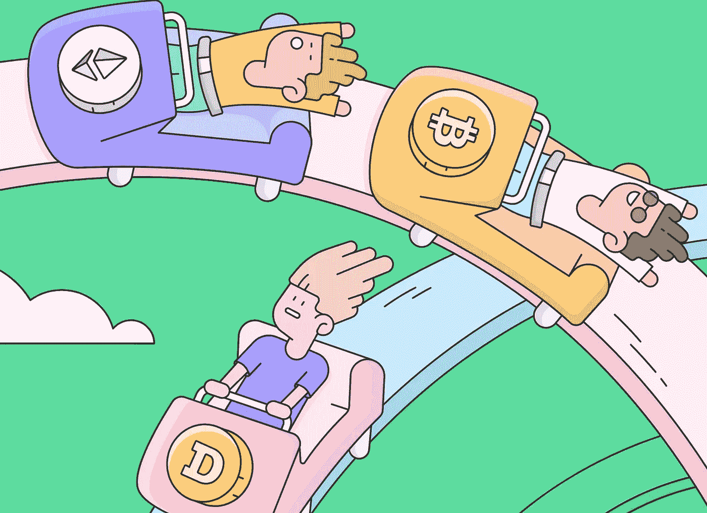

# 提高你的加密俚语！

> 原文：<https://medium.com/coinmonks/improve-your-crypto-slang-d352c47e6574?source=collection_archive---------65----------------------->

在我们的 YouTube 上观看视频的同时，享受这个流的资源！

YouTube:[https://youtu.be/xe6YN0jPOrM](https://youtu.be/xe6YN0jPOrM)

不和:【https://discord.gg/J73qhkj7kr】T2

推特:【https://twitter.com/CryptoverseDAO】

linktree:[https://linktr.ee/cryptoversedao](https://linktr.ee/cryptoversedao)

-

提高你的加密俚语:

当你在这个怪异而奇妙的环境中导航时，你可能会遇到一些外国术语，所以这里有一个快速列表来帮助你适应加密社区经常使用的语言:

FUD =恐惧、不确定和怀疑。
FOMO =害怕错过。HODL =坚持住，亲爱的。
投机=价格走高。
法定=政府发行的货币。鲸鱼=有很多秘密的人。看涨=期待价格上涨。看跌=预期价格会下跌。
分叉=当一个现有的区块链分裂成两个独立的区块链。
ICO/IDO = Initial Coin/DEX 发售——众筹的一种。
ATH =历史新高。硬币达到的最高价格。
DEFI =分散金融
CEFI =集中金融
ALTCOIN =继
比特币之后推出的另类加密货币。
文兰博？=当怀疑“文”的一笔资产
的成本是否足够买一辆时使用。抛售=一种操纵价格上涨，然后崩盘的方案

 [## 从 a 到 Z:加密货币词汇和术语| CoinGecko

### 与主要区块链并行运行的区块链分类帐，其中主要……

www.coingecko.com](https://www.coingecko.com/en/glossary) 

> 加入 Coinmonks [电报频道](https://t.me/coincodecap)和 [Youtube 频道](https://www.youtube.com/c/coinmonks/videos)了解加密交易和投资

# 另外，阅读

*   [Blockfi vs 比特币基地](https://coincodecap.com/blockfi-vs-coinbase) | [BitKan 点评](https://coincodecap.com/bitkan-review) | [Bexplus 点评](https://coincodecap.com/bexplus-review)
*   [南非的加密交易所](https://coincodecap.com/crypto-exchanges-in-south-africa) | [BitMEX 加密信号](https://coincodecap.com/bitmex-crypto-signals)
*   [MoonXBT 副本交易](https://coincodecap.com/moonxbt-copy-trading) | [阿联酋的加密钱包](https://coincodecap.com/crypto-wallets-in-uae)
*   [Remitano 审查](https://coincodecap.com/remitano-review)|[1 英寸协议指南](https://coincodecap.com/1inch)
*   [iTop VPN 审查](https://coincodecap.com/itop-vpn-review) | [曼陀罗交易所审查](https://coincodecap.com/mandala-exchange-review)
*   [40 个最佳电报频道](https://coincodecap.com/best-telegram-channels) | [喜美元评论](https://coincodecap.com/hi-dollar-review)