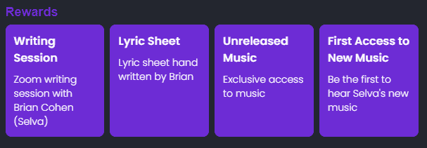

# IMS 伊比沙岛揭示了 DJ 塞尔瓦和即将到来的 NERVO 发布| $3000 EQ 交换竞赛 NFT 预售

> 原文：<https://medium.com/coinmonks/ims-ibiza-reveals-nft-pre-sell-by-selva-and-nervo-3000-eq-exchange-contest-e15e8bda5ec3?source=collection_archive---------43----------------------->

**Brian Cohen of SELVA**

4 月 27 日—4 月 29 日，IMS Ibiza 将举办一年一度的 EDM 音乐和商业会议，会上 DJ [**Selva**](https://www.instagram.com/selva/) 透露了他即将推出的音乐 NFTs 的预售情况。塞尔瓦是 EDM 世界顶级 DJ 之一，制作、混音和创作巴西贝斯、舞蹈和家庭音乐。这对双胞胎姐妹，统称为 NERVO，从超级粉丝到拥有超级粉丝。两位艺术家都在世界各地的大型 EDM 舞台、嘉年华会和音乐节上表演过。巴西艺术家塞尔瓦(Selva)和澳大利亚艺术家内尔沃(NERVO)将登上伊比沙岛音乐节的中心舞台，宣布他们第一首 [**音乐 NFT**](https://eq.exchange/eq-library/) 的细节。两位艺术家都打算通过 Web3 world 发布他们的最新版本，为音乐家和粉丝改变 EDM 流派的方向。铸造代币的 Web3 技术公司 EQ Exchange 也将在 IMS Ibiza 活动期间发放总额为 3000 美元的 cUSD。

每位艺术家的预售将由 250 个限量代币组成，这些代币将在 2022 年 5 月底获得他们的音乐 NFT 发布。预售还将包括一个随机的音乐 NFT，由一位情商高的艺术家[空投](https://beincrypto.com/learn/crypto-and-nft-airdrop/)到车主的钱包里；此外，所有代币持有者将自动参加$ 1000 cUSD3 奖金的抽奖。

[**IMS Ibiza**](https://www.internationalmusicsummit.com/) 是一个为期 3 天的会议，在西班牙大陆东部的 Ibiza 岛举行。自 2007 年以来，音乐爱好者、投资者、经理人、经纪人、艺术家、制作人、DJ 都聚集在国际音乐峰会上。IMS 由 Pete Tong 创立，旨在激发辩论和讨论，并帮助实现电子音乐的进步变革。正如 Pete Tong 所描述的那样，IMS 因其音乐和舞蹈派对而受到称赞，很像 Miami 的冬季音乐大会(WMC)，带有“回归商业的精神，引领着 Ibiza 官方开幕派对周末”。今年的峰会名为“追求目标”，Pete Tong 旨在突出全球疫情灾难性影响后的最佳实践。今年的会议将充满惊喜和传统，因为 2020 年和 2021 年的会议因冠状病毒而取消。过去的演讲者包括昆西·琼斯、大卫·林奇、吹牛老爹、瑞典浩室黑手党的史蒂夫·安杰洛、查克·D、史蒂夫·青木、乔治·克林顿、拉塞尔·西蒙斯和胖子·斯利姆等等。

Miriam “Mim” Nervo (left) and Olivia “Liv” Nervo (right) of EDM group, NERVO.

Mim 和 Liv Nervo 是电子舞曲的姐妹——被称为 Nervo。这对双胞胎一直是世界上最顶尖的女 DJ。他们共同创作并制作了《大卫·盖塔》的全球热播剧，还有更多更多。NERVO 经常出现在《Vogue》、《Elle》、《Cosmopolitan》、《NYLON》、《InStyle》、《People》和世界各地的其他时尚/流行文化出版物上。内尔沃姐妹对理解音乐并不陌生，“紫色的头发和紫色的口红；我们全都做到了，”米姆说。“坐在最前排的时候，我们差点摔断了肋骨。这么多年我们就是人群中的那些人。现在能和这些艺术家一起演奏，真是令人兴奋。”在一个由“兄弟”主导的流派中，内尔沃姐妹是女性赋权的缩影，表明女性也可以做到。

[Click here for full Tweet](https://twitter.com/EQ_Exchange/status/1509227528006909957)

对于 Selva 和 NERVO 的粉丝来说，艺术家们将通过 [**EQ Exchange**](https://web.eq.exchange/) 发布他们的音乐 NFT，这是一个面向音乐爱好者、粉丝、新兴和传奇艺术家的 WEB3 音乐 NFT 平台。EQ 首席执行官兼创始人， [**贾妮斯·泰勒**](https://www.youtube.com/watch?v=pT8MkDYcSMg&t=27s) 是峰会上的**演讲嘉宾，分别就 Web3、NFTs、权力下放、[**【CELO】**](https://celo.org/)区块链发表演讲，并宣布两位艺术家的最新音乐投资。 *EQ Exchange 以创造者的资本为荣，赋予女性和有色人种权力，将他们的 NFT 称为****“MEGs”，即相互交换礼物。MEGs 清楚地表明，艺术家、他们的粉丝和全球社区之间的交流同样是有益的。*****

**Selva 将在 5 月 28 日的 NFT 发布会上通过以下层级奖励粉丝(可能会有变化)。更多详情请见:**

**[**黄金等级——10 代币/兆**](https://web.eq.exchange/opportunities/158)**

****

**[**白银等级——10 代币/兆**](https://web.eq.exchange/opportunities/159)**

****

**[**青铜级——200 代币/兆**](https://web.eq.exchange/opportunities/160)**

****

**跟随[塞尔瓦](https://web.eq.exchange/artists/selva)上[脸书](https://www.facebook.com/musicselva)、 [IG](https://www.instagram.com/selva/) 或[推特](https://twitter.com/eupelu)。
跟随 [NERVO](http://nervomusic.com/) 姐妹上[脸书](https://www.facebook.com/NERVOmusic)、 [IG](https://www.instagram.com/nervomusic/) ，或者[推特](https://twitter.com/NERVOMUSIC)。**

**在我们的[情商图书馆](https://eq.exchange/eq-library/)自学。加入[不和](https://discord.com/invite/suJWVA9RQp)进行任何进一步的讨论。有问题就在任何社交平台上关注我们@EQ_Exchange，一路上享受不可思议的音乐。**

**在[情商交流](https://web.eq.exchange/)发现你未来最喜欢的艺人。**

****