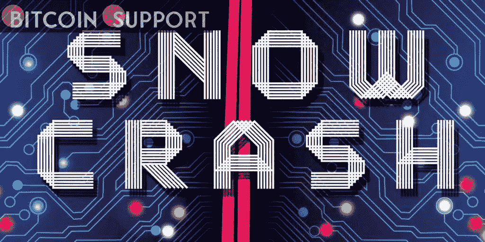

# 1992 年,《冰雪奇缘》中的元宇宙充斥着广告，真实的也是如此

> 原文：<https://medium.com/coinmonks/in-1992-snow-crashs-metaverse-was-crammed-with-advertisements-and-the-actual-one-will-be-as-well-5e667866ad87?source=collection_archive---------61----------------------->

**Visit our website:-** [**https://bitcoinsupports.com/**](https://bitcoinsupports.com/)

尼尔·史蒂文森的科幻小说《冰雪奇缘》在许多年前就预言了技术营销反面乌托邦的到来。尼尔·斯蒂文森(Neal Stevenson)的反乌托邦科幻小说《冰雪奇缘》(Snow Crash)已经成为硅谷科技界的传奇，它在 1992 年预见了未来元宇宙的崛起。

尽管斯蒂芬森声称自己“只是在瞎编”，但杰夫·贝索斯和马克·扎克伯格等科技企业家和未来学家长期以来一直钦佩《冰雪奇缘》出奇准确的预测和世界建设。当 Web3 的设计师和营销人员准备在今天的元宇宙开始做广告时，斯蒂芬森生动的虚构描绘了一个被商业广告的霓虹光芒过度饱和的元宇宙，听起来比以往任何时候都真实。2 月 23 日，NFT 混合现实平台 Realm 宣布与分散式广告交易所 Alkimi 合作。Realm 声称，它计划利用 Alkimi 的平台，通过透明地分享现有广告类型的收入，来激励用户从广告中赚钱。在一份声明中，Realm 的联合创始人 Matthew Larby 强调，开放是避免像 Snow Crash 这样的技术营销反面乌托邦的主要目标。

“广告是大多数现有社交应用的重要组成部分，但对于提供数据的个人和试图验证其投资的广告商来说，交易一直是一场噩梦。”Alkimi Exchange 的首席执行官本·普特利(Ben Putley)指出:“广告总是追随眼球，当我们看到花时间在 Metaverses 上的人数时，它将很快成为广告商希望纳入其战略的一个渠道。”当 Alkimi 和 Realm 专注于提供一个透明和长期的广告环境时，其他重要的参与者正一头扎进元宇宙。在最近的一份分析中，摩根大通宣称元宇宙是一个“1 万亿美元的机会”，并补充说“可能是元经济的主要部分之一”英国游戏广告公司 Bidstack 与国际媒体平台 Azerion 建立了合作关系。公司付费在《使命召唤》等游戏中的广告牌上为他们的产品做广告，Bidstack 专门制作“游戏内”广告。

游戏内广告并不是一个新概念；2008 年，巴拉克·奥巴马从 EA games 购买了游戏内置广告，以帮助他的总统竞选获得更广泛的受众。由于地理标记功能，EA 能够在 10 个不同的摇摆州定位广告，装饰 Madden，NBA 的广告牌，甚至奥巴马的宣传材料需要速度。另一方面,《元宇宙》并没有被开发成游戏；相反，它被设计成一种替代现实，在这种现实中，人们肯定会花费越来越多的时间，这意味着广告将是大多数品牌的自然下一步。元宇宙很可能会恶化成类似 Snow Crash 的情况，报酬过低的快递员在无尽的虚拟广告隧道中穿梭，除非个人和公司认真设计人们愿意花时间呆在其中的世界。叙述者说:“他的汽车基本上是一个阴暗的空间，反映了特许经营标志的隧道 loglo。―《冰雪奇缘》第 13 页。

**访问我们的网站:-**[**https://bitcoinsupports.com/**](https://bitcoinsupports.com/)

**免责声明:以上为作者观点，不应视为投资建议。读者应该自己做研究。**

> 加入 Coinmonks [电报频道](https://t.me/coincodecap)和 [Youtube 频道](https://www.youtube.com/c/coinmonks/videos)了解加密交易和投资

# 另外，阅读

*   [AscendEx 保证金交易](https://coincodecap.com/ascendex-margin-trading) | [Bitfinex 赌注](https://coincodecap.com/bitfinex-staking) | [bitFlyer 点评](https://coincodecap.com/bitflyer-review)
*   [Bitget 回顾](https://coincodecap.com/bitget-review)|[Gemini vs block fi](https://coincodecap.com/gemini-vs-blockfi)cmd |[OKEx 期货交易](https://coincodecap.com/okex-futures-trading)
*   [AscendEx Staking](https://coincodecap.com/ascendex-staking)|[Bot Ocean Review](https://coincodecap.com/bot-ocean-review)|[最佳比特币钱包](https://coincodecap.com/bitcoin-wallets-india)
*   [霍比评论](https://coincodecap.com/huobi-review) | [OKEx 保证金交易](https://coincodecap.com/okex-margin-trading) | [期货交易](https://coincodecap.com/futures-trading)
*   [网格交易机器人](https://coincodecap.com/grid-trading) | [Cryptohopper 审查](/coinmonks/cryptohopper-review-a388ff5bae88) | [Bexplus 审查](https://coincodecap.com/bexplus-review)
*   [7 个最佳零费用加密交换平台](https://coincodecap.com/zero-fee-crypto-exchanges)
*   [氹欞侊贸易评论](https://coincodecap.com/anny-trade-review) | [霍比保证金交易](/coinmonks/huobi-margin-trading-b3b06cdc1519)
*   [去中心化交易所](https://coincodecap.com/what-are-decentralized-exchanges) | [比特恩斯 FIP](https://coincodecap.com/bitbns-fip) | [Pionex 评论](https://coincodecap.com/pionex-review-exchange-with-crypto-trading-bot)