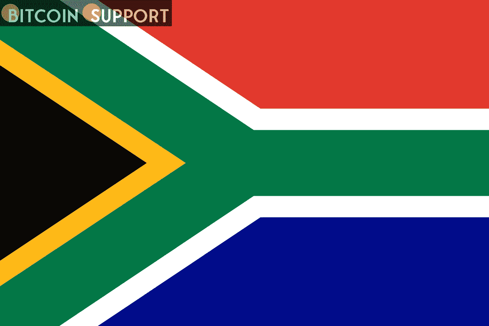
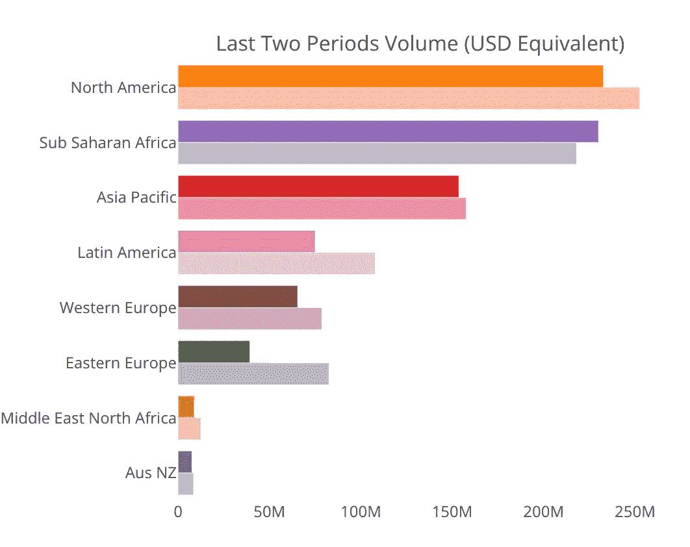
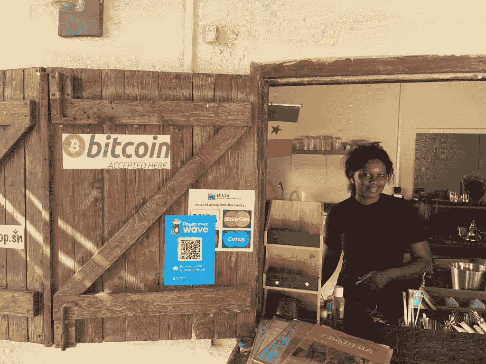

# 2021 年，非洲的加密货币用户增加了 2500%

> 原文：<https://medium.com/coinmonks/in-2021-cryptocurrency-users-in-africa-increased-by-2-500-percent-31063adca2ba?source=collection_archive---------94----------------------->

**Visit our website:-** [**https://bitcoinsupports.com/**](https://bitcoinsupports.com/)

根据 KuCoin 最近的一项研究，某些非洲国家的加密货币交易数量增长了 2670%。

尽管有社会经济的限制和障碍，加密货币的使用在整个非洲都在加速。根据加密货币交易所 KuCoin 发布的预测，到 2022 年，加密货币交易将增加 2670%。

一个引人注目的增长模式，急剧的流入量对应于以前时代报道的低值。非洲约占全球加密交易量的 2.8%。

根据 KuCoin 首席执行官 Johnny Lyu 的说法，“非洲数字资产的采用将继续呈指数级增长”，并补充道，“非洲国家目前拥有世界上最大的加密采用率，甚至超过了美国、欧洲和亚洲等最大的地区。”比特币塞内加尔的创始人努鲁确信，比特币(BTC)的使用在“未来几年”将继续以千分之一的速度增长

**“观察汽车、手机和消费电子产品如何在欧洲大陆扩散。非洲是一个以闪电般的进步和接受为特点的大陆。”**

**Visit our website:-** [**https://bitcoinsupports.com/**](https://bitcoinsupports.com/)

该调查特别指出，“非洲人进行的近 88.5%的比特币交易包括跨境转账。”低成本意味着“用户支付的费用不到加密货币交易总额的 0.01%。”

由于高通胀和智能手机普及率不断增长，非洲也有年轻的数字原生人口，他们适应了数字货币——实际上允许每个人成为自己的银行。对于加密货币寻求解决的挑战来说，非洲是一个极好的实验室。

Lyu 确实对惊人的增长率提出了警告:

**“增长率取决于当地政策制定者和各个当局对加密货币的态度。尽管如此，我相信数字货币在非洲的光明前景已成定局。”**

例如，在中非和西非，尽管对官方货币非洲金融共同体法郎存在普遍的不信任和不安，但 BTC 的接受度正在提高。

**Visit our website:-** [**https://bitcoinsupports.com/**](https://bitcoinsupports.com/)

根据 Lyu 的说法，非洲处于一个有趣的位置，因为“通货膨胀率上升，失业率高，进入银行机构的机会有限，以及国际支付费用过高”的组合促进了加密的采用。最终:

**“该地区的金融困境正迫使个人寻找新的工具和技术，为他们提供一些他们目前缺乏的经济独立。”**

然而，从长远来看，非洲提供了过多的优势，“所有这些都必须有助于土著人民广泛使用数字资产。”非洲的中位年龄相当年轻——才 19 岁——超过 40%的人口生活在城市。另一个令人鼓舞的发展是当地居民的技术意识提高了，许多年轻人开始研究编程和互联网技术

**访问我们的网站:-**[**https://bitcoinsupports.com/**](https://bitcoinsupports.com/)

**免责声明:以上为作者观点，不应视为投资建议。读者应该自己做研究。**

> 加入 Coinmonks [电报频道](https://t.me/coincodecap)和 [Youtube 频道](https://www.youtube.com/c/coinmonks/videos)了解加密交易和投资

# 另外，阅读

*   [Bitsgap 审查](/coinmonks/bitsgap-review-a-crypto-trading-bot-that-makes-easy-money-a5d88a336df2) | [Quadency 审查](/coinmonks/quadency-review-a-crypto-trading-automation-platform-3068eaa374e1) | [Bitbns 审查](/coinmonks/bitbns-review-38256a07e161)
*   [加密复制交易平台](/coinmonks/top-10-crypto-copy-trading-platforms-for-beginners-d0c37c7d698c) | [Coinmama 评论](/coinmonks/coinmama-review-ace5641bde6e)
*   [印度加密交易所](/coinmonks/bitcoin-exchange-in-india-7f1fe79715c9) | [比特币储蓄账户](/coinmonks/bitcoin-savings-account-e65b13f92451)
*   [OKEx vs KuCoin](https://coincodecap.com/okex-kucoin) | [摄氏替代品](https://coincodecap.com/celsius-alternatives) | [如何购买 VeChain](https://coincodecap.com/buy-vechain)
*   [币安期货交易](https://coincodecap.com/binance-futures-trading)|[3 commas vs Mudrex vs eToro](https://coincodecap.com/mudrex-3commas-etoro)