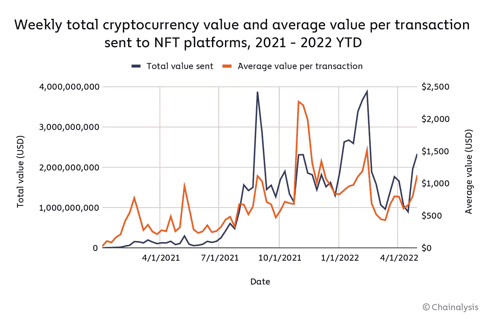
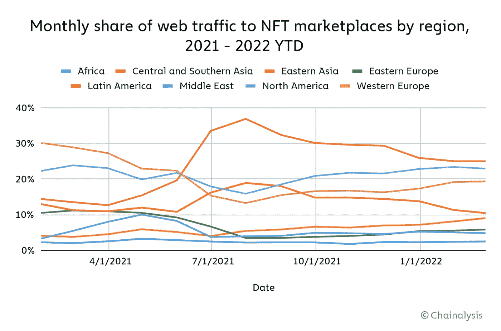

# 2022 年，NFT 收藏家将 370 亿美元投入市场，几乎与 2021 年持平

> 原文：<https://medium.com/coinmonks/in-2022-nft-collectors-sent-37b-to-markets-virtually-matching-2021-30043ace2fe2?source=collection_archive---------31----------------------->

**For full blog visit:-**[**https://bitcoinsupports.com/in-2022-nft-collectors-sent-37b-to-markets-virtually-matching-2021/**](https://bitcoinsupports.com/in-2022-nft-collectors-sent-37b-to-markets-virtually-matching-2021/)

尽管市场状况波动不定，但 NFT 收藏家今年上半年在 NFT 上的支出将超过 2021 年全年的支出。今年(截至 5 月 1 日)，不可替代代币(NFT)的收藏者已经为不可替代代币市场贡献了超过 370 亿美元的价值，几乎是 2021 年全年的两倍。

根据 Chainalysis 的一项研究，在整个 2021 年，投资者将 400 亿美元的加密货币转移到与 NFT 收藏品和市场相关的智能合约中。

**For full blog visit:-**[**https://bitcoinsupports.com/in-2022-nft-collectors-sent-37b-to-markets-virtually-matching-2021/**](https://bitcoinsupports.com/in-2022-nft-collectors-sent-37b-to-markets-virtually-matching-2021/)

自去年年初以来，NFT 的交易额大幅增加，但该行业的整体增长一直不稳定。

资料显示，NFT 成交量出现频率较低，自 2 月中旬以来一直呈下降趋势。截至 4 月中旬，NFT 市场出现了暂时的复苏，这很可能是由于最近围绕月鸟和无聊猿游艇俱乐部的元宇宙项目 Otherside 的兴奋。

尽管 NFT 交易量出现短期波动，但全球 NFT 市场仍然保持强劲，2022 年 Q1 将有 950，000 个独特的地址购买或出售 NFT。

截至 Q2 2022 年 5 月 1 日，已有 491，000 个唯一地址与 NFTs 进行了交易，这表明该市场在参与者方面正在保持其当前的增长轨迹。Chainalysis 发现，NFT 吸引了来自世界各地的用户，其中中亚和南亚用户最多，其次是北美和西欧。

**For full blog visit:-**[**https://bitcoinsupports.com/in-2022-nft-collectors-sent-37b-to-markets-virtually-matching-2021/**](https://bitcoinsupports.com/in-2022-nft-collectors-sent-37b-to-markets-virtually-matching-2021/)

这份报告与《华尔街日报》最近一篇报道的结论相矛盾，该报道称 NFT 的销售已经趋于平稳。尽管报告指出“NFT 的生意正在崩溃”，但仅 NFT 前五大收藏在同一周的一级和二级交易中就占了近 10 亿美元。Chainalysis 的研究也是在比特币基地未能在其内部的 NFT 市场创造显著需求的一天后发布的。在 5 月 4 日——交易的第一天——只有 150 笔交易发生，只有 7.5 万美元的交易量通过该平台。

**完整博客访问:-**[**https://bitcoinsupports . com/in-2022-NFT-collectors-sent-37b-to-markets-virtually-matching-2021/**](https://bitcoinsupports.com/in-2022-nft-collectors-sent-37b-to-markets-virtually-matching-2021/)

**免责声明:以上为作者观点，不应视为投资建议。读者应该自己做研究。**

> 加入 Coinmonks [电报频道](https://t.me/coincodecap)和 [Youtube 频道](https://www.youtube.com/c/coinmonks/videos)了解加密交易和投资

# 另外，阅读

*   [折叠 App 审核](https://coincodecap.com/fold-app-review) | [Kucoin 交易机器人](/coinmonks/kucoin-trading-bot-automate-your-trades-8cf0ca2138e0) | [Probit 审核](https://coincodecap.com/probit-review)
*   [如何匿名购买比特币](https://coincodecap.com/buy-bitcoin-anonymously) | [比特币现金钱包](https://coincodecap.com/bitcoin-cash-wallets)
*   [币安 vs FTX](https://coincodecap.com/binance-vs-ftx) | [最佳(SOL)索拉纳钱包](https://coincodecap.com/solana-wallets)
*   [比诺莫评论](https://coincodecap.com/binomo-review) | [斯多葛派 vs 3Commas vs TradeSanta](https://coincodecap.com/stoic-vs-3commas-vs-tradesanta)
*   [Capital.com 评论](https://coincodecap.com/capital-com-review) | [香港的加密借贷平台](https://coincodecap.com/crypto-lending-hong-kong)