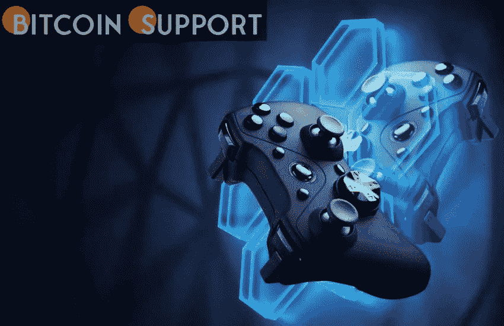

# 2022 年，最适合初学者的区块链游戏

> 原文：<https://medium.com/coinmonks/in-2022-the-most-beginner-friendly-blockchain-games-e34b8816d4e1?source=collection_archive---------92----------------------->

**Visit our website:-** [**https://bitcoinsupports.com/**](https://bitcoinsupports.com/)

Gaming is becoming increasingly important in today’s digital society. In the virtual gaming realm, the average gamer spends more than 8 hours every week. With sales expected to reach $20 billion in 2020, it’s no surprise that the industry is big business. Experts expect that there will be 1.3 billion active online gamers by 2025, up from the current estimate of 1 billion.

The gaming business segment known as “play-to-earn” is one in which gamers profit from their participation in the game. Players are usually rewarded with tokens or NFTs, which may be used in the game or sold for real money in most situations.

Play-to-earn (P2E) games built on the blockchain are intended to transform the game by levelling the playing field for all players, granting ownership and a source of revenue, and making the time spent playing meaningful.

Game developers have begun to take advantage of the combined possibilities of Cryptos and NFTs as more people become aware of them. A variety of online games where players can buy and sell tokens have been released. Here are five crypto games for beginners that you should not miss if you are new to the world of play-to-earn games and looking for some great games to play:

**Axie Infinity is a fictional character created by Axie.**

Axie Infinity is an Ethereum-based game with two modes: PvE and PvP. (PvP). In PvE mode, the player faces up against the game’s built-in background or creatures. A player competes against other players in a metaverse-like setting in a PvP mode.

Players must gather “Axies,” which are tiny spherical monsters designed to combat hordes of other monsters. The game is playable on both desktop and mobile platforms, and it employs a play-to-learn strategy in which each monster and piece of gear is represented by a nonfungible token (NFT).

The winners of the skirmishes get Smooth Love Potions, a cryptocurrency, as a reward for their victory (SLPs). The goal for players is to acquire a collection of the most valuable and durable Axies, with their value determined by the price of Ether (ETH).

Players can earn money in the form of SLP tokens, which can be exchanged for real money, or they can sell their Axies when their value has increased as a result of winning battles.

**Wagon of Assault**

Attack Wagon is a blockchain game studio that creates unique worlds. Their first game, Scrap Guilds, is currently available on the market. It’s a Sci-Fi RPG that makes it easy to spend the Attack Waggon token ($ATK) and offers a variety of ways for players to earn money both actively and passively.

Scrap Guilds is a role-playing game set in space. Players are hired scrapers whose ship is their lifeline. As they move through the ability skill tree, players accumulate and use various magic types for their blasters and shields. To knock down a wide spectrum of opponents, mix and match various magic types and skills for diverse effects and methods.

Players level up their ship parts in Scrap Guilds and sell them as NFTs. Land plots are fee generation methods for investors in guilds games, while plots are fee generation devices for investors to generate game fees. Users will cruise the Void, scraping and accomplishing tasks as they journey into dangerous PvP zones, nasty space animals, and all manner of things aiming to murder people; flying with pals is an excellent method to remain alive.

Their land plots are non-financial tokens (NFTs) that create revenue for players in the game. The marketplace pays them a percentage of all fees. They also get in-game resources and land plots on a regular basis.

**Splinterlands**

Players can buy and sell digital cards with unique NFT IDs in Splinterlands, a digital collectable card game. In the game, players can collect over 500 cards, which can also be used in combat. This is true for the game’s website as well as its mobile app. NFT cards come in four different rarities that players can gather. There are four levels of rarity: common, rare, epic, and legendary. They each have their own circulation and level caps. Players can also mix cards to gain higher levels, convert cards to cryptocurrency, and sell them on a variety of platforms.

As players interchange these cards in the game, they collect Dark Energy Crystals, the game’s native currency. In Splinterlands, Dark Energy Crystals are a sort of in-game currency that can be used to purchase items.

**Atlas of the Stars**

Star Atlas is a next-generation gaming metaverse that brings together cutting-edge blockchain technology, real-time graphics, multiplayer video games, and decentralised financial systems.

In the year 2620, three groups compete for resources, territory, and political dominance in Star Atlas, a blockchain game metaverse. The game’s players are Star Atlas residents. They can explore the metaverse, seek assistance, and influence the fates of warring factions to reap real-world rewards for their efforts. There are three game modes to pick from, each with a distinct level of difficulty. Non-playable characters and peer-to-peer ship, crew, component, land, and equipment trades use ATLAS as their in-game currency.

When playing Star Atlas, there are a few things to keep in mind. Repairing damage, extracting minerals, and supplying ship fuel are just a few examples.

If players approach purchases with a business strategy, they can grow their ATLAS holdings. The ATLAS currency is also accepted in the NFT game marketplace. NFT assets allow for peer-to-peer trade and offer players with true, decentralised ownership.

**Unchained Gods**

Gods Unchained (GODS) is a blockchain-based, free-to-play competitive trading card game that rewards you for participating. Players must outsmart their opponents by building formidable cards and executing fighting strategies. All in-game assets belong to the players in Gods Unchained, which means they can trade, sell, and use their cards in any way they choose, just like real cards.

In Gods Unchained, players can vie for glory in competitive arenas, win and gather cards during matches, purchase and trade cards in the in-game marketplace, and build the perfect deck to top leaderboards. The game is completely free to play (though not pay-to-win). It is largely focused with ensuring that competition is fair.

As part of their free welcome package, new players receive 140 cards, allowing them to construct a variety of basic decks. They can earn extra money by participating in tournaments and competing in them (whether they win or lose). Users can earn rewards by playing in weekly rated tournaments in the game’s play-to-earn (P2E) mode.

Several other blockchain gaming businesses in the GameFi ecosystem use the P2E concept, which has been proven to work.

**Conclusion**

Peer-to-peer games built on blockchain technology are the way of the future. These games provide players more control over the in-game assets they’ve worked so hard to accumulate, as well as the opportunity to earn bitcoin and NFTs while playing. The number of games available will skyrocket as more companies in the gaming industry use blockchain technology.

**Visit our website:-** [**https://bitcoinsupports.com/**](https://bitcoinsupports.com/)

**Disclaimer: These are the writer’s opinions and should not be considered investment advice. Readers should do their own research.**