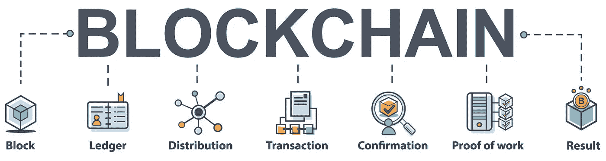

# 几个样本的话|什么是比特币区块链？

> 原文：<https://medium.com/coinmonks/in-a-few-sample-words-what-is-the-blockchain-5a5ad0f5d140?source=collection_archive---------31----------------------->

区块链是一个分布式的公共账本，包含每一笔比特币交易的历史。任何人都可以下载区块链的副本，可以对其进行检查，以跟踪比特币从一个比特币交易到另一个比特币交易的路径。应该注意的是，虽然有比特币交易的记录，但这些交易与现实生活中的身份并没有内在联系。正因如此，比特币被认为是假名。

What is The Blockchain

比特币不像 MP3 或 pdf 那样是存储在你电脑硬盘上的文件。相反，“拥有比特币”是指拥有一个在区块链上记录有余额的比特币地址。拥有一个比特币地址意味着控制相关的密钥，因此允许交易签名。

# 什么是街区？

一个区块指的是特定时期的一组比特币交易。块相互“堆叠”,因此一个块依赖于前一个块。以这种方式，一连串的积木被创造出来，因此我们有了术语“区块链”

寻找和发布新的区块是比特币矿工赚取比特币的方式。每当广播一个新的区块时，大约每 10 分钟，解决该区块的矿工就会收到几个比特币。比特币矿工保持网络安全，这是他们获得的回报。这个系统确保所有交易都是有效的，并使比特币网络免受欺诈。

如果你曾经等待一个新的比特币交易被确认，你是在等待一个包含你的交易的新块被发布。当这种情况发生时，比特币网络会认为你的交易有效。比特币基地目前要求在交易被视为最终完成之前进行三次网络确认。但是，这个数字会随着其他比特币服务的不同而不同。

# **如何查看区块链？**

许多“区块浏览器”服务允许你查看区块链中的内容。

这里有一个例子，通过进入这个网站，你可以探索区块链:blockchain.info

区块链是密码学、博弈论等二十世纪技术的独特新技术。因此，区块链技术有广泛的使用案例，包括目前的金融科技趋势，加密货币。对于那些不熟悉密码学和博弈论的人来说，密码学就是对数据进行加密和解密。博弈论是研究理性决策者之间战略互动的数学模型。

区块链技术通过提高效率、最小化运营成本和消除中介，提供了透明度和牢不可破的安全性等好处。

> ***NFT、比特币、Web3.0、DeFi、初学者加密货币***
> 
> *通过*[*CryptoWeb*](http://cryptoweb.wiki/)*免费的初学加密指南掌握 web3.0 世界的基础知识，在这里我们深入了解了该领域中一些顶尖的 NFT、加密和元宇宙项目，以便您在投资前得到通知。*

> 加入 Coinmonks [电报频道](https://t.me/coincodecap)和 [Youtube 频道](https://www.youtube.com/c/coinmonks/videos)了解加密交易和投资

# 另外，阅读

*   [币安 vs FTX](https://coincodecap.com/binance-vs-ftx) | [最佳(SOL)索拉纳钱包](https://coincodecap.com/solana-wallets)
*   [如何在 Uniswap 上交换加密？](https://coincodecap.com/swap-crypto-on-uniswap) | [A-Ads 审查](https://coincodecap.com/a-ads-review)
*   [加密货币储蓄账户](/coinmonks/cryptocurrency-savings-accounts-be3bc0feffbf) | [YoBit 评论](/coinmonks/yobit-review-175464162c62)
*   [Botsfolio vs nap bots vs Mudrex](/coinmonks/botsfolio-vs-napbots-vs-mudrex-c81344970c02)|[gate . io 交流回顾](/coinmonks/gate-io-exchange-review-61bf87b7078f)
*   [CoinFLEX 评论](https://coincodecap.com/coinflex-review) | [AEX 交易所评论](https://coincodecap.com/aex-exchange-review) | [UPbit 评论](https://coincodecap.com/upbit-review)
*   [AscendEx 保证金交易](https://coincodecap.com/ascendex-margin-trading) | [Bitfinex 赌注](https://coincodecap.com/bitfinex-staking) | [bitFlyer 审核](https://coincodecap.com/bitflyer-review)