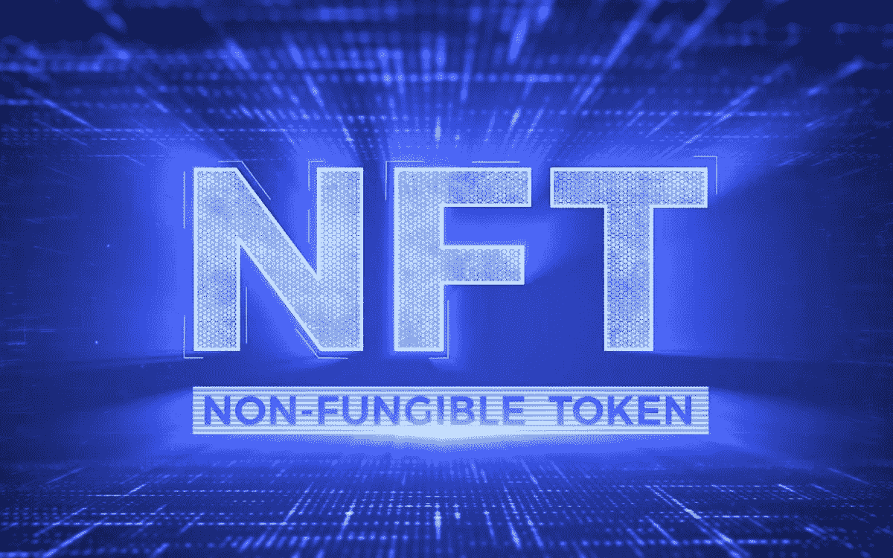

# 用几个样字|什么是 NFT？

> 原文：<https://medium.com/coinmonks/in-a-few-sample-words-what-is-the-nft-bc1ce12f4456?source=collection_archive---------82----------------------->

如果你想知道，“什么是 NFT 艺术？”你并不孤单。NFT 是一种加密货币，它不需要艺术商店或画廊来出售你的艺术品。你需要一大群社交媒体追随者来推销你的 NFT 艺术吗？如果 NFT 艺术家的作品受到版权保护，他们的每一笔销售都会得到补偿。这意味着你可以用你的艺术赚钱，而不用花太多时间营销或推广你的作品。

What is The NFT?

# **NFT 代表“不可替代令牌”**

NFT 是一种新的数字资产。这些所有权证书，也称为代币，作为创作者进行收藏投资的一种方式，正变得越来越受欢迎。虽然 NFTs 的概念并不新鲜，但是将它们应用到其他资产类别的兴趣正在增加。这种新的数字资产类别可以为使用者创造一种稀有感。换句话说，这些代币就像是不可替代的艺术品。

NFT 的主要特点是数量有限，有唯一的识别码。相比之下，大多数数字创作的供给是无限的，很难切断供给和增加价值。这就是为什么限量生产、不可替代的代币(NFT)是独一无二的。此外，NFT 可以被复制并用作个人资料图片，这使得它成为比艺术品风险更高的投资

不可替代令牌是一种具有唯一身份的数字资产，记录在数据库中，可在用户之间交易。NFT 通常与艺术联系在一起，但也可以采取视频或音乐的形式。NFT 也类似于加密货币，因为它们可以随着时间的推移而增值，从而可以像货币一样进行交易。这对艺术家和消费者来说都是一个令人兴奋的创新。

除了作为一种货币，NFT 还具有收藏价值。除了作为实物收藏品的数字版本，NFT 还可以作为所有权的证明。例如，如果你要买一件艺术品，NFT 可以作为所有权的证明，让它对收藏家来说更有价值。此外，NFT 可以用来签署一件艺术品。它的元数据包含艺术家的签名，允许所有者证明所有权。

# **收尾**

NFT 已经变得很大，一些奇妙的艺术品卖出了数百万美元。除了 NFT 艺术品价格飙升之外，加密货币还有其他一些好处:知名艺术家有更多的曝光机会。NFT 艺术市场正趋于饱和，一幅 NFT 作品的价值可高达 1170 万美元。

> ***NFT，比特币，Web3.0，DeFi，以及针对初学者的加密货币***
> 
> *通过*[*CryptoWeb*](http://cryptoweb.wiki/)*免费的初学加密指南掌握 web3.0 世界的基础知识，在这里我们深入了解了该领域中一些顶尖的 NFT、加密和元宇宙项目，以便您在投资前得到通知。*

加入 Coinmonks [电报频道](https://t.me/coincodecap)和 [Youtube 频道](https://www.youtube.com/c/coinmonks/videos)了解加密交易和投资

# 另外，阅读

*   [币安期货交易](https://coincodecap.com/binance-futures-trading)|[3 comas vs Mudrex vs eToro](https://coincodecap.com/mudrex-3commas-etoro)
*   [如何购买 Monero](https://coincodecap.com/buy-monero) | [IDEX 评论](https://coincodecap.com/idex-review) | [BitKan 交易机器人](https://coincodecap.com/bitkan-trading-bot)
*   [尤霍德勒 vs 考尼洛 vs 霍德诺特](/coinmonks/youhodler-vs-coinloan-vs-hodlnaut-b1050acde55a) | [Cryptohopper vs 哈斯博特](https://coincodecap.com/cryptohopper-vs-haasbot)
*   [顶级付费加密货币和区块链课程](https://coincodecap.com/blockchain-courses)
*   [MXC 交易所评论](/coinmonks/mxc-exchange-review-3af0ec1cba8c) | [Pionex vs 币安](https://coincodecap.com/pionex-vs-binance) | [Pionex 套利机器人](https://coincodecap.com/pionex-arbitrage-bot)
*   [如何在印度购买比特币？](/coinmonks/buy-bitcoin-in-india-feb50ddfef94) | [瓦济克斯审查](/coinmonks/wazirx-review-5c811b074f5b)