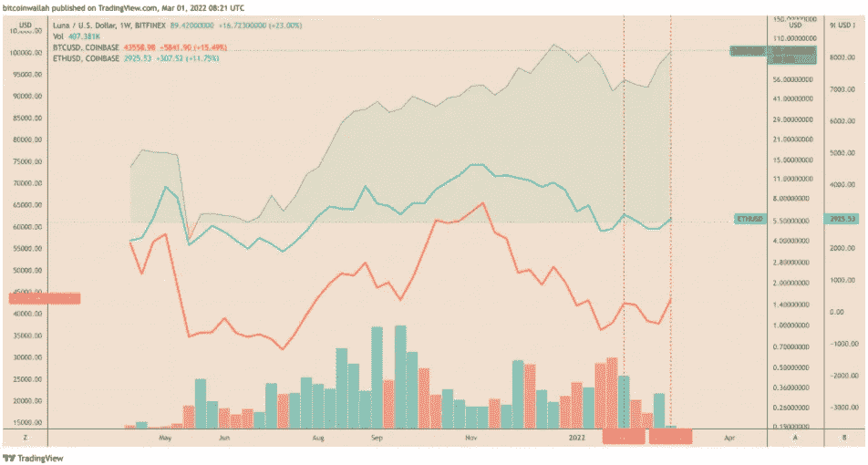
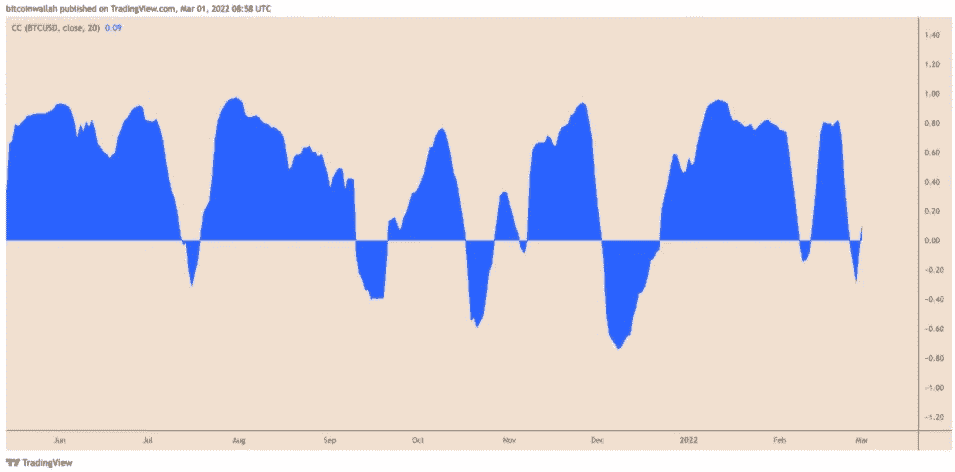
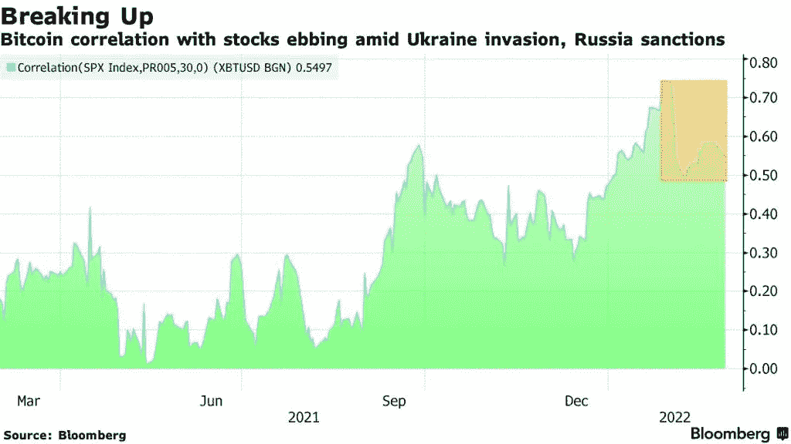

# 2 月份，月神令牌的供应量减少了 25.7 亿美元

> 原文：<https://medium.com/coinmonks/in-february-the-supply-of-luna-tokens-was-reduced-by-2-57-billion-c031babbf4d9?source=collection_archive---------70----------------------->

**Visit our website:-** [**https://bitcoinsupports.com/**](https://bitcoinsupports.com/)

象征性的焚烧发生在 Terra 的稳定货币 UST 的供应量在上个月增加了大约 14.75%的时候。Terra 是 2 月份表现最好的金融资产之一，这个月受到地缘政治紧张局势及其对加密货币市场的负面影响的影响。

**LUNA 将自己从加密货币市场中分离出来。月底，LUNA 的价格上涨了 75%多一点，达到 91.50 美元。相比之下，其他受欢迎的代币，主要是比特币(BTC)和以太网(以太网)，在同一时期的表现百分比分别约为 12.25%和 9%。**

**Visit our website:-** [**https://bitcoinsupports.com/**](https://bitcoinsupports.com/)

令人惊讶的是，LUNA 在 2 月份的大部分涨幅都是在这个月的最后一天。2 月 28 日，Terra token 上涨了 26%,这得益于加密市场其他地方的类似涨幅。同一天，BTC 和 ETH 分别上涨 14.50%和 11.50%以上。根据 TradingView 的数据，虽然 LUNA 与比特币的相关性仍为 0.09，但在 2 月 21 日达到 0.81 的峰值后，最近有所下降。相关性为 1 表示两种资产的价格同步变动，而相关性为 0 表示它们的价格独立波动。

**Visit our website:-** [**https://bitcoinsupports.com/**](https://bitcoinsupports.com/)

Terra 的 LUNA/BTC 组合同样显示出对最受欢迎的加密货币的升值。

今年 2 月，卢纳/BTC 对增加了近 56%，达到 21，171 只，这表明随着比特币与低迷股市的相关性恶化，交易者正在寻找泰拉币的避风港，今年早些时候达到了 0.70。

**Visit our website:-** [**https://bitcoinsupports.com/**](https://bitcoinsupports.com/)

解释可能在于 Terra 的代币经济学，这可以解释为什么交易者似乎首先将 LUNA 视为临时避风港。

总计 2900 万的 Terra 代币被销毁。

根据分析平台 Smart Stake 收集的数据，Terra protocol 最近销毁了 2900 万枚价值 25.7 亿美元的 LUNA 代币。与此同时，由 LUNA 而非美元支持的稳定货币 TerraUSD (UST)的供应量从 2 月 1 日的约 1126 万飙升至 2 月 28 日的近 1292 万，涨幅近 14.75%。

由于所谓的 UST-卢纳令牌机制，交易员认为 UST 供应量的增加是卢纳上涨的驱动力。特别是 Terra，它有一个弹性的货币策略来维持 UST 与美元的联系。当 UST 的价值超过 1 美元时，Terra 会激励用户烧掉卢娜并制造 UST。

然而，当 UST 供应收缩时，卢娜的价值由于燃烧机制的减缓而下降。总的来说，卢娜的价值随着 UST 供应量的增加而上升。

2 月 22 日，支持 Terra 区块链生态系统的非营利组织 Luna Foundation Guard (LFG)宣布，它已经在由三箭资本(Three Arrows Capital)和 Jump Crypto 牵头的 LUNA token 销售中筹集了 10 亿美元，三箭资本是一家由以太坊怀疑论者苏竹支持的风险投资公司，Jump Crypto 是一家以协助 Solana 的跨桥平台虫洞补充他们被盗的 3 亿美元而闻名的贸易集团。

[https://twitter.com/terra_money/status/1496162889085902856](https://twitter.com/terra_money/status/1496162889085902856)

LFG 表示，这笔资金将用于创建“UST 外汇储备”，为稳定的货币流通增加价值 10 亿美元的卢纳支持的代币提供了可能性。自从 LFG 的声明发布以来，LUNA 的价格已经飙升了大约 90%。相比之下，所有加密货币的总市值在同一时间框架内仅增长了 13%，这表明加密交易商一直在涌向 Terra 市场。

**卢娜的未来会怎样？**

由于正在进行的“牛市旗”突破移动，Terra 的技术前景似乎倾向于上行。牛市标志是牛市的延续形态，当价格在下跌通道中向下盘整时，在强劲上行后出现。它最终向上突破通道范围，价格目标与牛市旗形成之前的向上移动相当。如下图所示，露娜似乎已经进入了牛市标志设置的最后阶段。它现在的目标是运行到 120 美元，这将是 Terra 的历史新高，如果完成的话。

另一方面，在三日图上，月神的成交量出现低位，表明持续向上的回撤对交易者的吸引力较小。同样，它的成交量也显示，过去很少在 70 美元以上波动。

尽管如此，泰拉币阻力最小的长期路径仍然向上，截至 2022 年 2 月 28 日，其对美元的同比表现接近 1200%。

**访问我们的网站:-**[**https://bitcoinsupports.com/**](https://bitcoinsupports.com/)

**免责声明:以上为作者观点，不应视为投资建议。读者应该自己做研究。**

> *加入 Coinmonks* [*电报频道*](https://t.me/coincodecap) *和* [*Youtube 频道*](https://www.youtube.com/c/coinmonks/videos) *了解加密交易和投资*

# 另外，阅读

*   [Bookmap 评论](https://coincodecap.com/bookmap-review-2021-best-trading-software) | [美国 5 大最佳加密交易所](https://coincodecap.com/crypto-exchange-usa)
*   最佳加密[硬件钱包](/coinmonks/hardware-wallets-dfa1211730c6) | [Bitbns 评论](/coinmonks/bitbns-review-38256a07e161)
*   [新加坡十大最佳加密交易所](https://coincodecap.com/crypto-exchange-in-singapore) | [购买 AXS](https://coincodecap.com/buy-axs-token)
*   [红狗赌场评论](https://coincodecap.com/red-dog-casino-review) | [Swyftx 评论](https://coincodecap.com/swyftx-review) | [CoinGate 评论](https://coincodecap.com/coingate-review)
*   [投资印度的最佳密码](https://coincodecap.com/best-crypto-to-invest-in-india-in-2021)|[WazirX P2P](https://coincodecap.com/wazirx-p2p)|[Hi Dollar Review](https://coincodecap.com/hi-dollar-review)
*   [加拿大最佳加密交易机器人](https://coincodecap.com/5-best-crypto-trading-bots-in-canada) | [库币评论](https://coincodecap.com/kucoin-review)
*   [用于 Huobi 的加密交易信号](https://coincodecap.com/huobi-crypto-trading-signals) | [HitBTC 审查](/coinmonks/hitbtc-review-c5143c5d53c2)