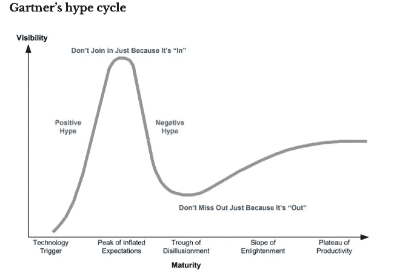

# 为技术而战

> 原文：<https://medium.com/coinmonks/in-it-for-the-tech-deda130fd4f3?source=collection_archive---------18----------------------->

NFT 的炒作正在变得疯狂，每个人似乎都在启动自己的 NFT 项目或铸造 NFT。除了购买虚拟土地，猿、熊和女孩的 JPEG 图片以及各种加密俚语，我认为 NFT 技术还有更多。我认为区块链和 NFT 技术的结合被大大低估了，随着公司发现它的力量，它已经准备好进入黄金时代了。我认为，当企业开始转向在 Web 3.0 上开展业务时，它有可能扰乱由会计公司卡特尔管理的价值数十亿美元的财务审计行业。

我的第一份工作是财务审计员，在四大会计师事务所之一从早到晚苦干。为了发表审计意见并编制全套财务报表，审计团队花费了大量时间来规划、执行和总结审计业务。这是一份压力很大的工作。

然而，我作为一名审计员的时间是值得的。没有付出，就没有收获。对于我失去的工作与生活的平衡，技能(技术的和软件的)、友谊和经验得到了回报。

鉴于我作为一名审计员已经花了相当长的时间，我看到了潜在的区块链混乱的展开。谁知道它真的会实现呢？

以下是我的观点，我希望它能给你一些启示和鼓励，让你开始探索 DeFi，它可能什么都不是。

关于财务审计的一些独家新闻:审计是为了获得合理的保证，即财务报表中陈述的信息不存在重大错报。

审计程序旨在降低审计风险，并确保财务报表中的断言得到处理。财务报表中的一些断言的例子是收入和费用被准确地记录在适当的时期；资产和负债得到合理估值，权利和义务得到确认。损益表和资产负债表有不同的主张。

审计的主要任务是提供担保。这意味着对公司的时间表或分类账进行检查，以确保维护的数据与支持文件相匹配。这些通常由公司的新手手工完成。手工工作最大的缺点之一是人为错误和偏见。睡眠不足和在巨大压力下工作经常会导致错误的发生。

相反，通过使用区块链技术，它允许交易数据的更大透明度，因为“担保”现在是由矿工和利益相关者根据设计通过共识机制来完成的。然后，验证的数据将发布在块管理器上，供公众查看。

任何拥有适当能力和工具的人都可以读取和查询相关数据，并发布财务报表，该报表可以追溯到 block explorer 上经过验证的源数据。对于好奇的读者，请查看 Dune Analytics 了解更多开放金融内容。

Block explorer 和 NFT 技术可以复制审计需求，因为财务断言可以通过矿工和股东的验证来处理。NFT 技术能够证明真实性，所有权线索，最后交易价格和所有财务断言，审计员需要形成一个结论。此外，可以实时查询交易数据，而不是像传统做法那样定期查询。

开放金融的开放数据。

在撰写本文时，对协议或 DAO 的非财务方面的披露(即协议治理、不确定性、风险等)。充分披露很重要，因为它为报告的用户提供了充足的信息，以便做出决策，无论是使用还是投资于协议或"一体行动"方案。投稿人应该想出创造性的方法来达到这个目的，以便更好地增强用户的整体阅读体验，而不是为了掩护你的屁股而产生一份诱导睡眠的报告。随着时间的推移，这个问题将得到解决。

一旦炒作冷却下来，创新的清晰度就会变得更加清晰。总之，不要因为它流行就加入，不要因为它不流行就错过。

感谢阅读，敬请关注更多 DeFi 内容！

作为我的新年决心的一部分，我将分享我在 crypto 的经历，以讲述由我工作中的朋友& crypto OGs 激发的更好的故事。

*免费加密&股票连同推荐启动你的旅程:*[*https://docs . Google . com/spreadsheets/d/1 f2bx-xkvmezorxdzqavgckina 1 PME _ uI9pa _ c4l 4-DM/edit？usp =分享*](https://docs.google.com/spreadsheets/d/1f2bX-xKvmEzOrxDZqAvgCkIna1pmE_uI9pa_C4l4-DM/edit?usp=sharing)

> 加入 Coinmonks [电报频道](https://t.me/coincodecap)和 [Youtube 频道](https://www.youtube.com/c/coinmonks/videos)了解加密交易和投资

# 另外，阅读

*   [OKEx vs KuCoin](https://coincodecap.com/okex-kucoin) | [摄氏替代品](https://coincodecap.com/celsius-alternatives) | [如何购买 VeChain](https://coincodecap.com/buy-vechain)
*   [币安期货交易](https://coincodecap.com/binance-futures-trading)|[3 commas vs Mudrex vs eToro](https://coincodecap.com/mudrex-3commas-etoro)
*   [如何购买 Monero](https://coincodecap.com/buy-monero) | [IDEX 评论](https://coincodecap.com/idex-review) | [BitKan 交易机器人](https://coincodecap.com/bitkan-trading-bot)
*   [CoinDCX 评论](/coinmonks/coindcx-review-8444db3621a2) | [加密保证金交易交易所](https://coincodecap.com/crypto-margin-trading-exchanges)
*   [红狗赌场评论](https://coincodecap.com/red-dog-casino-review) | [Swyftx 评论](https://coincodecap.com/swyftx-review) | [CoinGate 评论](https://coincodecap.com/coingate-review)