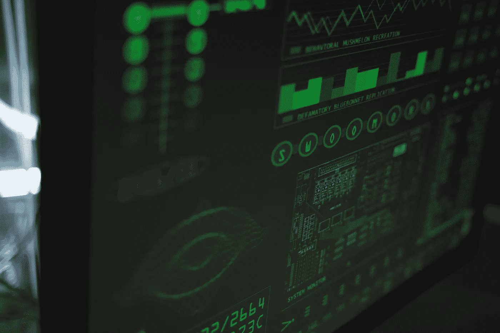

# 仅在今年的三个月内，区块链加密黑客已经窃取了约 7 亿美元，其中索拉纳和币安智能链受到的影响尤为严重。

> 原文：<https://medium.com/coinmonks/in-just-three-months-this-year-crypto-blockchain-hackers-have-stolen-about-700-million-with-1e49a53cf13d?source=collection_archive---------51----------------------->

Photo by [Tima Miroshnichenko](https://www.pexels.com/@tima-miroshnichenko?utm_content=attributionCopyText&utm_medium=referral&utm_source=pexels) from [Pexels](https://www.pexels.com/photo/close-up-view-of-system-hacking-5380618/?utm_content=attributionCopyText&utm_medium=referral&utm_source=pexels)

根据 Atlas VPN 周二的一份报告，加密区块链程序员在 2022 年取走了近 7 亿美元，对索拉纳和币安精明链环境的攻击超过了这一总额的一半。

报告称，网络犯罪分子在今年头三个月从 72 起攻击中获得了 6.82 亿美元。Atlas VPN 的信息显示，对索拉纳和 BSC 网络的黑客攻击导致近 5 亿美元的资产被盗，其中 4 亿美元来自索拉纳，1 亿美元来自币安辉煌连锁，这些信息依赖于被黑客攻击的 Slowmist 的数据。

非功能性网络攻击是首要目标，数量最多的是 20 次攻击，造成近 4900 万美元的损失。报告称，一些攻击者利用网络钓鱼攻击 Discord 来造成人员伤亡。

“随着新型加密环境的兴起，网络罪犯有了更多可以利用的目标。同样，洪水泛滥的 NFT 模式吸引了更多的骗子加入这个行业，”Atlas VPN 说。

当攻击发生时，金融灾难是根据特定加密货币的变化速度来确定的。

BSC 环境遭受了 12 次黑客攻击，而 Solana 生物系统遭受了多次黑客攻击。虫洞，索拉纳和其他分散金融(DeFi)组织之间的通信跨度，是今年 2 月最大的黑客攻击的目标。

“一名攻击者利用该组织中的标记检查漏洞，在索拉纳上铸造了 12 万个虫洞包裹的以太，价值约 3.34 亿美元，”Atlas VPN 说。

以太坊生物系统在 2022 年经历了 16 次黑客攻击，损失了近 2500 万美元。它在去年第一季度遭遇了类似数量的黑客攻击，这使它成为程序员的首要目标。

交易多次被黑，损失 4200 万美元。区块链不同类型的黑客攻击在 9 起事件中造成了 5200 万美元的损失。

大多数与区块链有关的黑客攻击都发生在网络罪犯利用风险代码的缺陷时。卓有成效的黑客攻击可能会给制造商和加密阶段的资金支持者带来巨大的不幸。

信息显示，区块链相关的黑客攻击在 2022 年第一季度创下历史新高，与去年同期相比增长了 118%。

Atlas VPN 表示:“不断发展的加密货币商业领域吸引了对这种创新感兴趣的真正个人，但也吸引了需要利用这种创新的网络罪犯。”。

根据 Crystal Blockchain 的一份报告，程序员在 2021 年获得了价值超过 40 亿美元的加密形式的金钱，几乎是 2020 年的三倍。

此外，上周，一名密码程序员在关注 Axie Infinity 的浪人网络后，完成了可能是有史以来最大的一次抢劫，带走了价值 6.25 亿美元的以太网和 USDC 稳定币。

> 加入 Coinmonks [电报频道](https://t.me/coincodecap)和 [Youtube 频道](https://www.youtube.com/c/coinmonks/videos)了解加密交易和投资

# 另外，阅读

*   [3 商业评论](/coinmonks/3commas-review-an-excellent-crypto-trading-bot-2020-1313a58bec92) | [Pionex 评论](https://coincodecap.com/pionex-review-exchange-with-crypto-trading-bot) | [Coinrule 评论](/coinmonks/coinrule-review-2021-a-beginner-friendly-crypto-trading-bot-daf0504848ba)
*   [莱杰 vs n rave](/coinmonks/ledger-vs-ngrave-zero-7e40f0c1d694)|[莱杰 nano s vs x](/coinmonks/ledger-nano-s-vs-x-battery-hardware-price-storage-59a6663fe3b0) | [币安评论](/coinmonks/binance-review-ee10d3bf3b6e)
*   [Bybit Exchange 审查](/coinmonks/bybit-exchange-review-dbd570019b71) | [Bityard 审查](https://coincodecap.com/bityard-reivew) | [Jet-Bot 审查](https://coincodecap.com/jet-bot-review)
*   [3 commas vs crypto hopper](/coinmonks/3commas-vs-pionex-vs-cryptohopper-best-crypto-bot-6a98d2baa203)|[赚取加密利息](/coinmonks/earn-crypto-interest-b10b810fdda3)
*   最好的比特币[硬件钱包](/coinmonks/hardware-wallets-dfa1211730c6) | [BitBox02 回顾](/coinmonks/bitbox02-review-your-swiss-bitcoin-hardware-wallet-c36c88fff29)