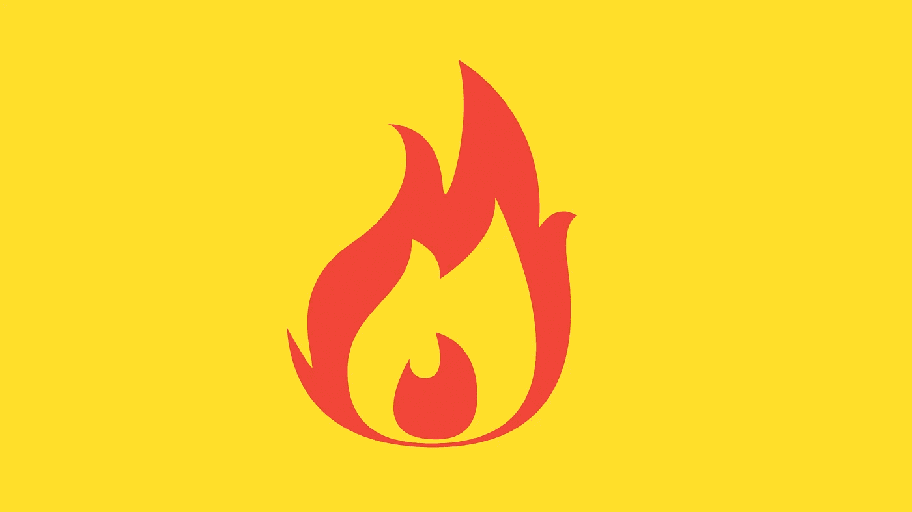

# 通俗地说:Crypto 里烧的是什么？

> 原文：<https://medium.com/coinmonks/in-laymans-term-what-is-burning-in-crypto-6ca9b090b576?source=collection_archive---------54----------------------->

## 什么在加密中燃烧？

焚烧是指**将代币或硬币发送到一个只用于接收硬币的钱包地址**。用于接收硬币的钱包地址也被称为**‘一次性钱包’。**

每个钱包都有一个公钥和私钥。一旦私钥丢失，钱包里的硬币就没办法找回了。一次性钱包没有**私钥，因此它只能接收硬币。**

## 燃烧的影响

燃烧**将硬币或代币从流通供给**中移除。相比之下，你可以想象传统市场上的公司通过**股票回购**来减少流通股的数量。

## 开发商和社区为什么要烧钱？

焚烧硬币的做法是为了通过减少代币的发行量来提高代币的价格。虽然焚烧硬币的预期效果是为了提高加密项目的价值，**但并不能 100%确定它确实达到了预期目的。**

然而，值得注意的是，焚烧硬币可能是投资者购买和持有硬币的一种催化剂，希望在流通供应量减少时，硬币会随着时间的推移而升值。

好了，我希望你今天学到了一些新东西。评论下来，让我知道你下一步想学什么。我欢迎所有反馈。

*感谢阅读我的文章！如果你喜欢，那就考虑支持我，在这里给我买一台* [***ko-fi。***](https://ko-fi.com/unemployedbanana) *☕❤️*

想要购买/交易密码？考虑免费使用我的会员链接:

***【🟡(收费最低！)|*[***ku coin***](https://www.kucoin.com/r/rf/rPELADP)**🟢(大量低帽宝石！)****

**免责声明:我不是任何形式的财务顾问。永远 DYOR，投资安全。**

**想了解更多关于加密和区块链？**

** [## 通俗地说:区块链和密码中的分叉是什么？

### 分叉是软件工程中使用的一个术语，用于将一个项目分成两个或多个独立的过程。在…

medium.com](/coinmonks/in-laymans-term-what-is-forking-in-blockchain-and-crypto-1c53de221157) 

在这里阅读我的其他一些加密和投资文章，你可能会感到很兴奋。

 [## 不投资 Terra LUNA 2.0 的 3 个理由

### Terra LUNA 2.0 就在这里，这就是为什么你永远不应该接触或投资它。

medium.com](/coinmonks/3-reasons-not-to-invest-in-terra-luna-2-0-860817408e84)  [## 提供 10% APY 的新算法 Stablecoin USN 不同的成功秘诀？

### 本质上相似，但技术上不同于 UST 和露娜。

medium.com](/coinmonks/new-algorithmic-stablecoin-usn-offering-10-apy-a-different-recipe-for-success-ced380e3f119)  [## 为什么你的钱在稳定的银行里不安全的 3 个原因

### 你的钱放在马厩里真的安全吗？

medium.com](/coinmonks/3-reasons-why-your-money-isnt-really-safe-in-stablecoins-90625f125516)  [## 2022 年你应该投资 Polygon (MATIC)的 3 个理由。

### 你还在考虑投资$MATIC 吗？现在读读这个。

medium.com](/coinmonks/3-reasons-why-you-should-invest-in-polygon-matic-in-2022-c8b3f5da41aa) 

> 加入 Coinmonks [电报频道](https://t.me/coincodecap)和 [Youtube 频道](https://www.youtube.com/c/coinmonks/videos)了解加密交易和投资

# 另外，阅读

*   [CoinDCX 点评](/coinmonks/coindcx-review-8444db3621a2) | [加密保证金交易交易所](https://coincodecap.com/crypto-margin-trading-exchanges)
*   [红狗赌场评论](https://coincodecap.com/red-dog-casino-review) | [Swyftx 评论](https://coincodecap.com/swyftx-review) | [CoinGate 评论](https://coincodecap.com/coingate-review)
*   [Bookmap 评论](https://coincodecap.com/bookmap-review-2021-best-trading-software) | [美国 5 大最佳加密交易所](https://coincodecap.com/crypto-exchange-usa)
*   [如何在 FTX 交易所交易期货](https://coincodecap.com/ftx-futures-trading) | [OKEx vs 币安](https://coincodecap.com/okex-vs-binance)
*   [CoinLoan 审查](https://coincodecap.com/coinloan-review) | [YouHodler 审查](/coinmonks/youhodler-4-easy-ways-to-make-money-98969b9689f2) | [BlockFi 审查](https://coincodecap.com/blockfi-review)
*   《XT.COM 评论》的|
*   [SmithBot 评论](https://coincodecap.com/smithbot-review) | [4 款最佳免费开源交易机器人](https://coincodecap.com/free-open-source-trading-bots)**