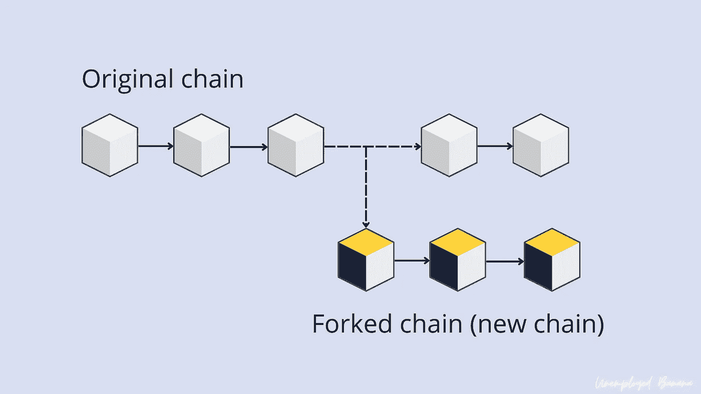
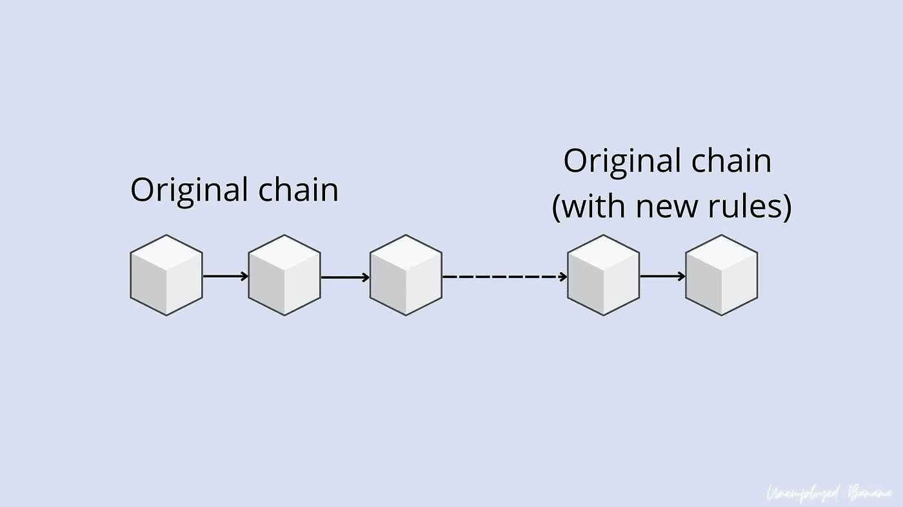

# 通俗地说:区块链和密码中的分叉是什么？

> 原文：<https://medium.com/coinmonks/in-laymans-term-what-is-forking-in-blockchain-and-crypto-1c53de221157?source=collection_archive---------31----------------------->

分叉是软件工程中的一个术语，用来将一个项目分割成两个或更多独立的过程。在区块链，当一组开发人员或社区对区块链进行更改时，就会发生分叉。**块中的一个节点包含一组对社区有用的规则和信息**。当一个分叉发生时，一个单独的规则集与最初的规则集相背离。**有两种叉子** — **硬叉子和软叉子。**

## 硬叉子

你可以把硬分叉想象成硬件升级。比如从苹果 iPhone X 升级到 iPhone 12。

在一个更技术性的解释中，当新块的节点不支持旧块中的节点时，就会发生硬分叉，从而使新节点不向后兼容。因此，一条路径作为“分叉链”跟随新升级的区块链，而另一条路径作为“原始链”沿着旧路径继续。

一个经典的例子是以太坊经典(没有双关语)和以太坊。以太坊经典($ETC)维护了以太坊($ETH)网络的原始历史和代码。由于原始链的智能合同存在缺陷，黑客得以利用它，并在 2016 年窃取了价值 5000 万美元的以太坊。最终，社区投票通过了一个硬分叉来彻底改变以太坊网络，使其对攻击和黑客攻击更具弹性。这就是以太坊和以太坊经典的由来。

## 软叉

把 Soft Fork 想象成你手机的软件升级。你实际上使用的是升级了软件的同一部手机。

与区块链类似，soft forks 只修改了部分代码来引入新功能。每个新块中的节点接受旧块中的节点，从而使其向后兼容。

本质上，升级时会保留原始链。升级后，进行升级的下一个块将有一个新节点或一组规则。然而，不像硬分叉，不会有链分叉。

像比特币($BTC)和以太坊($ETH)这样的软叉在区块链相当常见，用于更新链的安全性，以防止恶意攻击；或者它可能是添加一些新功能的更新——就像同一部 iPhone 中从 iOS 14 到 iOS 15 的软件更新一样。

好了，我希望你今天学到了一些新东西。请让我知道我如何能改进我的文章，尤其是教育材料。我对所有的反馈都持开放态度！

*感谢阅读我的文章！如果你喜欢，那就考虑在这里给我买一台* [***ko-fi 支持我吧。它走了很长的路！***](https://ko-fi.com/unemployedbanana) *☕❤️*

如果你想购买/交易，考虑免费使用我的会员链接(它也有助于支持我！):

1.  ***【🟡(收费最低！)***
2.  **[***kucoin***](https://www.kucoin.com/r/rf/rPELADP)**🟢(大量低帽宝石！)****

**免责声明:我不是任何形式的财务顾问。永远 DYOR，投资安全。**

**你也可以在这里阅读我的其他文章。**

** [## 为什么你的钱在稳定的银行里不安全的 3 个原因

### 你的钱放在马厩里真的安全吗？

medium.com](/coinmonks/3-reasons-why-your-money-isnt-really-safe-in-stablecoins-90625f125516)  [## 2022 年你应该投资 Polygon (MATIC)的 3 个理由。

### 你还在考虑投资$MATIC 吗？现在读读这个。

medium.com](/coinmonks/3-reasons-why-you-should-invest-in-polygon-matic-in-2022-c8b3f5da41aa) 

> 加入 Coinmonks [电报频道](https://t.me/coincodecap)和 [Youtube 频道](https://www.youtube.com/c/coinmonks/videos)了解加密交易和投资

# 另外，阅读

*   [分散交易所](https://coincodecap.com/what-are-decentralized-exchanges) | [比特 FIP](https://coincodecap.com/bitbns-fip) | [Pionex 审查](https://coincodecap.com/pionex-review-exchange-with-crypto-trading-bot)
*   [用信用卡购买密码的 10 个最佳地点](https://coincodecap.com/buy-crypto-with-credit-card)
*   [最好的卡达诺钱包](https://coincodecap.com/best-cardano-wallets) | [Bingbon 副本交易](https://coincodecap.com/bingbon-copy-trading)
*   [印度最佳 P2P 加密交易所](https://coincodecap.com/p2p-crypto-exchanges-in-india) | [柴犬钱包](https://coincodecap.com/baby-shiba-inu-wallets)
*   [八大加密附属计划](https://coincodecap.com/crypto-affiliate-programs) | [eToro vs 比特币基地](https://coincodecap.com/etoro-vs-coinbase)
*   [最佳以太坊钱包](https://coincodecap.com/best-ethereum-wallets) | [电报上的加密货币机器人](https://coincodecap.com/telegram-crypto-bots)**