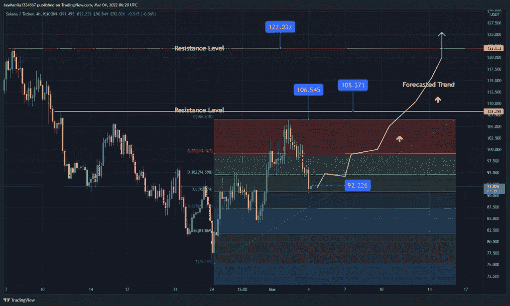

# 面对熊市，索拉纳正准备迅速飙升至 122 美元

> 原文：<https://medium.com/coinmonks/in-the-face-of-a-bearish-stock-market-solana-is-preparing-to-surge-to-122-in-no-time-7d081d92ca6a?source=collection_archive---------68----------------------->

**Visit our website:-** [**https://bitcoinsupports.com/**](https://bitcoinsupports.com/)

-索拉纳可能很快就会达到每股 122 美元。

— SOL 保持前十的市场地位。

——索拉纳现在正在从事一千多个项目。

可扩展性极强的区块链 Solana 保持着市场十大加密货币之一的地位。目前，SOL 的市值约为 320 亿美元，24 小时交易量超过 21 亿美元。这些市场资源有助于 SOL 保持其在行业中的领导地位。

此外，SOLANA 每天都在继续扩大其生态系统中的项目数量。这是由于它的区块链，这使得创业公司能够无缝地启动他们的项目。今天，SOLANA 的平台支持一千多个不同的加密网络。

**Visit our website:-** [**https://bitcoinsupports.com/**](https://bitcoinsupports.com/)

在市场形势方面，加密货币继续在熊市中战略性地捍卫自己的地位。准确地说，SOL 在斐波那契黄金分割比率水平 0.618 上方保持上升趋势。如果 SOL 保持这一速度，它可能会扩大其进展，并突破 0.38 至 0.23 的斐波纳契水平。如果出现这种情况，SOL 可能会达到 108 美元的高点，这是通往 122 美元的看涨价格的路线。

然而，如果 SOL 未能保持这一趋势，加密货币的价格可能会突破目前的区间。综上所述，SOL 的价格可能会大幅下降。有可能会跌破斐波那契黄金分割比率 0.618。结果，这种情况可能在网络的交易者和投资者中产生 FUD。SOL 目前以 90 美元的合理价格交易，七天增长率为+3.2%。

**访问我们的网站:-**[**https://bitcoinsupports.com/**](https://bitcoinsupports.com/)

**免责声明:以上为作者观点，不应视为投资建议。读者应该自己做研究。**