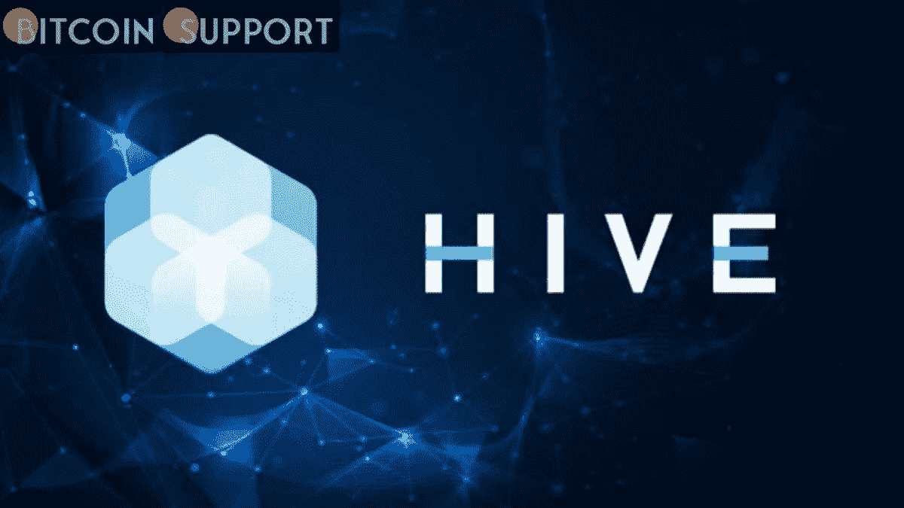

# 在美国，HIVE Blockchain 已经签署了英特尔新采矿芯片的协议

> 原文：<https://medium.com/coinmonks/in-the-united-states-hive-blockchain-has-signed-a-deal-for-intels-new-mining-chips-96d68282d2c0?source=collection_archive---------56----------------------->

**Visit our website:-** [**https://bitcoinsupports.com/**](https://bitcoinsupports.com/)

加拿大加密货币矿商 HIVE block chain[周一宣布](https://www.hiveblockchain.com/news/hive-blockchain-announces-landmark-deal-to-buy-new-high-performing-asic-chips-from-intel-and-a-100-mw-renewable-energy-deal-in-texas/)已同意购买英特尔最新的 ASIC 处理器，用于采矿设备。据该公司称，这笔交易是 HIVE 进军美国的目标的一部分。

还披露了与矿业基础设施提供商 Compute North 达成的初步协议，该公司将在得克萨斯州的一家可再生能源设施托管 100 兆瓦的采矿产能。

**得益于与英特尔的合作，HIVE 的 BTC 开采率将增长近一倍。**

HIVE 表示，新设备将于 2022 年下半年开始供应，一旦安装，将使其比特币挖掘散列率提高高达 95%。这家矿业公司还表示，它已经与一家原始设计制造商合作，使用英特尔的 CPU 来创建定制设备。

蜂巢矿此刻比特币，以太坊，以太坊经典。截至去年 12 月 31 日，其持有的流动性 BTC 和 ETH 的总价值约为 1.68 亿美元。英特尔上个月发布新芯片时，这是该公司进军区块链科技的第一步。芯片制造商声称，新的硅芯片将超过传统采矿技术 1000 倍。据英特尔称，Argo Blockchain 和杰克·多西的 BLOCK Inc 将于今年晚些时候率先获得升级的 CPU。ASICs，或专用集成电路，是专为特殊用途设计的芯片，如本例中的密码挖掘。

**蜂巢现在已经在美国出现。据 HIVE 公司称，该公司与 Compute North 的合作是该公司首次进军美国。鉴于目前对 crypto mining 碳足迹的担忧，该企业将完全由可再生能源驱动。该公司去年在美国纳斯达克交易所上市。它主要在加拿大多伦多证券交易所上市。数据中心现在位于加拿大、瑞典和格陵兰。

**访问我们的网站:-**[**https://bitcoinsupports.com/**](https://bitcoinsupports.com/)

**免责声明:以上为作者观点，不应视为投资建议。读者应该自己做研究。****