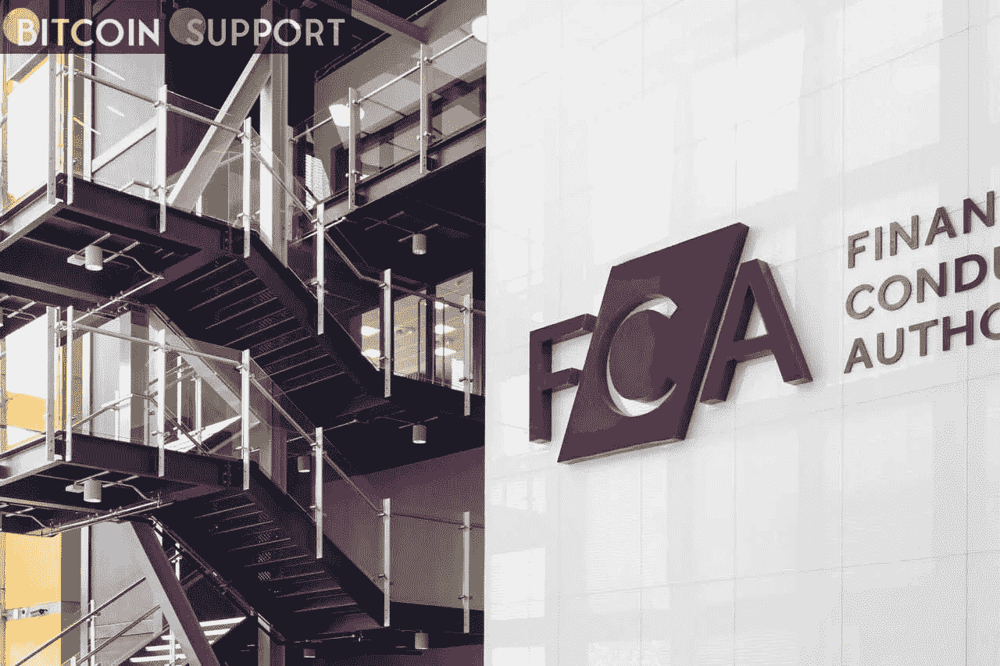

# 在新的打击行动之后，英国金融监管机构正在寻找加密人才

> 原文：<https://medium.com/coinmonks/in-the-wake-of-a-new-crackdown-the-uk-financial-watchdog-is-looking-for-crypto-talent-3b52fa5c0138?source=collection_archive---------53----------------------->

**Visit our website:-** [**https://bitcoinsupports.com/**](https://bitcoinsupports.com/)

英国金融行为监管局(FCA)正在寻找具有加密货币经验的高管，因为监管机构准备建立一个新的加密部门来监管该行业。根据 LinkedIn 上的职位列表，FCA 正在寻找数字资产部门的负责人和支付与数字资产部门的主管。这两个招聘广告都是针对密码爱好者的。

FCA 的数字资产主管职位空缺周一发布在 LinkedIn 上，寻求一名候选人，负责指导该机构在整个英国加密市场的监管活动。根据公告，这一新角色预计还将帮助 FCA 开发“一个关于加密的叙述”。

根据声明，这个新职位是 FCA 创建一个专门的加密部门的目标的一部分，对于监管机构的加密监管工作至关重要:

**“我们正在寻找一个部门的负责人来创建和领导一个新的加密部门，该部门将监督和协调 FCA 在这个快速增长的市场中的监管行动。”在一个计划中的负责开发商业模式的新董事会中，这是一项至关重要的领导工作。"**

根据招聘公告，FCA 将在 2022 年 4 月 3 日前接受该职位的申请。根据上周发布的另一份招聘启事，FCA 还在寻找一名支付和数字资产部门主管。

该角色的最初职责包括支付、电子货币和加密资产的政策和监管，以及金融服务行业中其他发展中的业务模式。该职位需要具备相关监管环境的经验和知识，尤其是与加密货币和支付公司相关的挑战。

英国金融监管局努力建立一个新的专业加密监管团队，因为该机构最近几个月对加密货币行业的监管越来越担忧。作为打击洗钱努力的一部分，FCA 上周发布命令，关闭该国比特币(BTC)自动取款机的运营商。上周五，该监管机构强调，所有总部设在英国的金融服务公司，包括加密企业，必须遵守俄罗斯的制裁。

然而，监管机构此前一直积极监管该行业。3 月早些时候，FCA 透露，在 6 个月的时间里，它对未注册的加密公司提起了 300 多起投诉，其中 50 起正在进行调查。2021 年，FCA 收到了 6372 起涉嫌加密诈骗的警报，高于前一年的 3143 起。

**访问我们的网站:-**[**https://bitcoinsupports.com/**](https://bitcoinsupports.com/)

**免责声明:以上为作者观点，不应视为投资建议。读者应该自己做研究。**

> 加入 Coinmonks [电报频道](https://t.me/coincodecap)和 [Youtube 频道](https://www.youtube.com/c/coinmonks/videos)了解加密交易和投资

# 另外，阅读

*   [3 商业评论](/coinmonks/3commas-review-an-excellent-crypto-trading-bot-2020-1313a58bec92) | [Pionex 评论](https://coincodecap.com/pionex-review-exchange-with-crypto-trading-bot) | [Coinrule 评论](/coinmonks/coinrule-review-2021-a-beginner-friendly-crypto-trading-bot-daf0504848ba)
*   [莱杰 vs n rave](/coinmonks/ledger-vs-ngrave-zero-7e40f0c1d694)|[莱杰 nano s vs x](/coinmonks/ledger-nano-s-vs-x-battery-hardware-price-storage-59a6663fe3b0) | [币安评论](/coinmonks/binance-review-ee10d3bf3b6e)
*   [Bybit Exchange 审查](/coinmonks/bybit-exchange-review-dbd570019b71) | [Bityard 审查](https://coincodecap.com/bityard-reivew) | [Jet-Bot 审查](https://coincodecap.com/jet-bot-review)
*   [3 commas vs crypto hopper](/coinmonks/3commas-vs-pionex-vs-cryptohopper-best-crypto-bot-6a98d2baa203)|[赚取加密利息](/coinmonks/earn-crypto-interest-b10b810fdda3)
*   最好的比特币[硬件钱包](/coinmonks/hardware-wallets-dfa1211730c6) | [BitBox02 回顾](/coinmonks/bitbox02-review-your-swiss-bitcoin-hardware-wallet-c36c88fff29)