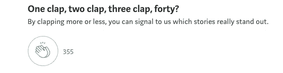

# 财务下滑—财务状况下滑的十大主要原因

> 原文：<https://medium.com/coinmonks/inancial-decline-top-10-major-reasons-for-decline-in-financial-situation-6aeaa359e461?source=collection_archive---------38----------------------->

## 如果你想要可持续的生活方式，就要不惜一切代价避免它们

Image by Author — Financial Decline — Burn the money

根据我自己的经验，以下 10 个关键原因可能会降低你的财务健康状况，让你陷入可怕的境地:

**#1。假期**

社会压力下的假期。

**#2。购买负债**

买车是身份的象征。

***“当你负债时，你就成了奴隶。”—安德鲁·杰克逊***

**#3。生活方式膨胀**

每个家庭成员都拥有智能手机。

**#4。不必要的社交**

避免自制食物，周末不必要的外出就餐。

**#5。品牌忠诚度**

沙龙、客厅和服装的品牌意识。被宠坏的生活方式增加了医疗费用。

**#6。特殊时刻**

通过花更多的钱而不是在一起的时间来让生日和周年纪念日变得特别。

***“富人投资时间；穷人投资钱。”—沃伦·巴菲特***

**#7。奢侈的**

盛大的婚礼和家庭聚会。

**#8。商业化**

医院、学校和教育等的商业化。

**#9。消费者债务**

通过贷款和信用卡花掉你还没有赚到的钱。

如果你的收入来自劳动而不是资产，你会被隐藏的通货膨胀摧毁——海军 Ravikant

**#10。炫耀文化**

在房屋和办公室内部花费大量金钱，从而增加了维护成本。

***“致富最快的方法是与穷人交往；变穷最快的方法是与富人交往。”—尼古拉斯·纳西姆·塔勒布***

我们在复制别人的生活方式，却不了解自己的需求和收入。如果这一点得不到遏制，它将导致大量的压力和焦虑。收入的增长速度赶不上支出的增长速度，这导致了更多的痛苦和更少的安宁。

一定要了解你的收入，然后根据它来制定支出，而不是看着别人的支出。

***“穷不是拥有太少，是想要更多。”—塞内卡***

感谢您的阅读，在您离开之前…

> 点击“关注”加入好奇求知者的社区，获取关于金融、健康、哲学、心理学和技术的每周文章。如果您想要电子邮件更新，请单击“信封+”标志。
> 
> 在| [脸书](https://www.facebook.com/thequantumthinker) | [推特](https://twitter.com/QuantumThinker)|[insta gram](https://www.instagram.com/the_quantum_thinker/)|[LinkedIn](https://www.linkedin.com/company/quantumthinker/)|[Pinterest](https://www.pinterest.com/quantum_thinker/)|[Reddit](https://www.reddit.com/r/the_quantum_thinker/)|

> *加入 Coinmonks* [*电报频道*](https://t.me/coincodecap) *和* [*Youtube 频道*](https://www.youtube.com/c/coinmonks/videos) *获取每日* [*加密新闻*](http://coincodecap.com/)

# 另外，阅读

*   [复制交易](/coinmonks/top-10-crypto-copy-trading-platforms-for-beginners-d0c37c7d698c) | [加密税务软件](/coinmonks/crypto-tax-software-ed4b4810e338)
*   [网格交易](https://coincodecap.com/grid-trading) | [加密硬件钱包](/coinmonks/the-best-cryptocurrency-hardware-wallets-of-2020-e28b1c124069)
*   [密码电报信号](/coinmonks/top-3-telegram-channels-for-crypto-traders-in-2021-8385f4411ff4) | [密码交易机器人](/coinmonks/crypto-trading-bot-c2ffce8acb2a)
*   [最佳加密交易所](/coinmonks/crypto-exchange-dd2f9d6f3769) | [最佳加密交易所](/coinmonks/bitcoin-exchange-in-india-7f1fe79715c9)
*   [开发人员的最佳加密 API](/coinmonks/best-crypto-apis-for-developers-5efe3a597a9f)