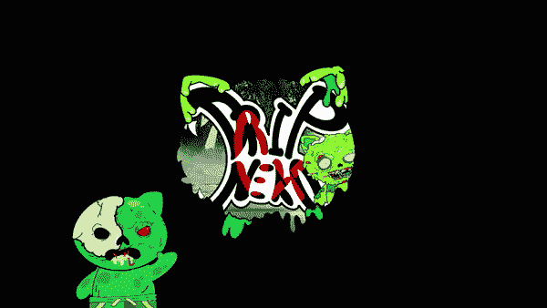
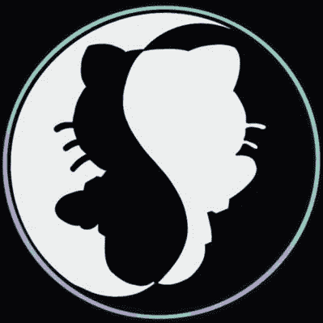

# 集体的包容性。NFT 2.2！！

> 原文：<https://medium.com/coinmonks/inclusiveness-of-a-collective-nft-2-2-b01962fa14a2?source=collection_archive---------44----------------------->

将时钟倒回到 2021 年，这是非功能性思维的一年。我们看到，从只有少数人知道 NFT，到市场上充斥着非功能性金融工具，这一切都在增长。最初的阶段都是关于人们拥有区块链技术中的图片数据，收藏家们欣赏它们，而鳍手们从中获利。

我们现在处于 2022 年的最初几个月，场景正在发生变化，元诗句正在出现，以弥合物理世界和数字世界之间的差距。以乐高积木的形式，NFT 变得越来越包容和互动，连接起来创造更大的可行的商业、娱乐、信息和互动产业。

> 什么是 NFT 2.2 版？

存储在区块链的少量数据已经成为过去。重要的是增值，它可以是互动性、可持续性和增长潜力的形式。

> **S**[ol 猫集体](https://twitter.com/SolanaNeko?s=20&t=DbOjZ7oEY_PmKEaINuc0bQ) 是一个旨在解决这些价值观的 WEB3 项目。

[SOL NEKO COLLECTIVE](https://twitter.com/SolanaNeko?s=20&t=DbOjZ7oEY_PmKEaINuc0bQ)

## **互动性:**

社区是人类互动的本质，人们相信社区中出现的每一个问题都可以通过对话和讨论来解决。暴政和压迫是隔离和分裂的罪恶，在去中心化的网络中没有立足之地。我们的目标是建立一个紧密而有机的社区，在这里人们可以畅所欲言，发挥创造力。

1.  创作者专区——一个崭露头角的艺术家、设计师、作家、开发者可以来这里互动，讨论项目或创造新事物的地方。它也将成为独立创作者筹集资金或寻求帮助的中心。最好的部分是没有费用，而且永远不会有。它也将成为酝酿中的项目的市场，不是被迫的，而是选择的。一个友好和热情的环境，在这里每个人都会被倾听，一个你可以把你的想法酝酿出来的地方，而唯一的规定是它是无毒的。[加入此处](https://discord.gg/ACTxCKSYEq)
2.  猫文化——“我们给你指路，你自己走”。索拉纳区块链上的沉浸式多元宇宙由集体的所有人管理。社区将决定如何构建故事情节。一个充满变数和未知的未来，甚至我们作为创始人也没有意识到，在真正意义上是去中心化的。不和谐是聚集和建设的地方。[在这里加入](https://discord.gg/ACTxCKSYEq)
3.  元宇宙——数字互动不断变化的维度和地缘政治边界的突破注定要在元宇宙发生。你可以带上你的 NFT，一头扎进内科斯的数字世界，参加各种以科技发展标准衡量的活动。嗯，这是一个迫在眉睫的未来，我们将成为其中的先驱之一。

## **可持续性:**

> 为了进一步减轻索拉纳对环境的低影响，索拉纳基金会已经使该网络在 2021 年实现碳中和。利用[流域气候](https://watershedclimate.com/)，基金会正在资助制冷剂销毁，据绿色美国报道，这是最大化碳抵消[的最有效方法之一。这一过程包括激励氯氟化碳的适当处置，从而永久消除它们。](https://www.greenamerica.org/climate-change-100-reasons-hope/top-10-solutions-reverse-climate-change)
> 
> 即使索拉纳的影响较轻，它的能源需求也会随着网络的增长而增长。索拉纳基金会致力于在 2022 年和未来保持网络碳中和，并鼓励所有验证者查看他们自己的本地排放数据和缓解策略。此外，Solana 实验室的工程师将继续让 Solana 更高效，因此也更节能。~~ by [索拉纳](https://solana.com/environment)

1.  我们选择的区块链有一分钱的汽油费，即 0.00025 美元，这可以解释为更便宜的铸造成本，即使从长远来看，不像其他同行收取高昂的汽油费。
2.  这有助于把我们的 NFT 带给大众，这就取消了只有精英们才能拥有的资产所有权。这是每个人投资一个项目的机会，这个项目的价值在未来几天将是无限的。
3.  这个项目不仅仅是销售，而是建立一个更大的有机基地，从长远来看，这将服务于这项事业。艺术收藏产生的大部分收入将用于资助漫画和元宇宙项目。

## **增长潜力:**

截至 2022 年，我们正在为商业生态系统的转型做准备。非英语专业的学生将留在这里，成为我们生活的一部分。我们很快就会开始在服务领域使用 NFT，加密货币 NFT 的总市场价值超过 300 亿美元，在未来几天内必将突破限制。WEB3 的去中心化为萌芽项目打开了一扇无限增长的窗户，我们渴望激励其他人实现有凝聚力的增长。

1.  这是一个更大的集体项目，以建立一个可投资的企业为愿景，它将由较小的集合组成，旨在连接起来，并为其所有者提供效用。这些艺术收藏品将演变成虚拟现实精神画布漫画 NFT，这将是第一个这样的。这些漫画也将与实体副本互动，为更大的粉丝群服务。
2.  我们的 NFTs 的所有者将在销售实物和 AR 收藏品中获得部分版税，从而使他成为企业的利益相关者。
3.  集体元宇宙应整合其所有的 NFT 作为头像或代币，可用于参与活动和玩赢取游戏。
4.  潜在的创造者区域项目将被列为我们集体的一部分，象征性的股份，当然只是出于选择。这将为小艺术家和开发者提供一个利用现有的索尔猫社区成长的机会。
5.  索尔猫俱乐部的出现将为有才华和有技能的社区成员在元宇宙项目中选择职业开辟前景。包括艺术家、设计师、VFX 艺术家、开发人员、音乐家、游戏开发人员、网页设计师、营销专家、作家、金融专家、交易员、零售商、模特和有影响力的人。
6.  为了帮助大众投资和收购资产，一个有凝聚力的社区的成长将形成一个道。
7.  索尔猫集体将为社会的更大利益服务，每次募捐所得收入的 10%将捐赠给非营利组织。

> *加入 Coinmonks* [*电报频道*](https://t.me/coincodecap) *和* [*Youtube 频道*](https://www.youtube.com/c/coinmonks/videos) *了解加密交易和投资*

# 另外，阅读

*   [Bookmap 评论](https://coincodecap.com/bookmap-review-2021-best-trading-software) | [美国 5 大最佳加密交易所](https://coincodecap.com/crypto-exchange-usa)
*   最佳加密[硬件钱包](/coinmonks/hardware-wallets-dfa1211730c6) | [Bitbns 评论](/coinmonks/bitbns-review-38256a07e161)
*   [新加坡十大最佳加密交易所](https://coincodecap.com/crypto-exchange-in-singapore) | [购买 AXS](https://coincodecap.com/buy-axs-token)
*   [红狗赌场评论](https://coincodecap.com/red-dog-casino-review) | [Swyftx 评论](https://coincodecap.com/swyftx-review) | [造币厂评论](https://coincodecap.com/coingate-review)
*   [投资印度的最佳密码](https://coincodecap.com/best-crypto-to-invest-in-india-in-2021)|[WazirX P2P](https://coincodecap.com/wazirx-p2p)|[Hi Dollar Review](https://coincodecap.com/hi-dollar-review)