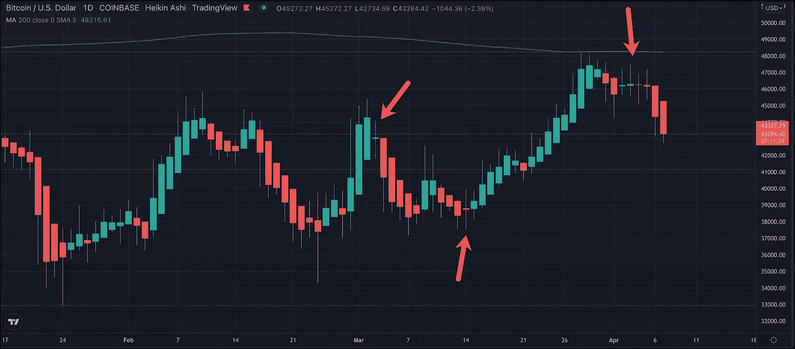

# 犹豫不决害死人

> 原文：<https://medium.com/coinmonks/indecision-kills-3df98d8a71b8?source=collection_archive---------66----------------------->

如果你不认为优柔寡断是致命的，看看多奇对趋势的影响。日本烛台可以给一些体面的告诉，这里有几个例子。这个图表不是标准的蜡烛图。这是一张黑金-阿什图表。Heikin-Ashi 通过几次会议平滑烛台数据。

当开盘价和收盘价非常接近时，尽管一天的波动范围很大，但还是会出现多点。这是一个多头推高价格但未能保持价格的故事，而空头也推低价格但未能保持价格。两个阵营都不占上风。这是优柔寡断的表现。市场决定不了何去何从。从交易者的角度来看，如果你不能决定市场的走向，你的风险管理精灵通常会告诉你退出。如果你有头寸，就平仓。

这就是为什么多奇形态是趋势反转的可靠指标。如果市场一直呈上升趋势，我们的买家就比卖家多。如果市场一直在走低，我们的卖家就比买家多。因此，如果交易员开始意识到市场在反弹后对方向感到困惑，那些看涨者将开始抛售风险，这是有道理的。他们对方向感到困惑或犹豫不决。他们将平仓，从而给市场施加抛售压力。

场内交易者有一种说法，实际上很多都不适合这个论坛，类似于“当有疑问时，放平，把手放在口袋里。”

> 加入 Coinmonks [电报频道](https://t.me/coincodecap)和 [Youtube 频道](https://www.youtube.com/c/coinmonks/videos)了解加密交易和投资

# 另外，阅读

*   [AscendEx Staking](https://coincodecap.com/ascendex-staking)|[Bot Ocean Review](https://coincodecap.com/bot-ocean-review)|[最佳比特币钱包](https://coincodecap.com/bitcoin-wallets-india)
*   [霍比审核](https://coincodecap.com/huobi-review) | [OKEx 保证金交易](https://coincodecap.com/okex-margin-trading) | [期货交易](https://coincodecap.com/futures-trading)
*   [网格交易机器人](https://coincodecap.com/grid-trading) | [Cryptohopper 审查](/coinmonks/cryptohopper-review-a388ff5bae88) | [Bexplus 审查](https://coincodecap.com/bexplus-review)
*   [7 个最佳零费用加密交换平台](https://coincodecap.com/zero-fee-crypto-exchanges)
*   [氹欞侊贸易评论](https://coincodecap.com/anny-trade-review) | [火币保证金交易](/coinmonks/huobi-margin-trading-b3b06cdc1519)
*   [分散交易所](https://coincodecap.com/what-are-decentralized-exchanges) | [比特 FIP](https://coincodecap.com/bitbns-fip) | [Pionex 评论](https://coincodecap.com/pionex-review-exchange-with-crypto-trading-bot)
*   [用信用卡购买密码的 10 个最佳地点](https://coincodecap.com/buy-crypto-with-credit-card)