# 指数合作社——产品综述

> 原文：<https://medium.com/coinmonks/index-cooperative-a-round-up-of-the-products-fcedd8b4db4?source=collection_archive---------25----------------------->

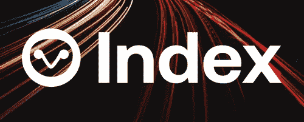

分散金融促进了几个不依赖于银行和其他遗留系统的复杂开放金融系统和工具的发展和推出。新产品/协议的不断创新证实了这一领域的潜力。此外，投资者已经转向被动创收技术，以从数字资产中提取价值，DeFi 提供了几个有利的主张。

DeFi 平台使投资者只需点击一个按钮就能获得高额 APYs。然而，被动创造财富的机会太多，需要对产品有深入的了解，并具备瞬间做出决定的能力。因此，即使存在选择，从中获利也需要时间和努力。

## 指数基金

在传统金融中，最不费力的投资是通过指数基金。指数产品属于一个成熟的产品类别，已经存在了 50 多年。

指数基金已经进入了不断增长和迅速崛起的 DeFi 领域。但在深入研究加密指数基金之前，我们先来看看传统金融领域的 ETF 和指数产品。

被定位为低风险和廉价的指数基金是被动投资的终极范例，为投资者提供相对稳定和长期的回报。但是什么是指数基金呢？要了解指数基金，我们先来了解一下什么是指数——

***指数是跟踪一项资产或一组资产表现的工具。它复制了市场特定部分的行为。***

简而言之，指数基金通过投资单一资产，提供了一种直接投资于整个行业的方式。与成份股挂钩使得这些基金的投资组合更容易理解，也更容易预测。此外，这些基金通常比那些需要积极管理的基金具有更低的费用比率。

因此，指数基金广泛的多样化、低成本和诱人的回报使其成为完美的被动投资策略。

指数基金的快速回顾

*   由于没有得到积极的管理，它们的费用很低
*   复制指定指数的表现，而不是以跑赢市场为目标。
*   他们帮助投资者管理和平衡投资组合中的风险。

指数基金不能保证巨大的收益或最好的回报。那么，为什么要选择它们呢？首先，它们克服了人的偏见，更重要的是，它们能立即分散你的投资组合，并最小化相关风险。因此，由对基础产品有深入了解的投资组合经理/方法学家创建的指数基金为投资者提供了在给定风险水平下赚取更好回报的机会。因此，投资者可能不会获得巨额回报，但可以更好地防范巨额损失。

指数基金已经进入了新兴的分散金融世界(DeFi ),在那里，它们不仅高效，而且负担得起，而且不受限制。此外，投资者不需要熟悉各种代币的经济或性能，也不需要了解不同协议的复杂性来进行投资。

与投资者可以购买 ETF 和指数产品的传统金融界类似，DeFi 的投资者可以前往 [Index Coop](https://app.indexcoop.com/) 购买这些产品。目前，很少有机构在加密货币指数基金领域开展工作，其中 Index Coop 是领导者。

如前所述，加密指数基金类似于传统的指数基金，只是完全基于区块链。因此，这些资金不受集中资产管理公司的控制或管理；相反，有一个开源软件和一个分散的治理系统或 DAO(类似于 Index Coop)来做决策。

# 指数合作

Index Coop 是一个去中心化的自治组织(DAO ),它的出现是为了创建和维护基于 DeFi 资产管理原语的加密原生结构化产品。它能够为散户投资者、机构和投资专业人士创建和采用链上加密指数产品。指数令牌持有者管理指数合作社。旨在促进投票和社区所有权的$INDEX 是 2020 年 10 月在区块链以太坊推出的 ERC-20 代币。社区成员和方法论者因为他们的贡献被奖励了$INDEX。

## 索引令牌

$INDEX 是 Index Coop 的治理令牌。它允许持有人对 Coop 的各种提案、未来产品、战略方向和潜在投资项目进行投票。 ***$INDEX 应被视为“工作证明”令牌，因为它被分发给那些为 Index Coop 的发展做出贡献的人。***

***最多供应 1000 万个指数代币，分配如下。***

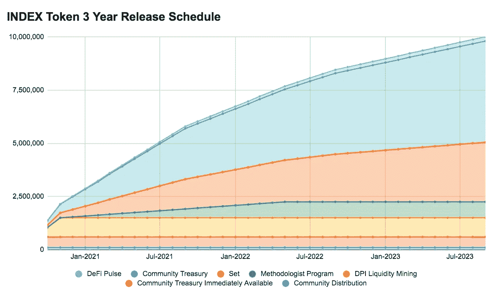

如果你有兴趣获得这些代币，你可以通过以下方式

1.  DEX —您可以在分散式交易所(DEX)购买$INDEX
2.  流动性挖掘计划——您可以参与流动性挖掘计划以获得美元指数
3.  INDEX Coop——对 DAO 的贡献将获得$INDEX 的奖励。

如需了解更多信息，请点击此处的。

## 索引合作产品列表

让我们介绍一下 Index Coop 上提供的一些产品。

**DeFi 脉搏指数(DPI)**

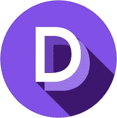

$DPI 是两个领先的加密团队 TokenSet 和 DeFi Pulse 合作的结果。该数字资产旨在跟踪 DeFi 令牌性能。$DPI 是一个 ERC 20 令牌，作为一个大写加权指数，包含流行的基于以太坊的 DeFi 令牌。它允许投资者在一个单一的令牌中获得以太坊 DeFi 的广泛敞口。

**元宇宙指数(MVI)**

MVI 是 Coop 推出的第一个没有外部合作伙伴作为方法论者的指数产品。它由来自 VR、AR、音乐、NFT 和娱乐的令牌组成，因为它旨在捕捉娱乐、体育和商业向虚拟环境转移的趋势。

**灵活杠杆指数(FLI)**

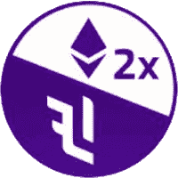

基于 Set 协议，FLI 是 Coop 与 DeFi Pulse 的第二次合作。灵活杠杆指数旨在最大限度地降低与管理和维护抵押债务相关的风险和成本。用 Index Coop 自己的话说，

***杠杆是 DeFi 的杀手用例之一。然而，传统的 DeFi 杠杆工作流程并不适合胆小的人。用户必须监控健康比率，警惕清算风险，避免罚款。***

***灵活杠杆指数就是为了应对这些风险，使杠杆使用更安全、更易于维护而创建的。***

****

*   ETH 2x 灵活杠杆指数- *以太坊灵活杠杆指数*
*   ETH 2x 灵活杠杆指数(Polygon)- *以太坊灵活杠杆指数的 Polygon-native 版本*
*   BTC 2x 灵活杠杆指数- *比特币灵活杠杆指数*

**注:** ETH2x-FLI 是以太坊主网上最初的 ETH2x 产品，而 ETH2x-FLI-P 是一个截然不同的、多边形原生的产品。

**无浅滩河床指数(河床)**

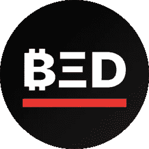

Bankless 和 Index Coop 合作创建了 BED on Set 协议基础设施。投资 BED 可以让用户被动地接触到允许独立银行业务的资产。

***BED 代表比特币、以太坊、DeFi。这些被认为是开放金融或无银行革命的重要组成部分。这是基于这样一个论点，即每一种投资都以同等的权重抓住了三个投资秘密主题的优势:***

*   ***比特币——“数字黄金”或价值储存***
*   ***以太坊——可编程货币***
*   ***DeFi —分权财务***

**数据经济指数(数据)**

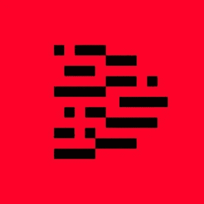

数据经济是指由基于数据的产品和服务组成的生态系统。由托马斯·赫普纳(Thomas Hepner)和基巴·加托(Kiba Gateaux)创建的数据经济指数(Data)让投资者被动地接触到数据经济中一些最重要的创新者。该指数包括 Filecoin(renFIL)、the Graph(GRT)、Basic Attention Token(BAT)、Livepeer(LPT)、OCEAN、numaire(NMR)和 Chainlink(LINK)，以数据为中心，不区分链。

**利息或复利**

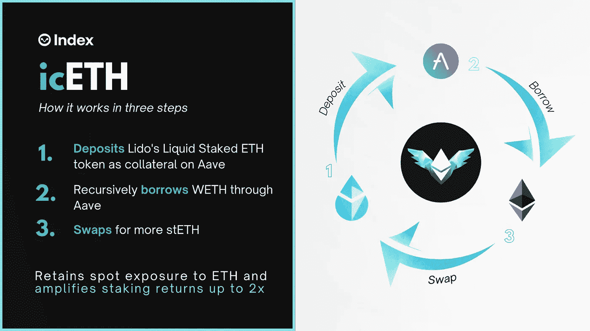

icETH 或复利 ETH 是 Index Coop 的第一个收益产品。icETH 旨在使用 Set 协议上的液体赌注策略来提高赌注回报。与 FLI 代币相比，icETH 的风险更低，它可以抽象抵押债务管理，自动重新平衡，并最大限度地降低成本和清算风险。
简而言之，icETH 将 stETH 存入 Aave v2 作为抵押品，并递归地借入 ETH 以获得更多 stETH。因此，与单纯持有 stETH 相比，代币持有者对 ETH 有即期敞口，并有能力赚取放大的回报。

## 如何购买指数 Coop 产品？

首先，让我们假设你有一个 Web 3.0 钱包，比如 [Metamask](https://metamask.io/download.html) 。本教程将侧重于直接从分散交易所购买指数合作产品。可以使用许多索引，如 Uniswap、Sushiswap、Loopring 和 Matcha。为了这个教程，让我们继续寿司。

所有这些产品都可以从 Index Coop 应用程序中获得，并由以太坊主网上的 Uniswap 和 Sushiswap 提供。此外，用户可以使用多边形或以太坊的 DPI，MVI 和数据。遗憾的是，BED 只在以太坊 Mainnet 上可用。

**DPI，MVI，FLI&sushi swap 上的数据**

进入 SushiSwap 应用程序。

1.  使用以太坊/多边形 Mainnet 连接您的钱包。

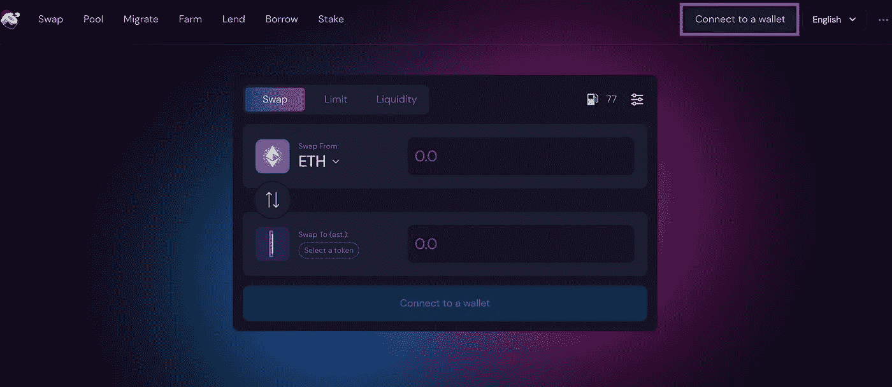

2.搜索您想要的产品— DPI、MVI 和数据。

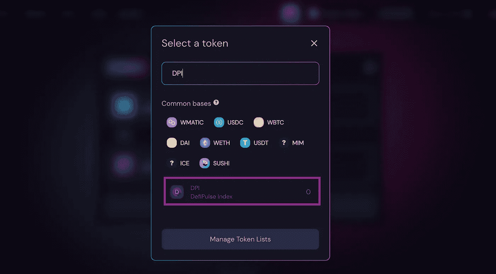

3.选择代币并输入您想要使用的金额。点击批准。

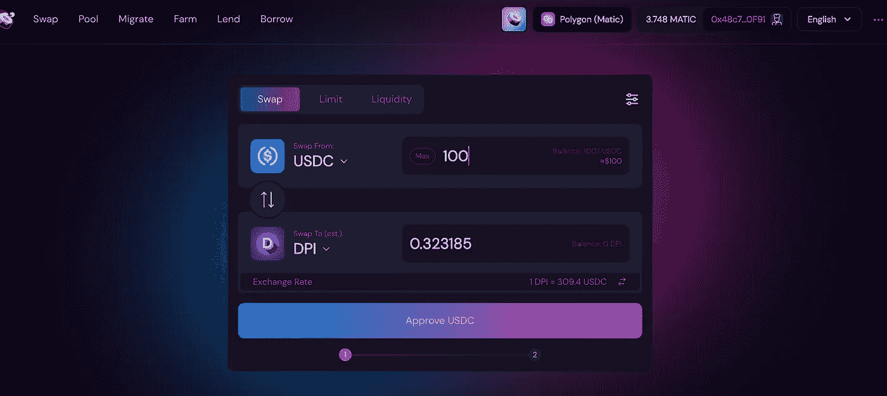

4.确认交易。

5.点击 Swap，再次确认交易。

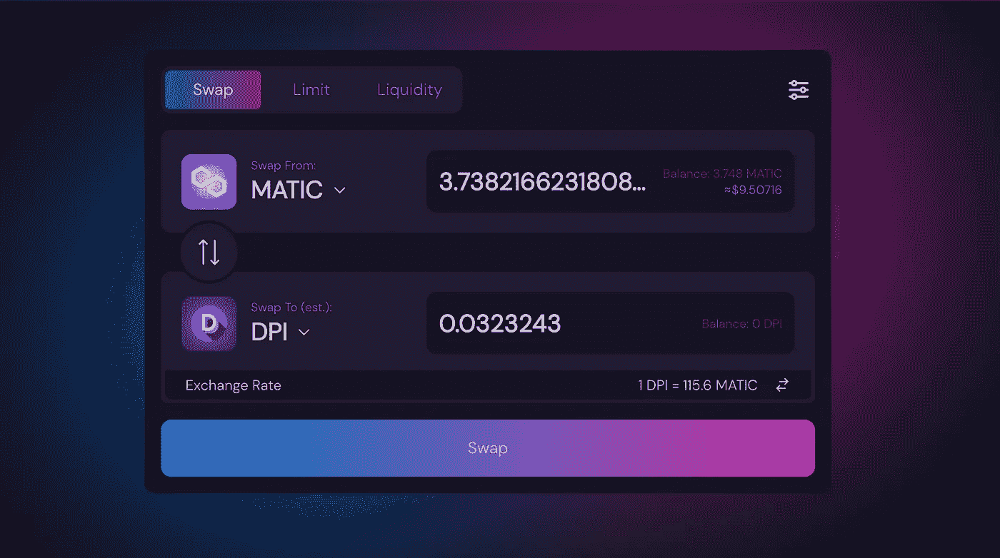

**对于床** —使用以太坊 Mainnet。

对于 icETH——查看 Youtube 视频教程

## 结论

由于简单和高效是最重要的价值主张，指数基金将继续存在。通过投资于单一的高流动性资产来创建多元化投资组合的能力，使它们受到高度重视。仅投资于一项资产使 DeFi 用户能够节省与购买多种代币相关的大量汽油费用，同时能够使用各种代币。用户不必担心跟踪单个令牌，节省了宝贵的时间和精力。指数基金让更多的主流观众接触到 DeFi 令人难以置信的产品。它通过分散投资减少了高波动性的现有障碍。

随着 DeFi 空间的发展和壮大，对这些指数产品的需求预计将会增长。因为在这个特殊的领域只有有限的参与者，Index Coop 凭借其广泛的产品清单和强大的合作伙伴关系，正在成为领先者。如果这还不够，Index Coop 就像一个 DAO，拥有一个强大的社区，负责做出关键决策，推动它朝着正确的方向发展。

**一切区块链—** 追求简化元宇宙链的不同区块。

请考虑通过捐赠、推荐或在社交平台上关注来支持。

捐赠地址— **万物区块链**。钱包

**下线**

[智囊团](https://app.usebraintrust.com/r/everything1/)，[预研](https://www.presearch.org/signup?rid=2491437)，[奥德赛](https://odysee.com/$/invite/@Cyekmyster:3)，[币安](https://accounts.binance.com/en/register?ref=12626399)，[库科恩](https://www.kucoin.com/ucenter/signup?rcode=rJCLFS2)

**社交**

[Substack](https://everythingblockchain.substack.com/account?utm_source=menu-dropdown) ， [Twitter](https://twitter.com/cyekmyster) ， [Youtube](https://www.youtube.com/channel/UCkcc6EceEAu1sMoi2dKczCQ) ， [Medium](/@everythingblockchain) ， [Reddit](https://www.reddit.com/user/cyekmyster)

本文提供的任何或所有信息仅用于教育目的，不得视为投资建议。在正确呈现任何信息方面的任何失误都是我们的责任。我们否认与使用此内容相关的任何责任。

> 加入 Coinmonks [电报频道](https://t.me/coincodecap)和 [Youtube 频道](https://www.youtube.com/c/coinmonks/videos)了解加密交易和投资

# 另外，阅读

*   [加密货币储蓄账户](/coinmonks/cryptocurrency-savings-accounts-be3bc0feffbf) | [YoBit 审核](/coinmonks/yobit-review-175464162c62)
*   [机器人大战纳波托斯大战雷克斯](/coinmonks/botsfolio-vs-napbots-vs-mudrex-c81344970c02) | [Gate.io 交易回顾](/coinmonks/gate-io-exchange-review-61bf87b7078f)
*   [CoinFLEX 点评](https://coincodecap.com/coinflex-review) | [AEX 交易所点评](https://coincodecap.com/aex-exchange-review) | [UPbit 点评](https://coincodecap.com/upbit-review)
*   [easterx 融资交易](https://coincodecap.com/ascendex-margin-trading)|[bit finex Staking](https://coincodecap.com/bitfinex-staking)|[bit flyer 点评](https://coincodecap.com/bitflyer-review)
*   [bit get Review](https://coincodecap.com/bitget-review)|[Gemini vs BlockFi](https://coincodecap.com/gemini-vs-blockfi)cmd |[OKEx 期货交易](https://coincodecap.com/okex-futures-trading)
*   [advancedex stating](https://coincodecap.com/ascendex-staking)|[Bot Ocean Review](https://coincodecap.com/bot-ocean-review)|[最佳比特币钱包](https://coincodecap.com/bitcoin-wallets-india)