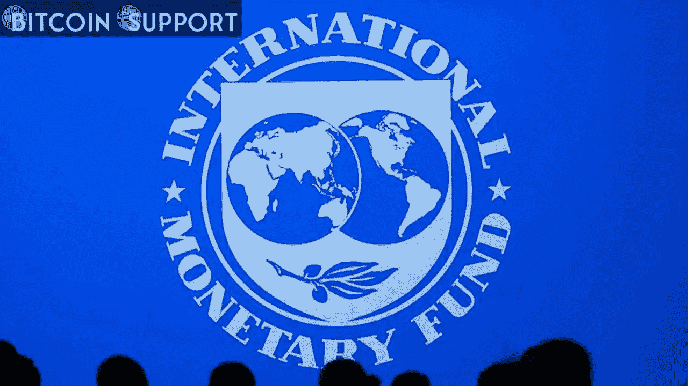

# 国际货币基金组织和印度正在合作起草一份关于加密货币的咨询文件

> 原文：<https://medium.com/coinmonks/india-collaborates-with-the-international-monetary-fund-on-a-crypto-consultation-paper-61f88611c4ae?source=collection_archive---------52----------------------->

这份文件可能为数字资产的国家框架奠定基础，它已接近完成。印度政府经济事务部正在敲定一份加密货币咨询文件，随后将移交给联邦政府。该文件的实施可以使这个 140 亿人口的国家更接近数字资产的国际监管协议。

经济事务大臣 Ajay Seth 于 5 月 30 日(星期一)在劳工和就业部主办的一次活动中透露，他的部门即将完成协商文件，该文件将确定该国对加密货币的立场。

该文件由行业利益相关方、世界银行和国际货币基金组织(IMF)共同制定。根据 Seth 的说法，这份文件将加强印度对“某种全球监管”的承诺:

**“然而，我们想要处理数字资产，需要有一个广泛的框架，所有经济体都可以在这个框架上合作。”在回答一个关于彻底禁止的问题时，这位官员承认，这种国家层面的禁止在孤立的情况下不会有效:

**“无论我们做什么，即使我们走极端，选择禁止的国家都会失败，除非有一个全球共识。”**

谈到加密货币，印度近年来采取了相当激进的立场。印度储备银行(RBI)和财政部在 2017 年将数字货币比作庞氏骗局，并禁止商业银行和贷款机构与之交易。

印度央行警告称，在禁令正式解除很久之后，加密货币将在 2022 年带来“美元化”的威胁，印度总理纳伦德拉·莫迪(Narendra Modi)在最近的达沃斯世界经济论坛(World Economic Forum)虚拟演讲中称加密货币是一项全球性挑战，需要所有国家和国际机构采取“集体和同步的行动”。

**免责声明:以上为作者观点，不应视为投资建议。读者应该自己做研究。****