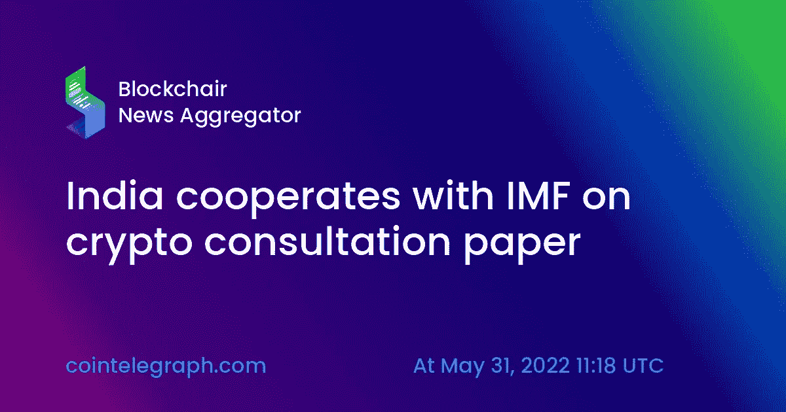

# 印度与国际货币基金组织就加密咨询文件进行合作

> 原文：<https://medium.com/coinmonks/india-cooperates-with-imf-on-crypto-consultation-paper-be10cd9649df?source=collection_archive---------53----------------------->

印度经济事务部正在敲定一份关于加密货币的咨询文件，然后将提交给联邦政府。该文件的实施可能会使这个拥有 140 亿人口的国家更接近数字资产的国际监管共识。

周一，在劳动和就业部主办的一次活动中，经济事务秘书 Ajay Seth 透露，他的部门正在完成咨询文件的工作，该文件将确定国家对加密的立场。

该文件是与行业利益相关者、国际货币基金组织和世界银行合作起草的。赛斯明确指出，该论文将加强印度对“某种全球监管”的忠诚:

“数字资产，无论我们想以何种方式处理这些资产，都必须有一个广泛的框架，所有经济体都必须在这个框架上合作。”

在回答可能彻底禁止的问题时，这位官员承认，任何国家层面的禁令都不会孤立地发挥作用:

“无论我们做什么，即使我们走极端的形式，那些选择禁止的国家，他们也不可能成功，除非有一个全球共识。”

近年来，印度在加密方面表现出了相当激进的姿态。2017 年，印度储备银行(RBI)和财政部将数字货币与庞氏骗局进行了比较，并禁止商业银行和贷款机构与数字货币进行任何操作。

2022 年，在禁令正式解除后很久，印度储备银行警告加密带来的“美元化”威胁；在最近的世界经济论坛(World Economic Forum)虚拟演讲中，印度总理纳伦德拉·莫迪(Narendra Modi)称加密货币是一项全球性挑战，需要所有国家和国际机构采取“集体和同步行动”。