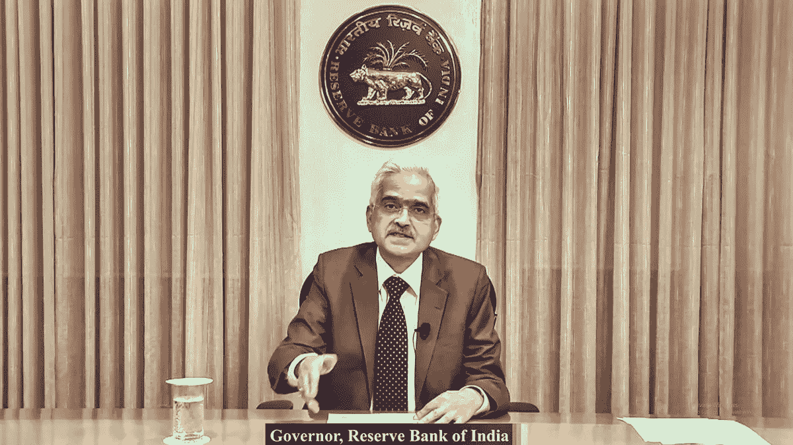

# 印度中央银行发现很难监管拒绝匿名

> 原文：<https://medium.com/coinmonks/indian-central-bank-is-finding-it-difficult-to-regulate-defi-anonymity-29ad02e157f?source=collection_archive---------61----------------------->

印度储备银行(Reserve Bank of India)行长 Shaktikanta Das 在 DeFi 市场发表声明，称该市场因其匿名性而构成挑战。中央银行行长在孟买的 BFSI 峰会上发表讲话，他说传统的方法不会有效。

Das 谈到了他对加密资产类别的厌恶，称它们对现有的金融系统构成了风险和威胁。

根据 Shaktikanta Das

> “DeFi 给监管机构带来了独特的挑战，因为它的匿名性、缺乏集中的治理机构以及法律上的不确定性会使传统的监管方法失效。”

印度央行还公开了其在监管加密领域的问题，此前曾谈到监管这种新型资产类别的难度。目前，这种资产类别被允许发挥作用，但被课以重税，且不被视为法定货币。印度政府带来的变化导致加密交易量急剧下降。

加密货币的税收规定只是印度央行和该国其他监管机构在监管加密货币的竞赛中迈出的第一步。预计将很快出台更多监管措施，印度正在等待更多的全球共识，然后再实施措施。

# 区块链监管需要全球协调

印度过去曾表示，希望在加密货币监管问题上进行全球协调。这是可以理解的，因为加密没有国界，除非政府合作，否则不可能有一个有效的系统。其他国家，如美国和英国，只是处于形成广泛法规的早期阶段，但这可能有助于印度做出决定。

Das 在演讲中还表示，在必要的情况下，“全球合作和监管的方法”和“监管间的协调，以实现对加密市场的全面评估”。印度储备银行也将在不久的将来发布一份关于数字终结的指导方针。

关注我们了解更多故事[点击这里](http://t.me/etellworld)

> 加入 Coinmonks [电报频道](https://t.me/coincodecap)和 [Youtube 频道](https://www.youtube.com/c/coinmonks/videos)了解加密交易和投资

# 另外，阅读

*   [MyConstant Review](https://coincodecap.com/myconstant-review) | [8 款最佳摇摆交易机器人](https://coincodecap.com/best-swing-trading-bots)
*   [MXC 交易所评论](/coinmonks/mxc-exchange-review-3af0ec1cba8c) | [Pionex vs 币安](https://coincodecap.com/pionex-vs-binance) | [Pionex 套利机器人](https://coincodecap.com/pionex-arbitrage-bot)
*   [我的密码交易经验](/coinmonks/my-experience-with-crypto-copy-trading-d6feb2ce3ac5) | [比特币基地评论](/coinmonks/coinbase-review-6ef4e0f56064)
*   [CoinFLEX 评论](https://coincodecap.com/coinflex-review) | [AEX 交易所评论](https://coincodecap.com/aex-exchange-review) | [UPbit 评论](https://coincodecap.com/upbit-review)
*   [AscendEx 保证金交易](https://coincodecap.com/ascendex-margin-trading) | [Bitfinex 赌注](https://coincodecap.com/bitfinex-staking) | [bitFlyer 点评](https://coincodecap.com/bitflyer-review)