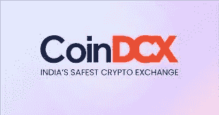
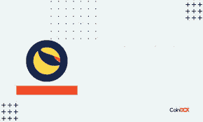
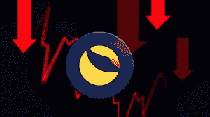
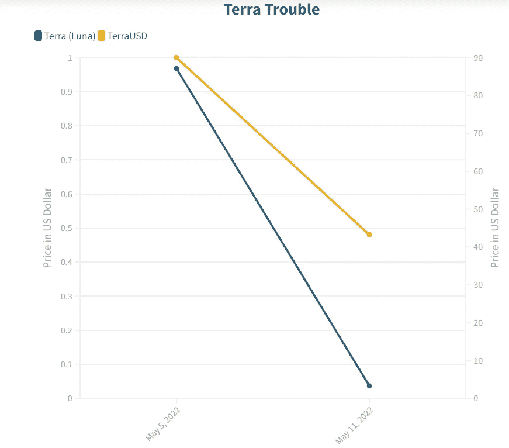

# 印度交易所退市后，100%的损失。

> 原文：<https://medium.com/coinmonks/indian-exchanges-delist-crypto-luna-after-100-loss-60d8f552d5c4?source=collection_archive---------28----------------------->

印度的加密交易，例如，WazirX 和 CoinDCX 已经开始退市，压倒了令牌 Terra (Luna ),在不到七天的时间里，高级资源几乎下跌了 100%。

**INDIA’S SAFEST CRYPTO EXCHANGE**

直到上周六，Luna 的报价约为 80 美元，周五晚上的交易价格为 0.00002446 美元，其价值下跌了近 100%。在此期间，代币的市值从大约 300 亿美元下降到大约 600 万美元。

**LUNA ON COINDCX**

在周五上午的一份通知中，WazirX(关于交换量的加密阶段)表示，它将从 Luna/USDT、Luna/INR 和 Luna/WRX 匹配中除名。“我们将授权币安自由交易所让客户提取他们的 Luna 储备，”该交易商补充道。USDT 是 stablecoin tie，WRX 是 WazirX 的实用令牌。

**LUNA FALLING**

此前，WazirX 的母公司币安周四表示，由于成本降至 0.005 美元以下，将取消卢纳/USDT 的合同。

另一家加密交易公司 CoinDCX 表示，将 UST 和卢娜从 CoinDCX 应用程序中除名，并很快生效。UST 或 terraUSD 是一种算法稳定币，是露娜的姐妹徽章。

“值得同情的是，客户可以利用 CoinDCX Master 和 CoinDCX Web Stage 上的其他交换匹配来继续交换上述资源，”CoinDCX 表示，CoinDCX 是印度最受尊敬的加密交易。

在此期间，交易 BuyUcoin 和 Unocoin 已经额外结束交换 Luna。值得注意的是，令牌还在 Bitbns 上交换，而 terraUSD (UST)没有在舞台上录制。

尽管几周前交易价格约为 80 美元，但 Terra 区块链在周四结束后，其象征性的 terra (Luna)价值跌至 2 便士以下。

卢娜的毁灭在周末再次开始，当它的姐妹代币 UST，一种稳定的硬币，在周末期间大型金融支持者开始抛售大量 UST 美元后，从 1 美元的尊重中脱离。

**LUNA DEPRECIATION**

稳定的硬币通常与美元等基本资源或黄金等贵重金属联系在一起。TerraUSD 是一种分散的算法稳定硬币，这意味着 UST 不是由资源支持，而是利用复杂的代码来制造新硬币或消灭旧硬币，以保持 1 美元的一致成本。

所有的 stablecoins 都有一个管理令牌，它提供了稳定性。由于 UST，它是露娜，这就解释了这两个标记之间的联系。

尽管如此，由于一般加密市场的新下跌，UST 忽略了平衡，并在周五上午触及 0.0449 美元的低点。Terra 的创造者们努力平衡令牌，然而他们的努力失败了。

自上周六以来，UST 的市值从 180 多亿美元暴跌至 20 亿美元以下。

**TERRA’S UST**

“正在进行的 Luna 灾难是一次非凡的学习，它为全球加密局域打开了一扇潜在的大门，因为它发现了基于计算的 stablecoin 环境中的故障点。值得注意的是，Terra network 是密码行业中最知名的公司之一，而 Terra UST 是基于算法的 stablecoin 竞赛的开拓者。授权的多方计算(MPC)加密托管钱包 Atato 的首席营销官 Charles Tan 表示:“LUNA 紧急事件重复了加密作为一种资源非常不稳定的方式，金融支持者需要在 2-3 年内与 alert 交换才能保持利益。

TERRA’S TROUBLE

印度最安全的加密交易所 CoinDCX 采取了这一非常有力和关键的步骤，以保护投资者免受市场波动的高风险。

# CoinDCXPathbreaker

> 加入 Coinmonks [电报频道](https://t.me/coincodecap)和 [Youtube 频道](https://www.youtube.com/c/coinmonks/videos)了解加密交易和投资

# 另外，阅读

*   [隐翅虫替代品](/coinmonks/cryptohopper-alternatives-d67287b16d27) | [HitBTC 审查](/coinmonks/hitbtc-review-c5143c5d53c2)
*   [CBET 评论](https://coincodecap.com/cbet-casino-review) | [库科恩 vs 比特币基地](https://coincodecap.com/kucoin-vs-coinbase)
*   [Fold App 审核](https://coincodecap.com/fold-app-review) | [Kucoin 交易机器人](/coinmonks/kucoin-trading-bot-automate-your-trades-8cf0ca2138e0) | [Probit 审核](https://coincodecap.com/probit-review)
*   [如何匿名购买比特币](https://coincodecap.com/buy-bitcoin-anonymously) | [比特币现金钱包](https://coincodecap.com/bitcoin-cash-wallets)
*   [币安 vs FTX](https://coincodecap.com/binance-vs-ftx) | [最佳(SOL)索拉纳钱包](https://coincodecap.com/solana-wallets)
*   [比诺莫评论](https://coincodecap.com/binomo-review) | [斯多葛派 vs 3Commas vs TradeSanta](https://coincodecap.com/stoic-vs-3commas-vs-tradesanta)