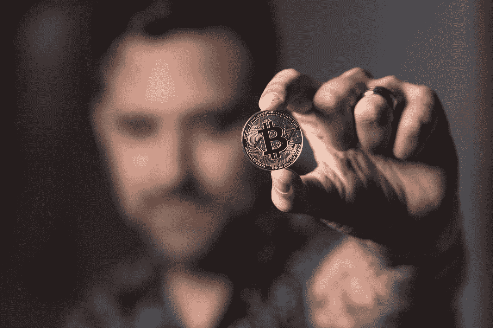

# 印度人应该趁早卖掉这 10 种加密货币

> 原文：<https://medium.com/coinmonks/indians-should-sell-these-10-cryptocurrencies-before-its-too-late-aba1aaf9d80?source=collection_archive---------19----------------------->

# 为了逃避 30%的加密税，印度商人应该处理掉这 10 种加密货币

印度政府宣布的 30%的加密费用对印度加密经纪人来说是一个噩梦，因为他们现在正面临着巨大的不幸。无论如何，他们中的一些人正在考虑请求最高法院调整条款。目前，对印度经纪人来说，考虑出售他们的先进资源似乎是一个有趣的时间，因为如此巨大的税收可能对他们没有帮助。这里有 10 种主要的数字形式的货币，他们应该在无法挽回之前赶紧卖掉。

# 以太坊

以太坊等数字货币背后的目标是建立一个分散的货币项目体系，这个星球上的任何人都可以毫无保留地获得这些货币项目，很少关注身份、国籍或信心。这种观点使某些国家的分支更有说服力，因为那些没有国家基础和国家区分证明的人可以获得分类账、预付款、保护或其他货币项目的分类。以太坊上的应用程序运行在以太网上，以太网是以太网的基础。以太网(ETH)类似于在以太坊舞台上移动的工具，通常由希望在以太坊内创建和运行应用程序的设计者寻找，或者目前由希望利用以太网获得其他计算机化货币标准的金融支持者寻找。

# 莱特币

Litecoin 依赖于一个开源的全球安装网络，它不受任何焦点能力的限制，并将脚本用作 PoW，可以在买方级焦点处理单元(CPU)的帮助下解码。尽管莱特币在许多方面都像比特币，但它有更快的阻塞率，并以这种方式提供更快的交换确认时间。除了设计者之外，越来越多的托运人承认像莱特币这样的加密货币形式。

# 卡尔达诺

Cardano (ADA)是一种“大毒蛇验证股份”数字货币，由建筑师、数学家和密码学专家采用基于考试的方法制作。卡尔达诺希望通过设计以太坊之类的 Defi 项目，以及回答连锁互操作性、选举作弊和合法协议遵循等问题，成为世界货币工作框架。

# 波尔卡多(点)

Polkadot (DOT)是一种特殊的 PoS 数字货币形式，旨在传递其他区块链之间的互操作性。Polkadot 的核心部分是它的移交链，它允许不同组织之间的互操作性。对于明确的用例，它同样考虑了具有自己的本地令牌的仿链或等价区块链。16

# 比特币现金(BCH)

比特币现金 BCH 在 altcoins 的历史背景中占有重要地位，因为它是第一枚比特币最早和最好的硬分叉之一。BCH 在 2017 年 8 月开始了它的生活，因为其中的一个部分。促使《BCH》问世的讨论与多功能性问题有关；比特币网络在方块大小上有一个突破点:1 兆字节(MB)。BCH 将广场的大小从 1MB 增加到 8mb，其想法是更大的广场可以容纳更多的交换，交换速度也会随之增加。18 它同样推出了不同的改进，包括取消影响街区空间的隔离见证惯例。

# 天堂般的(XLM)

天堂(XLM)是一个开放的区块链网络，旨在通过将货币机构与巨额交易的最终目标相关联来提供业务安排。银行和风险公司之间的大规模交易通常需要几天时间，包括各种中间人，并需要一笔可观的现金安排，现在几乎可以在没有任何代表的情况下立即完成，对那些进行交易的人来说几乎不需要任何成本。无论 Stellar 如何将自己定位为机构交流的区块链，它仍然是一个开放的区块链，任何人都可以利用。

# Dogecoin (DOGE)

Dogecoin (DOGE)被一些人视为第一枚“图像硬币”，随着硬币价格飙升，它在 2021 年引起了轩然大波。这枚硬币的标志是一只柴犬的照片，被一些重要的组织认为是一种分期付款，包括达拉斯小牛队(Dallas Mavericks)、克罗诺斯，可能最重要的是埃隆·马斯克(Elon Musk)旗下的美国航空制造商 SpaceX。

# 币安硬币(BNB)

币安硬币(BNB)是一种公用事业数字货币，作为一种分期付款策略，用于支付与币安交易所交易相关的费用。按市值计算，它是第三大数字货币。24 那些利用代币进行分期付款交易的人可以获得折扣。

# 铁(USDT)

铁(USDT)是第一个也是最著名的所谓稳定硬币的聚会之一——旨在将货币的合理价值固定为现金或其他外部参考的数字形式，以减少不可预测性。由于大多数先进的货币形式，甚至是比特币这样的重要货币形式，都遇到了情绪不可预测性的持续时间，因此系绳和其他稳定的硬币努力简化价值波动，以吸引可能会以某种方式保持警惕的客户。

# 莫内罗(XMR)

Monero 在分散化和适应性方面表现突出，并通过使用一种称为“环形标记”的特殊方法来增强整体安全性。通过这种策略，出现了密码标记的集合，包括一个真正成员周围的某个地方，然而真正的成员不能被分离，因为它们看起来都是合法的。由于这些出色的安全系统，Monero 已经建立了一个令人厌恶的地位，它与全球各地的犯罪活动都有联系。

> 加入 Coinmonks [电报频道](https://t.me/coincodecap)和 [Youtube 频道](https://www.youtube.com/c/coinmonks/videos)了解加密交易和投资

# 另外，阅读

*   [非洲最佳密码交易所](https://coincodecap.com/crypto-exchange-africa) | [胡交易所评论](https://coincodecap.com/hoo-exchange-review)
*   [eToro vs robin hood](https://coincodecap.com/etoro-robinhood)|[MoonXBT vs Bybit vs Bityard](https://coincodecap.com/bybit-bityard-moonxbt)
*   [风暴增益评论](https://coincodecap.com/stormgain-review) | [普罗比特评论](https://coincodecap.com/probit-review) | [北海巨妖评论](/coinmonks/kraken-review-6165fc1056ac)
*   [如何在势不可挡的域名上购买域名？](https://coincodecap.com/buy-domain-on-unstoppable-domains)
*   [印度的秘密税](https://coincodecap.com/crypto-tax-india) | [altFINS 审查](https://coincodecap.com/altfins-review) | [Prokey 审查](/coinmonks/prokey-review-26611173c13c)
*   [Blockfi vs 比特币基地](https://coincodecap.com/blockfi-vs-coinbase) | [BitKan 评论](https://coincodecap.com/bitkan-review) | [期货交易机器人](/coinmonks/futures-trading-bots-5a282ccee3f5)