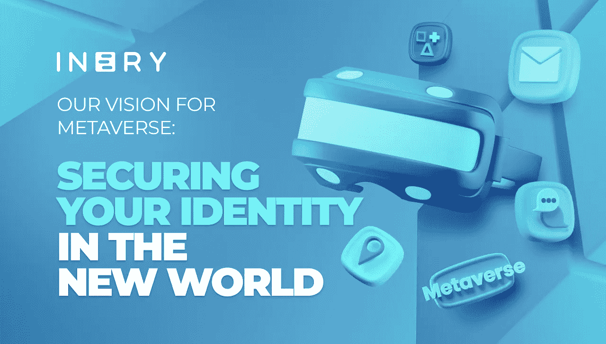

# 在新世界中保护你的身份

> 原文：<https://medium.com/coinmonks/inerys-vision-for-metaverse-securing-your-identity-in-the-new-world-a7a1ee2fa187?source=collection_archive---------30----------------------->

想象一下。你在元宇宙的虚拟办公室里。你正在和你的同事讨论一笔数百万美元的机密交易的细节。第二天，当你们再次见面讨论时，你意识到这位同事不记得会议细节了。

刚刚发生了什么？

# 元宇宙的网络犯罪和攻击

在元宇宙，这被称为身份盗窃。一个攻击者通过窃取您的网络凭证并使用他的头像来窃取他的身份。该事件导致您向攻击者提供商业交易的机密信息。这只是元宇宙的几个网络安全威胁之一。

# AR 的安全风险

增强现实或 AR 将成为元宇宙的支柱之一。虽然它提供了多种可能性，但也带来了与用户隐私相关的元宇宙安全风险。这意味着 AR 收集、存储、共享和管理数据的方式将决定用户信息的网络安全威胁。在集中式基础架构上管理数据最终会使用户数据变得脆弱，容易受到攻击。

# 身份盗窃

与我们之前的例子类似，任何人都可能成为黑客头像或 deepfake 的受害者。用户通过他们的数字化身在元宇宙相互交流。但是如果头像被泄露，这可能会导致社会工程攻击。攻击者可以欺骗人们透露他们的个人信息，包括财务细节或机密数据。

# 数据泄露

当前 web2 迭代的挑战之一是科技公司和社交媒体巨头控制用户数据和他们的参与。如果将同样的基础设施应用于元宇宙，这可能会对用户的数据构成更大的威胁。在元宇宙，可能会有更多的数据可供这些公司利用，科技公司对用户隐私的侵犯将会继续。

元宇宙的基础需要做好，因为它可能对用户身份、隐私和安全构成更大的威胁。

# IneryDB:在元宇宙保护您的身份

IneryDB 通过其分散式数据库管理解决方案为保护数据提供了坚实的基础。它使分散和分布式基础设施能够收集、存储、共享和管理用户在参与元宇宙时产生的数据。

IneryDB 上的数据库管理带来的好处和可能性包括:

*   **自主身份—** IneryDB 为自主身份——由用户自己管理的数字身份提供了可能性，无需依赖任何第三方提供商。这消除了在中央数据库中维护个人信息的需要。
*   互操作性——由于 IneryDB 是一个分散的数据库，任何用户都可以将数据从一个元宇宙平台传送到另一个平台。每次数据都是从数据库而不是孤立的元宇宙平台中提取的。
*   **安全性—** Inery 是第 1 层区块链解决方案，专门解决数据库管理问题。其加密机制确保用户数据的最佳安全性。
*   **隐私** —数据库管理解决方案的基础设施旨在支持所有者控制的数据资产。取代第三方组织，用户将拥有共享私人信息的控制权。

这些可能性可以进一步增加元宇宙流量，提高用户的忠诚度。此外，作为一个平台，它允许元宇宙在客户同意的情况下获取用户信息。

用户可以登录到多个元宇宙平台，并使他们的数据在不同的元宇宙平台之间流动。Inery 有可能改变元宇宙的动态，从特定于平台的方法到不同平台之间资产和内容的互操作性和可移植性。

元宇宙的创新要求随之也要求创新实践。我们不能再继续沿用 web2 时代的做法。Inery 帮助建立一个更安全的元宇宙的基础。

# 关于 Inery

Inery 是有史以来第一个提供分散式数据库管理解决方案的第一层区块链，其愿景是实现新的数据范式。Inery 旨在实现数据的跨链通信、更高的速度和更好的安全性。它专门处理与区块链功能和分布式数据库管理属性集成的数据库管理。

Inery 数据库管理解决方案(IneryDB)为数据库管理提供了一种安全、低成本和不可变的方式，其中私有信息的控制权仍然掌握在用户和企业手中。它为 web3 的未来奠定了基础，通过与其他系统、应用程序和第 1 层网络无缝连接来创造价值。

[网站](https://inery.io/) | [推特](https://twitter.com/IneryBlockchain) | [电报](https://t.me/inery_blockchain) | [电报安](https://t.me/inery_channel) | [LinkedIn](https://www.linkedin.com/company/inery-blockchain/) | [不和](https://discord.com/invite/inery)|[Reddit](https://www.reddit.com/r/Inery/)|[insta gram](https://www.instagram.com/inery_blockchain/)

> 加入 Coinmonks [电报频道](https://t.me/coincodecap)和 [Youtube 频道](https://www.youtube.com/c/coinmonks/videos)了解加密交易和投资

# 另外，阅读

*   [如何在 CoinDCX 上购买柴犬(SHIB)币？](https://coincodecap.com/buy-shiba-coindcx)
*   [CBET 评论](https://coincodecap.com/cbet-casino-review) | [库科恩 vs 比特币基地](https://coincodecap.com/kucoin-vs-coinbase) | [拜比特 vs 比特币基地](https://coincodecap.com/bybit-vs-coinbase)
*   [折叠 App 回顾](https://coincodecap.com/fold-app-review) | [LocalBitcoins 回顾](/coinmonks/localbitcoins-review-6cc001c6ed56) | [Bybit vs 币安](https://coincodecap.com/bybit-binance-moonxbt)
*   [加密保证金交易交易所](/coinmonks/crypto-margin-trading-exchanges-428b1f7ad108) | [赚取比特币](/coinmonks/earn-bitcoin-6e8bd3c592d9) | [Mudrex 投资](https://coincodecap.com/mudrex-invest-review-the-best-way-to-invest-in-crypto)
*   [WazirX vs coin dcx vs bit bns](/coinmonks/wazirx-vs-coindcx-vs-bitbns-149f4f19a2f1)|[block fi vs coin loan vs Nexo](/coinmonks/blockfi-vs-coinloan-vs-nexo-cb624635230d)
*   [比斯勒评论](https://coincodecap.com/bitsler-review)|[WazirX vs coin switch vs coin dcx](https://coincodecap.com/wazirx-vs-coinswitch-vs-coindcx)