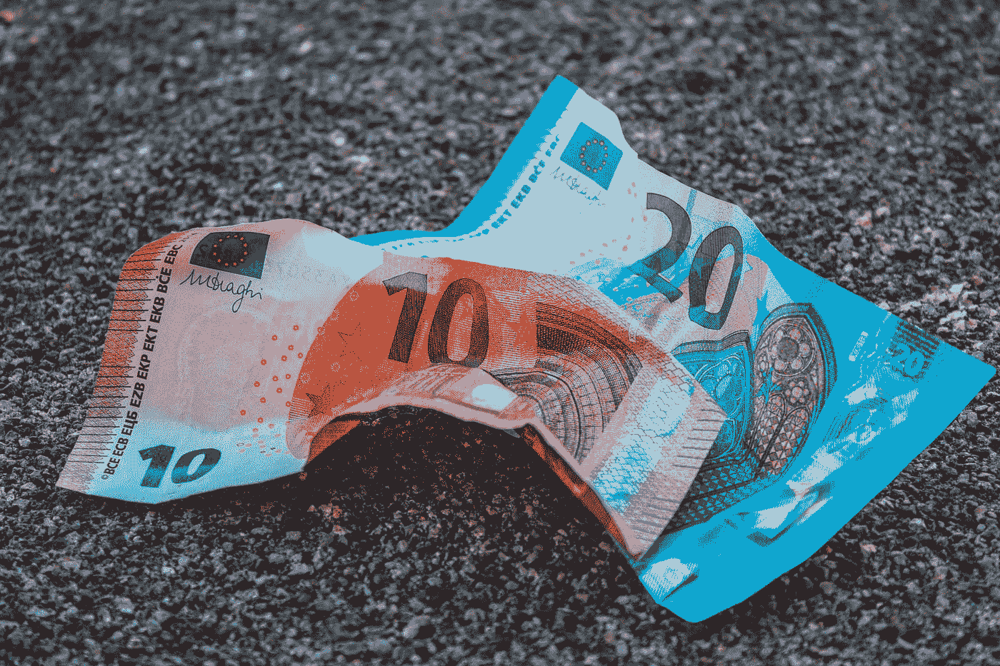
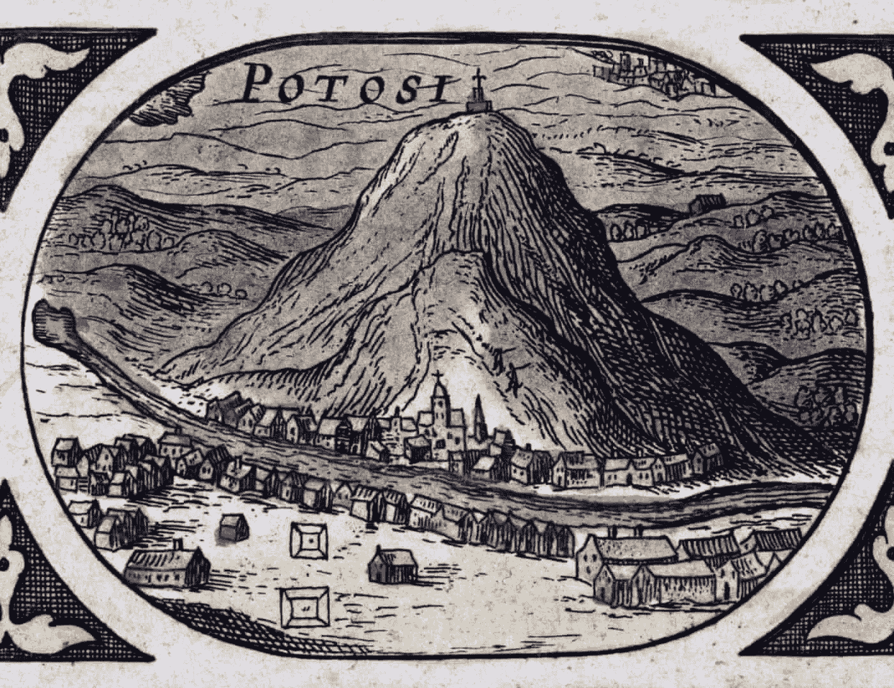

# 通货膨胀——走在历史的车道上

> 原文：<https://medium.com/coinmonks/inflation-a-walk-down-history-lane-9645e246cd7?source=collection_archive---------63----------------------->

Photo by [Imelda](https://unsplash.com/@unleashed_?utm_source=medium&utm_medium=referral) on [Unsplash](https://unsplash.com?utm_source=medium&utm_medium=referral)

通货膨胀是当今世界越来越令人担忧的问题，各国央行、政府、企业和家庭都在努力应对物价指数的天文数字般增长。虽然每个人对这种螺旋上升的性质和原因都有自己的观点，但回过头来阅读尼亚尔·费格森对 16 世纪和 17 世纪欧洲“价格革命”的描述还是很有趣的，在他的 F [世界金融史《货币的崛起](https://www.amazon.com/Ascent-Money-Financial-History-World/dp/0143116177)中有一些详细的描述。

在 16 世纪 40 年代和 17 世纪 40 年代之间，欧洲的食品价格相对于过去 300 年的价格稳定而言急剧上涨。例如，弗格森报告称，在英格兰群岛，生活成本每年上涨 7 倍，即约 2%。以今天的标准来看，这似乎是相当可持续的，但重要的是要理解这是前工业革命时期，大部分人口依赖自给农业。弗格森写道，自然，当时世界的不成熟意味着面包价格的上涨不太受欢迎。

那么，是什么导致了这种螺旋式通胀呢？弗格森将这一现象的根源追溯到西班牙征服者在新大陆发现大量白银。弗格森解释说，中世纪的欧洲在贵金属的可获得性方面受到限制。银的发现改变了这一切，因为每年有 170 吨银从新大陆运到西班牙。

这个增长故事的核心是“鲜为人知的印加村庄”，即今天秘鲁的波托西，它将“在 70 年内成为基督教世界的第四大城市”，并给成千上万的矿工和奴隶带来死亡和财富。这篇[卫报](https://www.theguardian.com/cities/2016/mar/21/story-of-cities-6-potosi-bolivia-peru-inca-first-city-capitalism)的评论出色地捕捉到了这座城市的诞生，并让读者对这座“银山”产生了一种引人入胜的阅读。

Cerro Rico de Potosi or the Rich Mountain of Potosi — Illustration: Dea Picture Library/De Agostini/Getty

这些新发现的财富使西班牙君主政体成为欧洲最富有的国家&在国内资助了新世界的战争，同时为整个欧洲提供了弗格森所描述的“货币刺激”。然而，西班牙人不断挖掘以资助他们的战争，以至于白银相对于其他商品开始贬值，并导致了上文提到的 16 世纪 40 年代至 17 世纪 40 年代的通货膨胀。引用弗格森的话，“西班牙人没有意识到贵金属的价值不是绝对的。钱只值别人愿意给你的钱。货币供应量的增加不会使社会变得更加富裕，只会使垄断货币生产的政府更加富裕。在其他条件相同的情况下，货币扩张只会推高价格”。

当你看到世界各国政府自 2020 年 3 月以来为刺激后 covid 世界的各自经济而采取的巨大货币扩张时，你会发现这与 4 至 5 个世纪前的欧洲非常相似。尽管关于物流瓶颈的论点有一定道理，但不可思议的货币扩张不容忽视。

这个例子中有一个关于稀缺性的非常强烈的信息——这是比特币(BTC)的长期牛市论点激烈宣扬的东西。如果货币短缺，就不会通过货币扩张引起通货膨胀。相反，随着越来越多的财富被有限供给的货币所定义，价格应该会保持稳定甚至下降。当然，这需要货币是无限可分的，这正是数字货币的概念所体现的。话虽如此，但如果美元 BTC 成为一种通胀对冲工具，它最近的价格表现仍有许多不尽人意之处。不是说不会，只是觉得我们还有一段路要走。改天再说吧。

> 免责声明:文章中提出的观点是作者的个人观点，不代表其雇主的观点，也不是财务建议。在投资或使用文中提到的任何产品之前，请做好自己的研究。作者可能会也可能不会投资于任何特定的产品。