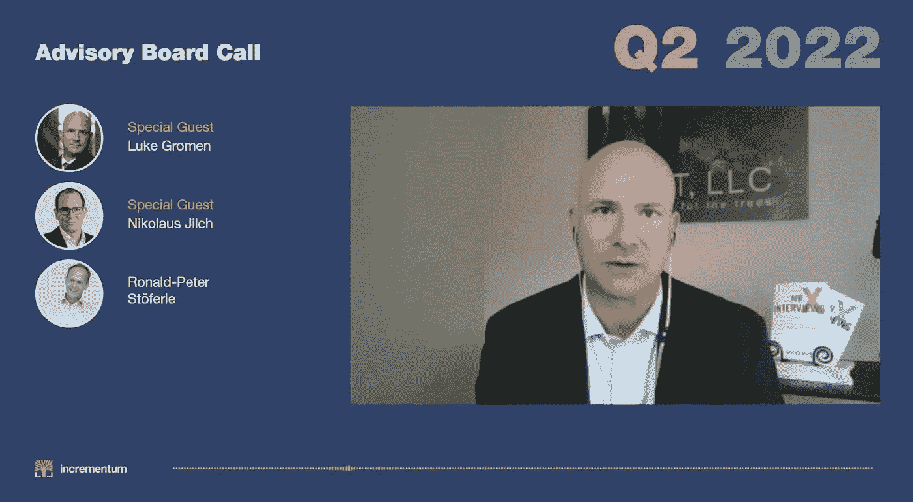

# 通货膨胀，能源战争-卢克·格罗曼访谈

> 原文：<https://medium.com/coinmonks/inflation-energy-war-an-interview-with-luke-gromen-91fadd74bb5d?source=collection_archive---------29----------------------->

[https://www.youtube.com/watch?v=Dc80HgtqNQE&t=3s](https://www.youtube.com/watch?v=Dc80HgtqNQE&t=3s)

距离我们于 2022 年 5 月 24 日发布《我们信任的黄金 报告 2022》仅剩两周时间。我们和卢克·葛罗门一起出席顾问团会议。

本季度的顾问委员会我们要欢迎两位特殊的客人。Luke Gromen 是投资分析公司 Forest for the Trees (FFTT)的创始人兼总裁。他被广泛认为是去美元化的专家之一。我们的第二位嘉宾是 Nikolaus Jilch，他最近开始了他的播客，名为“Was Bitcoin Bringt”(比特币带来了什么)，他在播客中谈到了比特币和相关话题。

在电话中，我们谈到了:美联储将如何应对通胀？美联储有正确的反应吗？加息能解决我们的通胀问题吗？会带来什么附带损害？美元的武器化及其影响今天的滞胀与过去相比，主要的区别是什么？日元及其未来以及乌克兰-俄罗斯冲突的地缘政治影响。

点击观看本次采访[。](https://www.youtube.com/watch?v=Dc80HgtqNQE&t=3s)

在推特上关注我们。

从 [IGWT 商店](https://www.ingoldwetrustreport.shop/)购买。

查看我们的 [Odysee Accoun](https://odysee.com/@InGoldWeTrust:2) t。

还是我们的[隆隆账号](https://rumble.com/user/InGoldWeTrust)。

更多信息[请点击](https://ingoldwetrust.report/?lang=en)。

[订阅](https://ingoldwetrust.report/igwt/?lang=en)或下载往期*金信*报道。

查看我们的投资基金。

这里是我们最新出版物的直接链接。

> 加入 Coinmonks [电报频道](https://t.me/coincodecap)和 [Youtube 频道](https://www.youtube.com/c/coinmonks/videos)了解加密交易和投资

# 另外，阅读

*   [3 商业评论](/coinmonks/3commas-review-an-excellent-crypto-trading-bot-2020-1313a58bec92) | [Pionex 评论](https://coincodecap.com/pionex-review-exchange-with-crypto-trading-bot) | [Coinrule 评论](/coinmonks/coinrule-review-2021-a-beginner-friendly-crypto-trading-bot-daf0504848ba)
*   [莱杰 vs n rave](/coinmonks/ledger-vs-ngrave-zero-7e40f0c1d694)|[莱杰 nano s vs x](/coinmonks/ledger-nano-s-vs-x-battery-hardware-price-storage-59a6663fe3b0) | [币安评论](/coinmonks/binance-review-ee10d3bf3b6e)
*   [Bybit Exchange 审查](/coinmonks/bybit-exchange-review-dbd570019b71) | [Bityard 审查](https://coincodecap.com/bityard-reivew) | [Jet-Bot 审查](https://coincodecap.com/jet-bot-review)
*   [3 commas vs crypto hopper](/coinmonks/3commas-vs-pionex-vs-cryptohopper-best-crypto-bot-6a98d2baa203)|[赚取加密利息](/coinmonks/earn-crypto-interest-b10b810fdda3)
*   最好的比特币[硬件钱包](/coinmonks/hardware-wallets-dfa1211730c6) | [BitBox02 回顾](/coinmonks/bitbox02-review-your-swiss-bitcoin-hardware-wallet-c36c88fff29)
*   [BlockFi vs 摄氏度](/coinmonks/blockfi-vs-celsius-vs-hodlnaut-8a1cc8c26630) | [Hodlnaut 审核](/coinmonks/hodlnaut-review-best-way-to-hodl-is-to-earn-interest-on-your-bitcoin-6658a8c19edf) | [KuCoin 审核](https://coincodecap.com/kucoin-review)