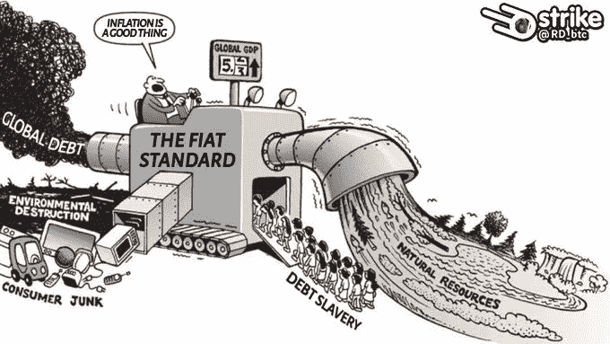
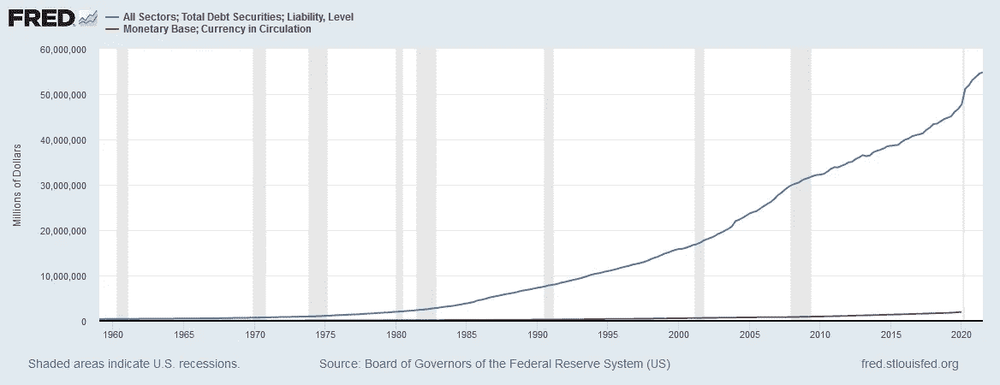
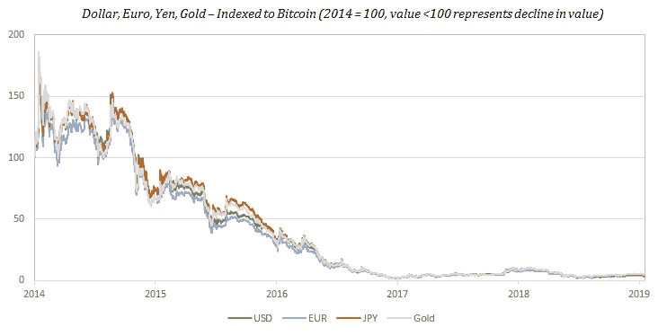
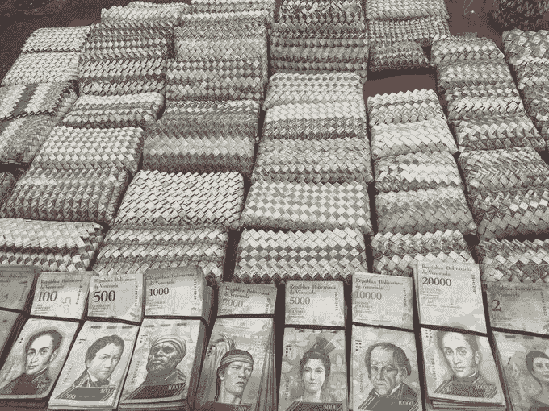
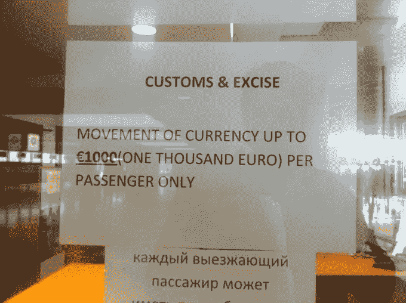
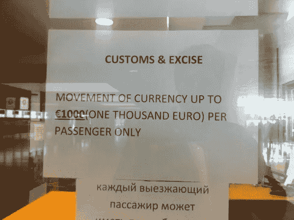

# 通货膨胀是时间贬值第二部分

> 原文：<https://medium.com/coinmonks/inflation-is-time-devaluation-part-2-b2e9051f4d8f?source=collection_archive---------11----------------------->

***“没有比让货币堕落更微妙、更可靠的推翻现有社会基础的手段了。这一过程利用了经济规律中隐藏在破坏一方的所有力量，其方式是百万分之一的人都无法诊断的。”***

*约翰·梅纳德·凯恩斯*

Aggri 珠子是一种由玻璃制成的小型装饰性珠子，在古代东非和西非曾一度被高度重视并作为货币使用了几个世纪。这些珠子很难用当时在非洲使用的玻璃制造技术来生产，因此保持了一定程度的稀缺性，这巩固了它们的货币用途。当欧洲商人在 16 世纪抵达时，他们很快意识到这些珠子对当地人很有价值，并开始在当时拥有更先进玻璃制造技术的欧洲大量生产这些珠子。用实物资产换取假珠子的交易促成了历史上最大的财富转移事件之一，让非洲社会在接下来的几个世纪里陷入瘫痪。这些珠子被大量运往非洲，最终导致了对非洲自然资源缓慢但持续的掠夺，更重要的是时间。阿格里珠后来被戏称为“奴隶珠”，因为新近贫困的非洲人将自己或他人作为奴隶卖给了欧洲人。奴隶珠——历史上被伪造者武器化的众多货币体系之一——在长达几个世纪的跨大西洋奴隶贸易中发挥了重要作用。(1)

纵观历史，货币体系一直受到腐败和操纵的影响，因为政府从未能够抵制住通过增加货币供应量来解决短期政治问题的诱惑。这已经产生了可怕的后果，包括社会道德败坏，战争和奴役。在政府指导下工作的中央银行与商业银行一起垄断货币发行，从而成为事实上的权力中心。这种力量，再加上几乎为零的货币发行成本，以及可以创造的货币数量的无限性，**保证了随着时间的推移，流通中的现有货币的购买力会被消灭。因此，历史上最“血腥”的世纪也是央行世纪也就不足为奇了。**

在[第一部分](https://kudzai.substack.com/p/inflation-the-ultimate-time-thief?r=3bc8b&utm_campaign=post&utm_medium=web)中，我们探讨了导致价格上涨(即通货膨胀)的货币供应扩张与时间盗窃之间的联系。理解这个环节**非常重要**，因为没有准确理解这个问题，你就不可能避免由此产生的后果。在第二部分，我们将进一步探讨这一观点，特别强调比特币的货币属性。

***“这个国家的人民不了解我们的银行和货币体系，这已经足够了，因为如果他们了解，我相信在明天早上之前就会有一场革命。”***

*亨利福特*

在他的《共产党宣言》(1848)中，卡尔·马克思呼吁引入货币社会主义的“措施”。马克思的第五项措施指出:“通过拥有国家资本和独家垄断权的国家银行，将信贷集中在国家手中。”(2)几个世纪后，马克思的梦想实现了，因为世界现在运行在法定货币上，而法定货币是由他上面提到的中央银行控制的。在法定货币体系中，货币是通过信用扩张创造的，其价值**不是来自央行持有的黄金。法定货币是债务支持的货币。例如，在其他因素保持不变的情况下，美元的价值在很大程度上是由于美元相对于美元计价的债务的稀缺性，即经济中的债务必须多于流通中的美元。未来对美元的需求是由债务创造的，因为人们需要美元来偿还美元计价的债务。**

(3)

债务创造了需求美元的最终动机，因为流通中的每一美元都代表着对现实世界资产的要求权。只要美元相对于未偿债务的数量是稀缺的，美元就保持相对稳定。这就是法定货币体系的运作方式；激励信用创造，你同时创造了基础货币的未来需求来源。为了维持系统中的债务量，中央银行必须稳步增加货币供应，否则信贷系统将会崩溃。随着时间的推移，增加货币供应还会导致货币逐渐贬值。这都是设计好的。多印钞票；制造更多的债务。负债太多？印更多的钱，等等。说白了，这个系统是设计来让你永远负债的。

稀缺性可能是货币资产最重要的特征，因为它确保商品和服务的价格不会持续扭曲；和任何货币资产一样，它也是支撑法定货币的货币属性之一。法定稀缺性是相对于系统中的信用量而言的；比特币的稀缺性是绝对的，即预先确定的 2100 万的最大供应量。菲亚特系统是基于信任的；比特币是不可信的。法定货币供应由中央银行控制，而比特币的供应由市场参与者的共识决定。“没有统治者的规则”的真实生活工作例子。法定货币的供应将永远是其信用体系的衍生品，而比特币的供应则完全脱离了信用的功能。此外，创造美元的成本几乎为零，而“挖掘”比特币的成本是有形的、可量化的。(4)比特币的绝对稀缺性使其成为最理想的通胀避险工具。这是迄今为止让你免受央行马克思主义负面影响的最佳工具。

就像你不能训练坏的饮食一样，你也不能训练坏的货币。低于实际通货膨胀率的年薪增长只是踩水的一种形式。10%的工资增长对 20%的通货膨胀率有什么好处？典型的共同基金(又名单位信托)；一般来说，指数基金、ETF 或“多样化股票投资组合”也不能提供多少保护，因为它们是法定系统的衍生品。此外，这些产品通常经过优化，以超越或跟踪市场表现(其中大多数都未能做到)，而不是超越通胀。比特币每年 160%的平均投资回报率远远超过典型的通货膨胀率；同时跑赢大多数金融资产。下图进一步强调了不同货币和黄金在一段时间内以比特币衡量的价值。一张图确实胜过千言万语。

(5)

***“通货膨胀，这个词在任何地方，尤其是在这个国家，都经常使用，意思是增加流通中的货币和钞票的数量，以及受到检查的银行存款的数量。但是今天人们用“通货膨胀”这个词来指通货膨胀不可避免的后果，即所有价格和工资率上升的趋势。这种令人遗憾的混乱的结果是，没有留下任何术语来表明价格和工资上涨的原因。再也没有任何词可以用来表示迄今为止被称为通货膨胀的现象了。”***

路德维希·冯·米塞斯

在战争期间，一些国家试图通过制造大量假币来伤害他们的敌人，以引发恶性通货膨胀。纳粹试图用这种策略对付英国人；日本人也试验了这种经济颠覆的策略。最近，在萨达姆·侯赛因倒台后，伊朗也对伊拉克采取了这种策略，以破坏伊拉克的重建努力。根据美国陆军心理战专家 Spc 的说法。大卫·拉隆德，*“将假币引入一个经济体可以被认为是一场经济战。它会破坏经济稳定，抬高价格，降低货币价值。”(6)* 制假和印钱是一个硬币的两面。更大的问题是，当央行印更多的钱，慢慢地让货币贬值时，这难道不是一种经济战吗？价格上涨只是“意外后果”的影响吗？我想知道。

通货膨胀不是一种“暂时的”无害现象；是一个国家的货币贬值让“所有人”变得更穷。这也是发动经济战争和财富再分配的工具。通胀的最大危险不在于随后商品和服务价格的上涨，而在于它摧毁财富创造的能力。价格上涨只是一个信号，表明新的货币进入了经济，而没有增加生产来吸收额外的货币供应。如果货币是一种交易人类时间的工具，那么由于货币扩张而导致的价值损失也是货币所代表的人类时间的贬值。

比特币通过恒定且递减的“硬币”发行率规避了这一现象。这种发行速度独立于市场力量，但通过算法编程到比特币协议中。每周 7 天、每天 24 小时，每 10 分钟就有一个新的比特币区块被开采出来，每四年每个区块可开采的比特币数量减少 50%。在 2020 年“减半”后，每 10 分钟每块大约开采 6.25 个比特币，没有失败，也没有中央银行的协调；不管比特币价格如何，也不管中国是否第无数次禁止比特币。这一比率不受中央计划者的突发奇想和意见的影响。

这一切对你来说意味着什么？简而言之，这意味着没有任何一个实体可以将其意志强加于网络，任意增加货币供应量。随着时间的推移，你的比特币(和你的时间)会保值。这与随着时间的推移破坏价值的菲亚特系统是对立的。是的，比特币的价格在中短期内是波动的，但对于一个处于婴儿期的货币网络来说，价格是一个误导性的信号，这个货币网络正以估计价值 250 万亿美元的金融资产缓慢地给整个全球经济重新定价。正如 Satoshi 所说的，“如果它流行起来，买一些可能是有意义的。如果有足够多的人以同样的方式思考，这将成为一个自我实现的预言。”

***“传统货币的根本问题在于它运转所需的所有信任。必须相信央行不会让货币贬值，但法定货币的历史充满了对这种信任的违背。我们必须信任银行持有我们的钱，并以电子方式转移，但它们在信贷泡沫的浪潮中放贷，几乎没有一部分储备。”***

*中本聪*

想象一下，有一天醒来，你银行账户里所有的钱都不见了。你将如何面对你身上唯一的钱就是你所剩下的一切这一事实？你将如何生存？虽然这听起来像是反乌托邦电影中的场景，但最近在塞浦路斯就发生了这样的例子。2013 年，塞浦路斯经历了一场金融危机，其主要原因是当地银行对过度杠杆化的房地产市场和希腊债务危机的敞口。长话短说，该国需要 170 亿欧元的救助。国际货币基金组织和欧洲中央银行同意出资最多 100 亿欧元，条件是塞浦路斯政府必须支付欠该国债权人的 60 亿欧元。

政府决定通过没收塞浦路斯银行的大量存款来筹集资金。账户余额在 10 万€及以上的储户，其 60%的钱未经他们同意就被没收了。(6)储蓄者、养老金领取者和小企业(即中产阶级)受这种“一次性税收”的冲击最大。塞浦路斯政府将责任推给了其公民，而大多数公民从一开始就不是这场危机的策划者。作为避免银行挤兑的措施，银行宣布放假 12 天。全国的自动提款机都干涸了。当这些银行最终重新开业时，塞浦路斯出台了资本管制措施，规定每日最高取款限额为 300€，游客从塞浦路斯携带的现金不得超过 1000€。

(5)

如果这些储户把钱存在比特币中，上述“一次性税收”就不可能实施。首先，如果没有你钱包的私人密钥(把它当成一个密码)，没人能抓住或没收你的比特币。它们只能由私有密钥的持有者自愿地传送；不是政府、银行或科技公司。这使得比特币的审查在设计上具有抵抗性。其次，由于其分散的性质，没有一个金融中介拥有批准或停止比特币网络交易的权力。这创造了一个分布式的货币和支付系统，它同时是安全的、开放的和全球性的。像对塞浦路斯实施的资本管制或随后的“银行假日”不会以任何方式阻止或限制比特币交易。价值可以转让给全球任何人，无需**许可**，24/7，365。

你要问自己的问题是:如果今天类似的事件发生在你的国家，你会采取保护措施吗？你还能养活你的家人或计划未来吗？".当你第二次审视你的财务和投资时，它们是否“合法地”或以其他方式免于被没收？大多数人可能认为这不太可能，但这在一个曾被誉为“避税天堂”的欧盟国家是有先例的。精神食粮。

***“一个发行公共货币的私人中央银行比一支常备军对人民自由的威胁更大。我们不能让我们的统治者让我们背上永久的债务。没有哪一代人有权承担超过其自身存在期间所能清偿的债务。”***

托马斯·杰斐逊

在这篇简短的文章中，我们仅仅触及了通货膨胀的危险和一些主要原因的表面，但是有一点是肯定的；法定货币系统旨在通过通货膨胀窃取你的财富和时间，通过债务窃取你的自由。对菲亚特系统的咆哮最有利于提高意识，但你今天能做的最重要的事情是在你的控制范围内如何分配你的资金。选择是把你的钱放在一个不可触及的和升值的资产中，还是放在同一个被设计来逐渐吸走你的财富和时间的制度化系统中。选择权在你。比特币不仅仅是一个“投资机会”，它还是一艘金融救生船。这是强加的货币体系和平等机会的另一种选择。

**致谢**

1.罗伯特·布里德洛夫。金钱的主人和奴隶。*中等。*【在线】【引用日期:2022 年 1 月 22 日。】[https://breed love 22 . medium . com/masters-and-slaves-of-money-255 ECC 93404 f。](https://breedlove22.medium.com/masters-and-slaves-of-money-255ecc93404f.)

2.**波利特，索斯坦。**为什么马克思热爱中央银行。*米塞斯研究所。*【在线】【引用日期:2022 年 1 月 23 日。】[https://mises.org/wire/why-marx-loved-central-banks.](https://mises.org/wire/why-marx-loved-central-banks.)

3.**美国美联储系统理事会。**货币基础；流通中的货币。*弗雷德，圣路易斯美联储银行。*【在线】【引用日期:2022 年 1 月 23 日。】[https://fred.stlouisfed.org/series/MBCURRCIR.](https://fred.stlouisfed.org/series/MBCURRCIR.)

4.**刘易斯·帕克。**比特币不是无凭无据的。*被解放的资本。*【在线】【引用日期:2022 年 1 月 23 日。][https://unchained-capital . com/blog/bit coin-is-not-backed-by-nothing/。](https://unchained-capital.com/blog/bitcoin-is-not-backed-by-nothing/.)

5.— .比特币取代了所有其他货币。*被解放的资本。*【在线】【引用日期:2022 年 1 月 23 日。][https://unchained . com/blog/bit coin-obsoletes-all-other-money/。](https://unchained.com/blog/bitcoin-obsoletes-all-other-money/.)

6.美国陆军。伊拉克警方对抗假币。美国陆军。【在线】【引用日期:2022 年 1 月 24 日。】[https://www . army . mil/article/39370/Iraqi _ police _ 对峙 _ 打假。](https://www.army.mil/article/39370/iraqi_police_confront_counterfeiting.)

7.塞浦路斯最大银行的客户因 60%的储蓄被抢而感到刺痛。*独立。*【在线】【引用日期:2022 年 1 月 22 日。][https://www . independent . co . uk/news/world/Europe/customers-at-Cyprus-big-bank-sting-by-60-raid-on-savings-8555078 . html](https://www.independent.co.uk/news/world/europe/customers-at-cyprus-biggest-bank-stung-by-60-raid-on-savings-8555078.html.)

8.**伊斯兰教，费萨尔。在拉纳卡机场的标志限制所有货币出口到€1000。正在进行一些搜索。*推特。*【在线】【引用日期:2022 年 1 月 23 日。]**

[Faisal Islam @faisalislam](https://twitter.com/faisalislam/status/317256598005362688?ref_src=twsrc%5Etfw%7Ctwcamp%5Etweetembed%7Ctwterm%5E317256598005362688%7Ctwgr%5Ehb_1_8%7Ctwcon%5Es1_&ref_url=https%3A%2F%2Fwww.theguardian.com%2Fbusiness%2F2013%2Fmar%2F28%2Feurozone-crisis-cyprus.)

[在拉纳卡机场签字限制所有货币出口到€1000。正在进行一些搜索。](https://twitter.com/faisalislam/status/317256598005362688?ref_src=twsrc%5Etfw%7Ctwcamp%5Etweetembed%7Ctwterm%5E317256598005362688%7Ctwgr%5Ehb_1_8%7Ctwcon%5Es1_&ref_url=https%3A%2F%2Fwww.theguardian.com%2Fbusiness%2F2013%2Fmar%2F28%2Feurozone-crisis-cyprus.)

【2013 年 3 月 28 日

31 条转发

> 加入 Coinmonks [电报频道](https://t.me/coincodecap)和 [Youtube 频道](https://www.youtube.com/c/coinmonks/videos)了解加密交易和投资

# 另外，阅读

*   [Bookmap 评论](https://coincodecap.com/bookmap-review-2021-best-trading-software) | [美国 5 大最佳加密交易所](https://coincodecap.com/crypto-exchange-usa)
*   最佳加密[硬件钱包](/coinmonks/hardware-wallets-dfa1211730c6) | [Bitbns 评论](/coinmonks/bitbns-review-38256a07e161)
*   [新加坡十大最佳加密交易所](https://coincodecap.com/crypto-exchange-in-singapore) | [购买 AXS](https://coincodecap.com/buy-axs-token)
*   [红狗赌场评论](https://coincodecap.com/red-dog-casino-review) | [Swyftx 评论](https://coincodecap.com/swyftx-review) | [CoinGate 评论](https://coincodecap.com/coingate-review)
*   [投资印度的最佳密码](https://coincodecap.com/best-crypto-to-invest-in-india-in-2021)|[WazirX P2P](https://coincodecap.com/wazirx-p2p)|[Hi Dollar Review](https://coincodecap.com/hi-dollar-review)
*   [加拿大最佳加密交易机器人](https://coincodecap.com/5-best-crypto-trading-bots-in-canada) | [KuCoin 评论](https://coincodecap.com/kucoin-review)