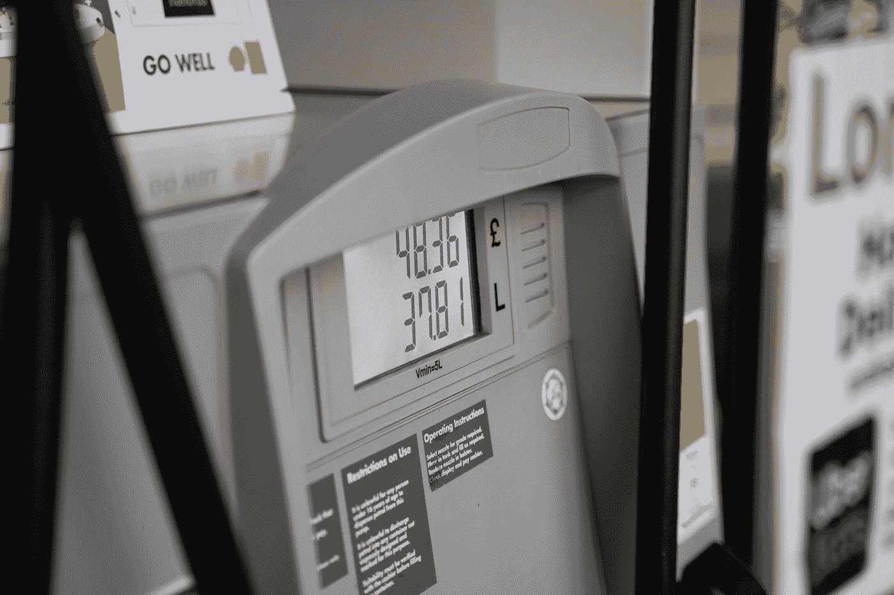

# 通胀起飞，战鼓回响

> 原文：<https://medium.com/coinmonks/inflation-takes-off-war-drums-echo-5d984cf517ed?source=collection_archive---------53----------------------->

## 购买比特币和其他资产来抵御即将到来的风暴

Photo by [Krzysztof Hepner](https://unsplash.com/@nsx_2000?utm_source=medium&utm_medium=referral) on [Unsplash](https://unsplash.com?utm_source=medium&utm_medium=referral)

我在加州的一个朋友在她的 FB feed 上贴了一张当地汽油价格的图片。这些天她为无铅汽油支付了将近 6 美元！ *Ay caramba* ！在我住的地方，食品杂货更贵，尽管由于我们的供应链问题，许多商品现在都缺货。