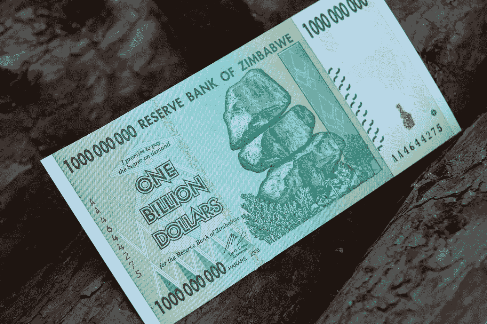

# 通货膨胀——普通人的噩梦

> 原文：<https://medium.com/coinmonks/inflation-the-common-mans-nightmare-50873cbf32ba?source=collection_archive---------38----------------------->

source: [Rob](https://unsplash.com/@rrrob_)

## 太晚了，太晚了会哭吗？

如果你不知道，自从尼克松在 20 世纪 70 年代取消了黄金对美元的支持以来，我们一直处于通货膨胀时代。这次唯一的不同是，财富差距比以往任何时候都要大得多，债务数额高得离谱，甚至连中产阶级也无法逃脱似乎是一种…