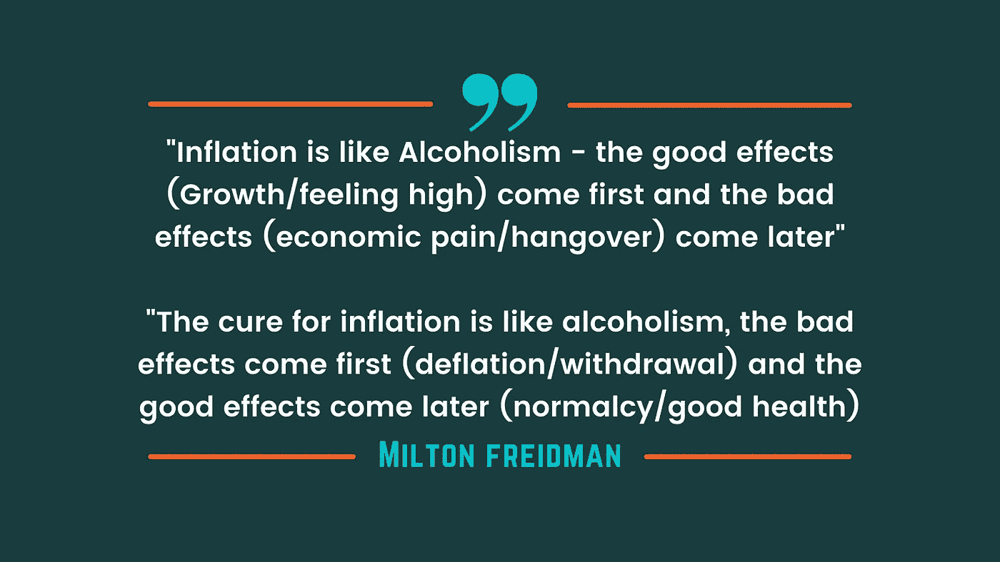
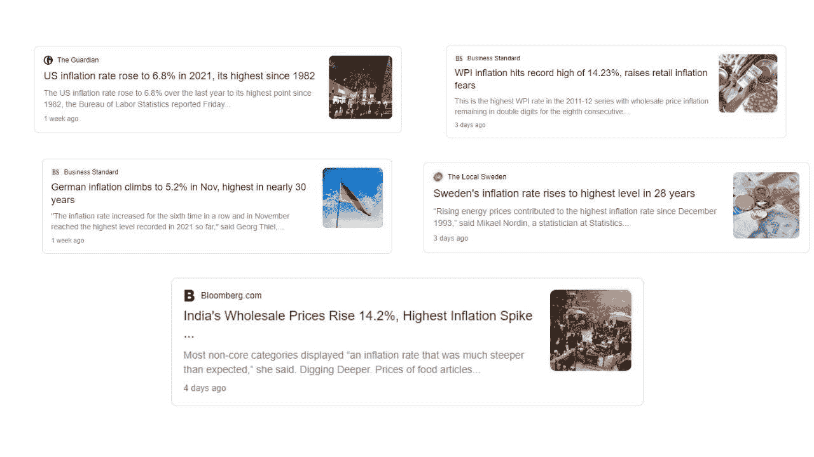
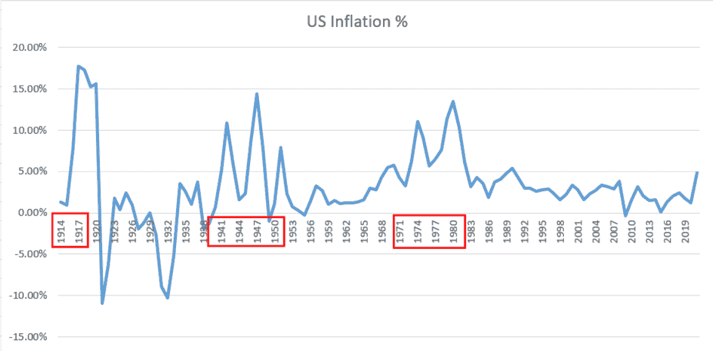
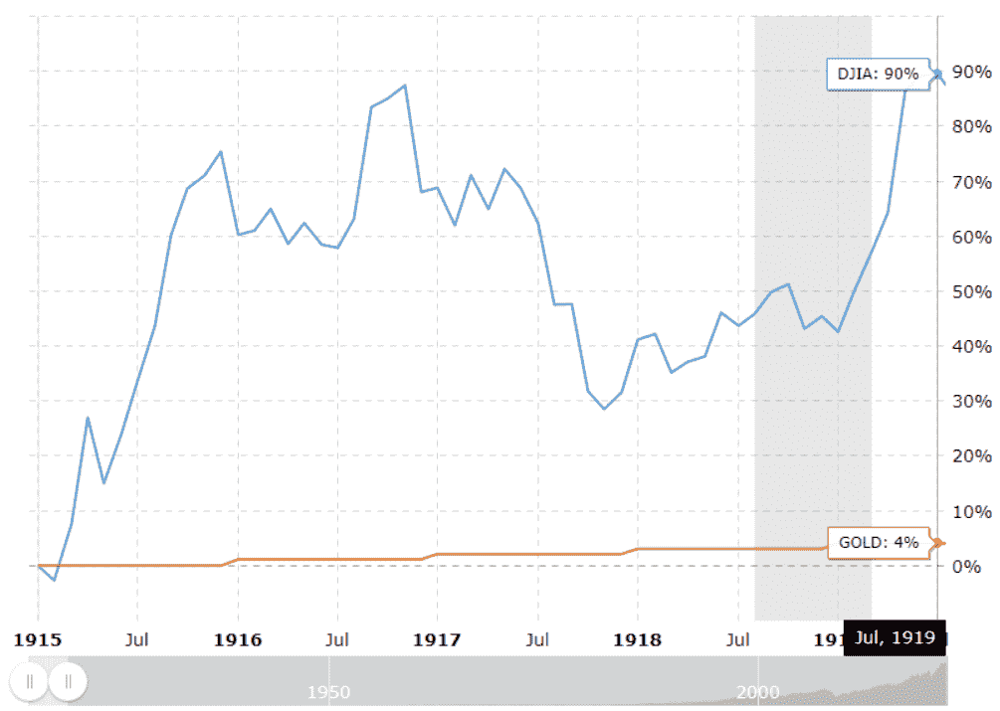
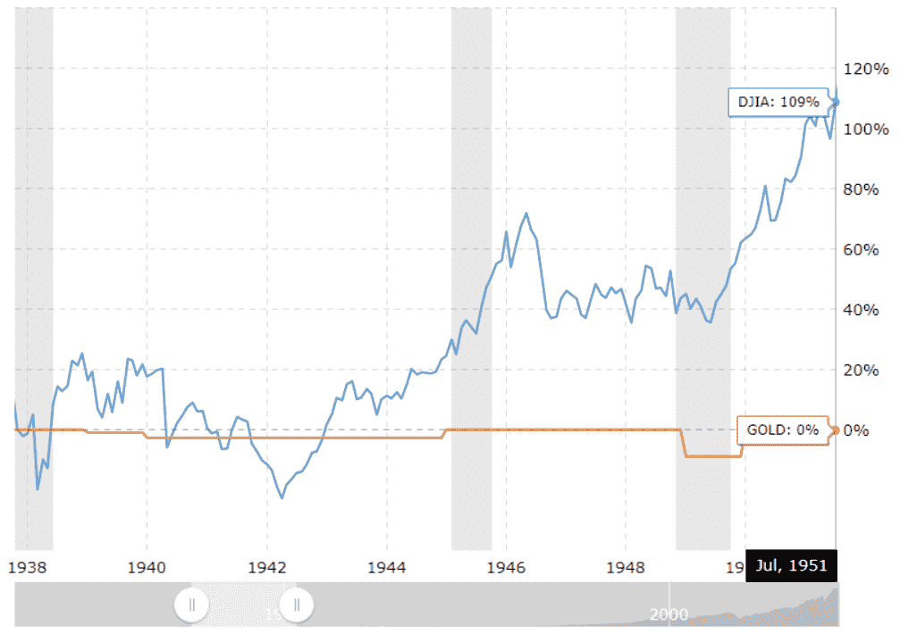
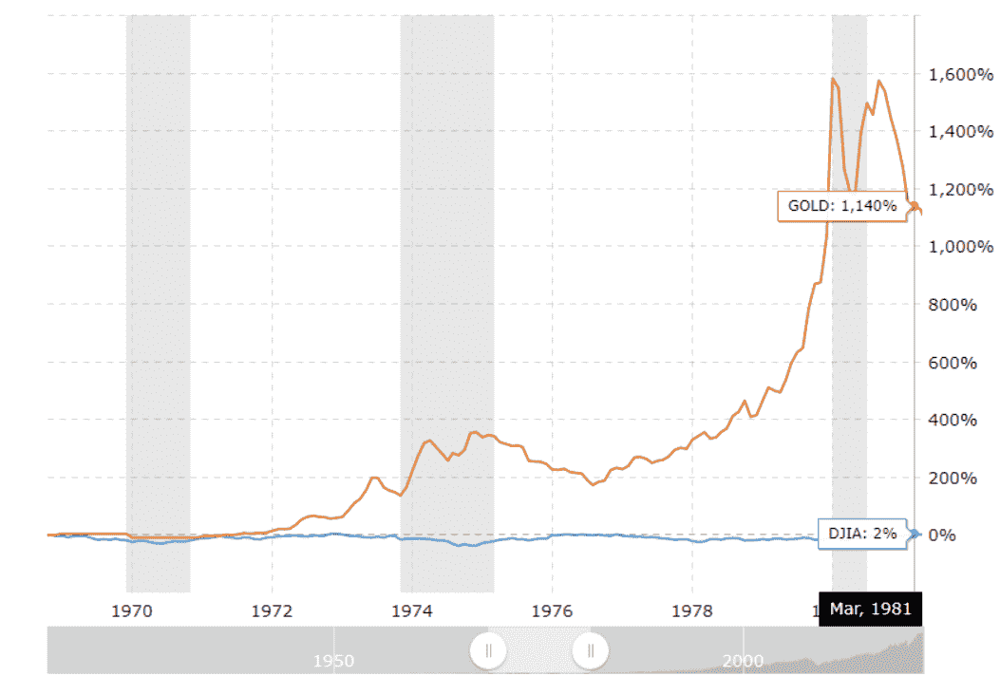
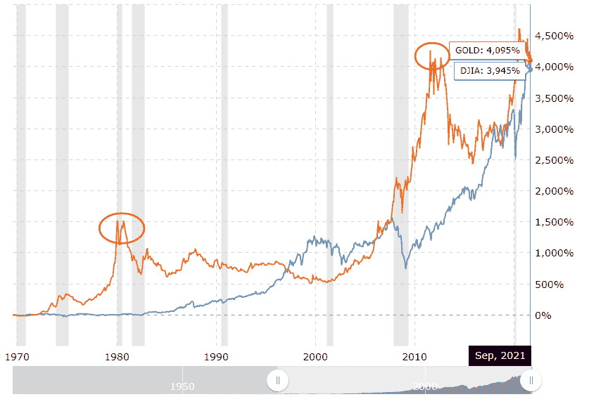

# 通胀海啸来了！你的救生筏准备好了吗？？

> 原文：<https://medium.com/coinmonks/inflation-tsunami-is-coming-is-your-life-raft-ready-39923cb19ffe?source=collection_archive---------21----------------------->

首先，让我为点击诱饵“y”标题道歉——责怪我们的注意力广度和我们的媒体公司训练我们的大脑只注意最不祥的标题。但是情况绝对是我们不能忽视的！因此有了这个帖子。

通货膨胀是一个经济体面临的最不祥的疾病。米尔顿·弗里德曼教授很好地总结了通货膨胀的影响。这篇文章的目的不是谈论通货膨胀的负面影响，而是回顾历史，看看不同的资产在通货膨胀的环境中表现如何。

如果你想要 TL/DR 版本——你可以参考这个 twitter 帖子，它在 280 个字的范围内解释了它！！

# 高通胀——一个严重的问题

似乎疫情还不够，后疫情世界一直被高通胀数字所困扰。在过去的两个季度里，许多国家都创下了通货膨胀的新高。虽然我不会深究为什么会发生通货膨胀，它是否是邪恶的，这篇文章的重点是不同的资产类别在过去的高通胀时期表现如何！此处提供的所有数据都来自美国市场！

> 历史不会重复，它当然会押韵。

# 过去的高通胀时期

美国有三个明显的长期高通胀时期(高于 7%)。

1.  第一次世界大战和第二次世界大战期间(1914 年至 1917 年和 1941 年至 1951 年)的前两个高通胀时期
2.  下一个时期是在尼克松冲击之后的 70 年代(法定美元的诞生)

# 资产绩效— 1914 年至 1917 年

第一次世界大战期间，股票指数(以 DJI 衡量)比黄金高出 86%。美国直到第一次世界大战后期才参与其中，但肯定从战争带来的经济增长中获益。

# 资产绩效— 1941 年至 1951 年

通货膨胀从 1941 年初开始增加，但是股票市场只是在 1944 年之后才开始增加(在盟军胜利确定之后)。资产表现与一战非常相似——股票表现超过黄金 100%。

# 资产绩效— 1971 年至 1980 年

这一时期与前两个时期明显不同，首先，70 年代的通货膨胀没有引发世界大战(感谢上帝)。第二，直到 1970 年，美元一直由黄金支撑，直到尼克松废除了[布雷顿森林体系](https://en.wikipedia.org/wiki/Bretton_Woods_system)，诞生了法定货币并使美元脱离金本位。

与其他高通胀时期不同，黄金的表现超过股票 1140%(约 12 倍增长)。在之前的高通胀时代，黄金的表现比股票高出 10 倍。

# 为什么黄金在第三次高通胀时期跑赢大盘(可能的原因)

**硬通货超过法定货币:【1970 年后，人们凭直觉意识到，与美元相比，黄金是更好的价值储存手段，因为黄金更硬，与美元相比，黄金的供应通胀有限，而美元的供应通胀无限，而且没有任何支撑。**

虽然我们认为储蓄黄金对我们(印度人)来说是很自然的事情，但我认为这更像是最近 50 年的现象。只要货币是由黄金支持的，人们就没有动力将财富储存在黄金中，因为货币同时服务于价值储存和交换媒介的目的。在 70 年代我们转向法定货币后，这种情况发生了变化。

在这一时期，黄金被确立为对冲通货膨胀的工具。自那以后，黄金一直表现出色。在过去的 51 年里，黄金的表现与 DJI 并驾齐驱。

# 救生筏在哪里？

未来十年，我们极有可能进入高通胀环境。降低通货膨胀的教科书方法是提高利率——但是中央银行将不得不三思，因为美国正坐在堆积如山的债务上。20 世纪 70 年代，总债务占 GDP 的比例是 30%，而现在是 130%。为了偿还债务——美国政府和美联储将不得不继续提高债务上限和降低利率，因为提高利率和刺激经济的其他选择似乎很遥远。

有了所有这些数据点，我相信硬资产在未来十年将会像 70 年代一样表现出色。什么是硬资产——任何供给不能随着需求的增加而改变的资产。一些硬资产是房地产、黄金、比特币等。

我个人认为，比特币将是应对通胀海啸的最有效的木筏，因为它具有以下特性:1)固定供应；2)不可变账本；3)分散账本；4)不断改进的技术。不管你选择哪种木筏，选择一个很重要，因为海啸肯定要来了。

你认为应对通货膨胀的更好方法是什么——请在下面的评论中告诉我！

***免责声明*** *:所有数据均来自公开来源。只有 2 个资产类别用于比较(房地产数据也可用于混合)。这些都不是投资建议——拜托，DYOR。*

> 加入 Coinmonks [电报频道](https://t.me/coincodecap)和 [Youtube 频道](https://www.youtube.com/c/coinmonks/videos)了解加密交易和投资

# 另外，阅读

*   [my constant Review](https://coincodecap.com/myconstant-review)|[8 款最佳摇摆交易机器人](https://coincodecap.com/best-swing-trading-bots)
*   [Godex.io 审核](/coinmonks/godex-io-review-7366086519fb) | [邀请审核](/coinmonks/invity-review-70f3030c0502) | [BitForex 审核](https://coincodecap.com/bitforex-review)
*   [10 本关于加密的最佳书籍](https://coincodecap.com/best-crypto-books) | [英国 5 个最佳加密机器人](https://coincodecap.com/uk-trading-bots)
*   [ko only Review](https://coincodecap.com/koinly-review)|[Binaryx Review](https://coincodecap.com/binaryx-review)|[Hodlnaut vs CakeDefi](https://coincodecap.com/hodlnaut-vs-cakedefi-vs-celsius)
*   [MoonXBT vs Bybit vs 币安](https://coincodecap.com/bybit-binance-moonxbt) | [硬件钱包](/coinmonks/hardware-wallets-dfa1211730c6)