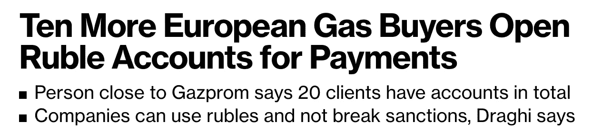

# 即使在 QT 和石油危机之后，通货膨胀仍将继续

> 原文：<https://medium.com/coinmonks/inflation-will-continue-even-after-the-qt-and-the-oil-crisis-deglobalization-ccb50277426f?source=collection_archive---------13----------------------->

这是最好的时代，这是最坏的时代，这是智慧的时代，这是愚蠢的时代，这是信仰的时代，这是怀疑的时代，这是光明的季节，这是黑暗的季节，这是希望的春天，这是绝望的冬天，我们面前拥有一切，我们面前一无所有，我们都直接走向天堂，我们都直接走向另一条路…

这是查尔斯·狄更斯小说的第一段。无论是在法国大革命时期还是今天，人们似乎都没有太多不同的想法。人类总是向前发展的。所以今天是历史上最繁荣的一天。但是人们仍然在受苦，在悲伤，在挨打，在战斗。我们看到这一点，说历史在重演。

2022 年也不例外。俄罗斯战争预示着世界经济体系的重塑。世界既团结又分裂的全球经济已经存在了几十年。然而，现在，孤立主义和种族隔离的运动正在慢慢兴起。F

这是一个去全球化的故事。

​1.自由贸易经济体系

故事从 2001 年 11 月中国加入世贸组织开始。这是开创自由贸易经济体系的重大事件。中国巨大的市场和廉价的劳动力加入了全球经济，世界范围内开始了分工。整个经济受益于中国廉价的制造成本。

美国和欧洲等发达国家专注于高附加值产业，如科技和第三产业，而中国专注于通过廉价劳动力为他们生产的二级制造业。

自由贸易经济体系不仅限于中国。美国和欧盟等发达国家专注于高附加值的第三产业，韩国和日本专注于半导体等高科技第二产业，中国专注于基于廉价劳动力的制造业，俄罗斯和中东和北非地区专注于能源生产。因此，世界已经为共同发展设定了自己的角色。这是过去 20 年高增长时代背后的最大驱动力。

由于规模经济、劳动分工和对比较优势的利用，这种体系提高了生产率。这是过去 20 年高增长时代背后的最大驱动力，它给通胀带来了下行压力。因此，世界在很长一段时间内保持了前所未有的低利率和 QE 立场。

然而，二十年过去了，这个自由贸易经济体系即将崩溃。我们称之为“去全球化”。

2.去全球化——自由贸易经济体系的崩溃。

去全球化指的是不同国家之间相互依赖和融合减少的过程。冷战期间，以美国为首的资本主义国家组成了一个集团，以苏联为代表的共产主义国家组成了另一个集团。今天的情况很相似:美国和欧洲是一个团队，中国和俄罗斯是他们的对手。

事实上，这是一场长期以来一直在不知不觉中进行的运动。从 21 世纪开始，中国经济迅速扩张，相反，美国经济在克林顿政府之后达到顶峰，并呈温和下降趋势，这是美国的全盛时期。随着两者之间的差距逐渐缩小，中国现在正试图挑战美国的霸权。这导致他们之间的紧张关系升级。这给美国设计、中国生产的自由贸易经济体系制造了一种不安感。

GDP of the US and China from 1990 to 2018\. As shown on the diagram, the gap is gradually narrowing

然后，乌克兰的爆发使这种焦虑成为必然。

2 月，俄罗斯入侵乌克兰。这震惊了整个世界，因为欧洲在二战后 70 年没有枪声。这些反人类的行为带来了情绪激动和悲伤。然而，战争造成的实际损害是以一种更间接、更微妙的方式带来的——供应链问题，以及随之而来的通货膨胀。欧洲的能源危机就是最好的例子。欧洲严重依赖俄罗斯的石油和天然气(以及食品供应)。然而，这次他们宣布终止从俄罗斯进口能源实施制裁。结果，作为交换，整个欧元区正在经历极度的通货膨胀(今年五月德国记录了 8%的通货膨胀率。情况并不比美国好多少)。最终，欧洲放弃了最初的计划，重新开始用卢布从俄罗斯进口能源。

这一事件影射了自由贸易经济体系的崩溃。这场战争破坏了当前经济体系的可信度，表明它可能会因一些政治冲突而崩溃。这导致了西方将他们的生产线内部化到他们自己的土地上的运动，甚至承担了生产成本的上升。

我可以举出无数这种现象的例子。拜登最近访问了南韩和台湾，以确保半导体供应链的安全，他承诺给三星和 TSMC 大幅减税，让他们的代工工厂回家。

此外，尽管存在污染问题，特朗普还是支持了页岩气行业，以实现能源独立于中东。同样的事情正在欧洲发生。阿迪达斯撤出了中国，将工厂迁址。此外，欧洲最近缓和了他们不妥协的环保政策。他们曾经拒绝核电厂，但现在正重新投资于该行业。这是为了减轻它们对外部能源进口的过度依赖。

 [## 随着普京威胁核灾难，欧洲学会再次拥抱核能

### 为了应对气候变化，欧洲已经在考虑发展核能。乌克兰战争可能会加速…

time.com](https://time.com/6169164/ukraine-nuclear-energy-europe/) 

这种孤立主义和去全球化的趋势可以在另一边看到。过去十年，俄罗斯和中国一直在不断减持美国国债。

[https://www.globaltimes.cn/page/202205/1265887.shtml](https://www.globaltimes.cn/page/202205/1265887.shtml)

此外，Xi 和普京肯定在迅速制裁后敏锐地感觉到，在对美国的单一威胁中，他们的外汇储备将是一张纸。因此，中国和俄罗斯的去美元化行动可能会加速。这也有很多证据。例如，中国和俄罗斯正在开发一个新的交易系统来取代 SWIFT。此外，斯里兰卡最近的暂停明确显示了中国在“一带一路”倡议背后的意图。表面上，他们提出了安全问题，但背后是一个公开的秘密，即他们反对美元霸权，并用他们赚来的美元保护实际资产，而不是通过回购他们的国债将它归还给美国。

这预示着通货紧缩时代的结束。正当化又在颠覆实际利益，政治又在颠覆冷战时代后的经济。各国更倾向于牺牲劳动分工和自由贸易的成果来实现自给自足，而不是冒着因政治冲突而导致供应短缺的风险。这当然会对通货膨胀产生向上的驱动力。

我解释这一大趋势的原因是为了强调世界经济正在发生根本性的变化。许多人认为通货膨胀是由于俄罗斯入侵，美联储的 QE 计划，以及上海封锁后的物流瓶颈。那是真的，但只是一部分。即使战争结束，鲍威尔吸收了流动性，上海再次开放，价格的上涨可能不会在很长一段时间内得到缓解。这是因为，在这个表面事件的背后，有一个更基本的、改变游戏规则的现象，叫做去全球化。

3.如何在这个通货膨胀的时代生存下来(创业公司/个人)？

让我不提在通货膨胀时期投资者应该投资什么。推荐黄金或者有垄断定价权的公司，这是老生常谈。有许多大师比我更能理解这些策略。相反，我想谈谈创业公司和个人作为个体应该如何做好准备。听起来很突然，但是让我来做吧。

让我们从创业公司开始。

3–1 家创业公司

次贷危机后蓬勃发展的 VC 行业最常见的策略是“不顾亏损，迅速扩大规模，吞噬市场份额，然后实现盈亏平衡”。亚马逊是最成功和最典型的例子，无数的创业公司都采用了类似的策略。他们以巨额赤字为代价支撑了用户数量，那些慷慨的风投在背后进行了大规模的后续投资，提高了初创公司的估值。

之所以不可能，是因为这对风投来说是一项有利可图的业务。由于长期 QE 趋势和流动性过剩，融资成本非常低。因此，即使垄断地位在规模上的增长或规模经济的效用很低，首先让投资者达到那个市场份额对他们来说仍然更有利可图。

然而，在通货膨胀和高利率期间，情况发生了巨大的变化。流动性枯竭，融资成本上升。这导致风投们犹豫不决。投资者捂紧了钱包，因此用后续投资填补赤字的方式变得不那么可行了。最终，没有能力产生现金流的创业公司将无法承受巨额债务，陷入资不抵债的境地。​​

[https://TechCrunch . com/2022/05/07/as-interest-rise-startups-and-VC-is-play-a-new-game/](https://techcrunch.com/2022/05/07/as-interest-rates-rise-startups-and-vcs-are-playing-a-new-game/)

这就过滤掉了那些刮在风投身上的僵尸和寄生虫。正如巴菲特所说，“当潮水退去，一切都会水落石出。那些杠杆率过高、借了又借的人，可能会陷入困境。似乎有一些似是而非的初创公司仍然陶醉于过多的投资。他们太关心 WLB，鼓励远程工作，甚至允许边旅行边工作，说一些像“数字游牧民族”这样的时髦话。所有这些现象似乎都出现在流动性派对的尾部，类似于维多利亚时代英国人如何享受他们奢侈挥霍的生活。当流动性耗尽时，面具就会摘下，那些守纪律、勤奋的公司将真正发光。

​

3–3:个人

让我在今年的伯克希尔哈撒韦股东大会上引用我的榜样的另一句话:“迄今为止，最好的投资是任何能发展你自己的东西，而且一点也不用缴税”。我们不称之为陈词滥调。它是经典的。

Stole it from my idol Ray Dalio’s book <Principles>. hehe

应对通货膨胀最有力的准备是培养自己的技能并变得有用。我说什么“好好工作，好好过日子”之类的话，并不是想多管闲事的光顾，只是单纯从经济学角度考虑。工资增长必须与通货膨胀保持一致。从这个角度来看，我认为这对像我这样的年轻人来说是一个机会。

我来详细说明一下。低利率低物价也意味着低工资。这导致了金融收入增长的后果，如股票和房地产价格飙升，而工资增长却停滞不前。这使我们贬低了劳动的价值，并产生了 FOMO 和蒂娜心理学(尤其是在过去的 2 年里)。但是，如果未来出现高价格趋势，劳动力的价值相对于金融资产的价值会上升得更快。耐心等待那一天，日复一日坚持不懈的磨刀，会有好机会的。

> 加入 Coinmonks [电报频道](https://t.me/coincodecap)和 [Youtube 频道](https://www.youtube.com/c/coinmonks/videos)了解加密交易和投资

# 另外，阅读

*   [OKEx vs KuCoin](https://coincodecap.com/okex-kucoin) | [摄氏替代品](https://coincodecap.com/celsius-alternatives) | [如何购买 VeChain](https://coincodecap.com/buy-vechain)
*   [币安期货交易](https://coincodecap.com/binance-futures-trading)|[3 comas vs Mudrex vs eToro](https://coincodecap.com/mudrex-3commas-etoro)
*   [如何购买 Monero](https://coincodecap.com/buy-monero) | [IDEX 评论](https://coincodecap.com/idex-review) | [BitKan 交易机器人](https://coincodecap.com/bitkan-trading-bot)
*   [CoinDCX 评论](/coinmonks/coindcx-review-8444db3621a2) | [加密保证金交易交易所](https://coincodecap.com/crypto-margin-trading-exchanges)
*   [红狗赌场评论](https://coincodecap.com/red-dog-casino-review) | [Swyftx 评论](https://coincodecap.com/swyftx-review) | [CoinGate 评论](https://coincodecap.com/coingate-review)