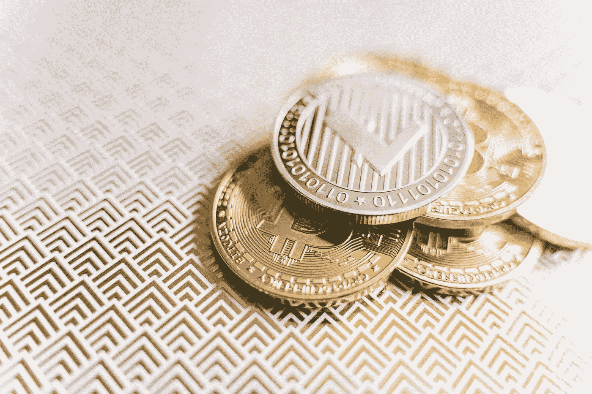

# 通货膨胀与通货紧缩的加密货币供应机制

> 原文：<https://medium.com/coinmonks/inflationary-versus-deflationary-cryptocurrency-supply-mechanisms-fa2a9b7b3c80?source=collection_archive---------16----------------------->

供给机制是定义供给、增加供给和从流通中去除供给的过程。就加密而言，供应涉及现有和将会存在的硬币或代币的数量，以及如何将这些硬币或代币添加到流通中或从流通中移除。接下来的几页分析了最大供给和循环供给的概念，然后研究了几种不同类型的供给机制，所有这些都是为了全面理解供给机制如何影响投资决策。

**固定供给——通货紧缩资产**

固定供应量加密货币在算法上限制硬币供应量。比特币是一种固定供应资产，因为一旦 2100 万枚比特币投入流通，就不可能再创造出更多的比特币。目前，近 90%的比特币已经被开采，每年约有 0.5%的总供应量正在流失。减半的结果(不久将被覆盖)，比特币将在 2140 年左右达到其最大供应量。许多其他加密货币(来源于 cryptoli.st)如币安硬币(BNB)、卡尔达诺(ADA)、莱特币(LTC)和 ChainLink (LINK)都有类似的固定供应。

固定供应模式最明显的好处是这些系统是通货紧缩的。通缩资产是指总供给随着时间推移而减少的资产，因此每个单位的价值都会增加。为了说明这一点，假设你和另外十个人被困在一个荒岛上，每个人只有一瓶水。随着人们饮用他们的水，一百瓶的总供应量只能减少。这使得水成为一种通货紧缩的资产。随着总供应量的减少，每瓶酒的价值越来越高。说，现在，只剩下二十个水瓶了。二十个水瓶中的每一个的价值相当于五个水瓶曾经的价值，因为总供应量减少了五分之一。通过这种方式，通缩资产的长期持有者会经历其持有资产价值的增加，因为相对于整体的基本面价值增加了。例如，在水瓶模拟开始时，100 个瓶子中有 1 个是总供应量的 1%,而到了最后，20 个瓶子中有 1 个是总供应量的 5%,使得每个瓶子的价值增加了 500%。通过这种方式，一个固定的供应和通缩模型，就像数字黄金一样，将随着时间的推移增加每个硬币或代币的基本价值，并通过稀缺性创造价值。

**无限供给——通胀资产**

随着时间的推移，当总供给下降时，每单位通缩资产相对于总供给的价值会增加。随着通货膨胀的资产，新的货币进入总流通供给，并导致所有其他货币贬值。回到岛上的场景，十个人每人有十个水瓶。假设我们被困岛上的游客被发现，一架飞机将飞越该岛，并每天运送二十瓶水，直到该群体被救出。然后每人每天会收到两瓶水，相当于他们总供应量的 20%。在 30 天内，总供应量(忽略饮用水)将达到 700 瓶，这意味着每瓶占总供应量的 0.14%，而不是原来的 1%。价值下降了 7 倍，反映了持续通货膨胀的影响。

同样的本金转移到证券和加密货币；许多硬币有无限的供应，因此经历了通货膨胀。使用无限供应模型的流行硬币有以太坊(ETH)、Dogecoin (DOGE)和其他许多硬币。

尽管如此，由于通货膨胀，无限供应模式并不是一种天生的破坏性力量——至少在价值方面是如此，尽管肯定不是为了我们的岛上居民。考虑以太坊(ETH)，它有无限的供应。每年开采一千八百万吨乙醚，这是一个固定不变的数字。给定无限长的时间，就可以制造出无限多的硬币。然而，由于 1800 万新增人口保持不变，而总供给增加，通货膨胀率必然会随着时间的推移而下降。为了形象化，如果存在 2.5 亿以太币，通货膨胀率为 7.2%，因为 18/250 是 0.072。然而，10 年后，当铸造了 1 . 8 亿枚新硬币，总供应量为 4 . 3 亿枚时，生产了相同数量的硬币(1800 万枚)，从而将通货膨胀率降至 4%。再过十年，通货膨胀率为 2.9%，二十年后，降至 1.8%。这样，通货膨胀随着时间的推移而降低。因此，尽管通货膨胀仍然存在于无限供应的硬币中，但通货膨胀率会随着时间的推移而降低。此外，少量的通货膨胀对经济有益，因为它迫使人们花钱或用钱来避免失去购买力。

因此，尽管大多数加密货币的供应量有限，大多数投资者也喜欢通缩资产的概念，但无论是有限还是无限模型都不优于替代方案。像往常一样，你应该做你的研究，了解你正在进入什么，虽然供应机制当然应该成为你决定的因素，但它们不应该是决定性因素。

*封面照片由* [*阿莱西娅·科齐克*](https://www.pexels.com/@alesiakozik?utm_content=attributionCopyText&utm_medium=referral&utm_source=pexels) *发自* [*佩克斯*](https://www.pexels.com/photo/stack-of-golden-bitcoins-in-close-up-photography-6777564/?utm_content=attributionCopyText&utm_medium=referral&utm_source=pexels)

> 加入 Coinmonks [电报频道](https://t.me/coincodecap)和 [Youtube 频道](https://www.youtube.com/c/coinmonks/videos)了解加密交易和投资

# 另外，阅读

*   [支持卡审核](https://coincodecap.com/uphold-card-review) | [信任钱包 vs 元掩码](https://coincodecap.com/trust-wallet-vs-metamask)
*   [Exness 点评](https://coincodecap.com/exness-review)|[moon xbt Vs bit get Vs Bingbon](https://coincodecap.com/bingbon-vs-bitget-vs-moonxbt)
*   [如何开始通过加密贷款赚取被动收入](https://coincodecap.com/passive-income-crypto-lending)
*   [BigONE 交易所评论](/coinmonks/bigone-exchange-review-64705d85a1d4) | [电网交易 Bot](https://coincodecap.com/grid-trading)
*   [氹欞侊贸易评论](https://coincodecap.com/anny-trade-review) | [货币现场评论](https://coincodecap.com/coinspot-review)
*   [新加坡十大最佳加密交易所](https://coincodecap.com/crypto-exchange-in-singapore) | [购买 AXS](https://coincodecap.com/buy-axs-token)