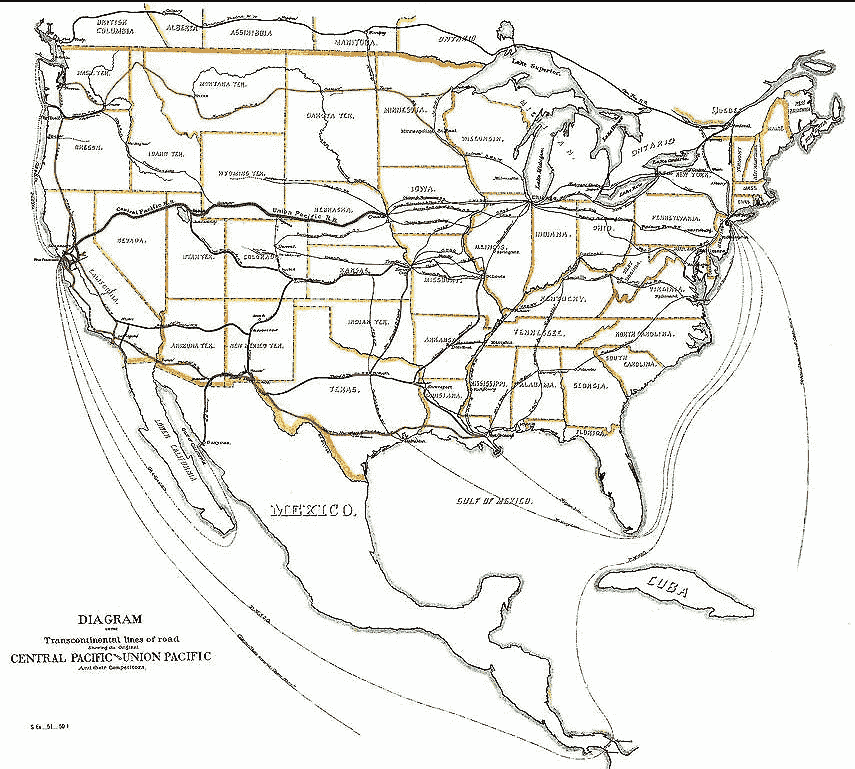

# 所有权基础设施

> 原文：<https://medium.com/coinmonks/infrastructure-for-ownership-755f513e4a7c?source=collection_archive---------25----------------------->

# 分散的加密网络正在将共享所有权的成本降至零

美国网络基础设施的建设有一个公认的模式:

*   *繁荣* —具有巨大潜力的新技术(如电信、铁路、互联网)被有远见的人和早期企业家发现并传播。资本和企业家开始涌入这个领域扩大产能。
*   *狂热*——“投机者”哄抬价格进入泡沫区域。网络容量变得严重过剩。
*   *破灭*——泡沫破裂。网络运营商被迫削减费率；晚进场的机会主义者损失惨重。公司破产。对“狂热”负有责任的“投机者”受到了严厉的批评和嘲笑。
*   回报——缓慢但稳定地，网络实现了它的潜力。现在广泛可用的基础设施的存在使得新一代的商业利益和用例能够在其上运行。数十年来，这项技术的变革性影响被证明是被最热情的推动者低估了。

研究充分的例子包括铁路网和互联网(例如参见[铁路和电子时代](http://fathom.lse.ac.uk/Features/122057/) & [为什么泡沫对经济有好处](https://www.amazon.com/dp/B000QUCO8K/ref=dp-kindle-redirect?_encoding=UTF8&btkr=1))。我将在这里论证，分散式加密网络的快速扩张也遵循着同样的模式。

每一次连续的基础设施扩建都有助于大幅降低一项重要的业务成本:

**铁路**——19 世纪中期铁路系统的扩建大幅降低了运输成本**(有人估计是 95% )。后来，全国范围的运输工具的使用爆炸式增长，像蒙哥马利·沃德和西尔斯这样的邮购零售商，以及像宝洁和可口可乐这样的消费品公司能够在上面建立高效的国家企业和品牌。**

****

**Transcontinental railroad network in 1887**

**互联网——后来，20 世纪后期互联网的建立使得 T21 的通讯成本几乎为零。通信和基于互联网的商务爆炸式增长，使得像亚马逊、谷歌和脸书这样的公司能够建立大规模成功的基于互联网的电子商务广告业务。**

**如果分散加密网络的快速建设是我们的下一个大规模基础设施项目，它有助于降低哪些成本？**

**实际上，我们可以指出几个潜在的成本，例如获得金融服务的成本(通过智能合同)。但是我想在这里关注的是共享所有权的**成本**。**

****共享所有权的魔力****

**硅谷多年来就知道共享所有权有强大的魔力。30 多年来，员工通过股票期权拥有所有权的文化一直是创业思维和实践的核心，这是有充分理由的。共享所有权协调了投资者(风投、管理层和员工)之间的激励，并有助于原本完全不同的利益&各方自我组织起来，朝着同一个方向前进。股权薪酬也是公开市场投资者用来将激励与大型企业高层管理人员挂钩的主要工具。**

> **"当一个人的薪水取决于他对某事的不理解时，要让他理解这件事是很难的。"——厄普顿·辛克莱。你希望这件事对你有利。**

**共享所有权从根本上影响人类，并影响他们的思维方式。你所拥有的东西被视为“自我”的延伸，与“他人”相对。在你自己身上做一个实验:观察你在购买某样东西的所有权之前和之后，你自己的思维是如何变化的。它不可能不影响你的思考(假设你对自己诚实)。**

**共享所有权是金融领域最强大的力量，可以让人类围绕共同目标采取行动。**

****

**[Shared ownership] surrounds us and penetrates us; it binds the galaxy together**

****降低共享所有权的成本****

**我们以前见过共享所有权的创新。我们已经从简单的合伙企业发展到[股份公司](https://www.jstor.org/stable/238866)现代公司。每一项发展都代表了人类在组织所有权方面的进步。作为法律概念，这些当然因法域而异，并依赖法院进行裁决和执行。**

**建立共享所有权结构需要时间、金钱和律师。到目前为止，还没有技术或互联网本地的解决方案，因为还没有互联网本地的所有权概念。因此，共享所有权一直是严格意义上的法律概念。直到现在。**

**Crypto 为所有权提供了一个全新的全球性互联网本地*基础设施，该基础设施基于纯信息(私钥知识),通过[协议规则](/coinmonks/the-triumph-of-open-protocols-f6a0c5fa1e52)和开源智能合同进行裁决。正如我们之前在[报道的开放协议的胜利](/coinmonks/the-triumph-of-open-protocols-f6a0c5fa1e52)一样，比特币的发展代表了人类合作的突破，为互联网上没有理由信任彼此的随机陌生人提供了一个基于规则的协议，允许他们合作管理一种新的稀缺数字财产的所有权。在[Crypto Tokens:A Breakthrough in Open Network Design](/@cdixon/crypto-tokens-a-breakthrough-in-open-network-design-e600975be2ef)中，Chris Dixon 指出，令牌的激励调整机制第一次允许在传统企业所有权&的背景之外运行的互联网规模基础设施的重大、昂贵部署，以获取价值。***

****法规****

**“等等，你不是说加密代币的功能基本上类似于股票吗？这难道不意味着它们在美国是非法证券吗？”**

**没错。我是说。但如果历史可以借鉴的话，监管者有办法在事后明智地适应现实。铁路网的扩张最初也远远领先于法律指导，一系列新的立法接踵而至(包括赫本法案、曼-埃尔金斯法案、州际商业法案)，帮助后来的事情合理化。国会只是现在才开始试图合理化互联网的快速扩张。**

**克里斯·狄克逊(Chris Dixon)和迈克·诺沃格拉茨(Mike Novogratz)等密码名人不能公开谈论代币的“股权置换”作用，至少不能公开谈论，因为他们从事的是积极影响美国监管机构的业务。所以他们转而谈论网络。这是作为一个 rando 博客作者的决定性优势之一:我想说什么就说什么。**

****在所有权基础设施之上创新****

**正是在这种背景下，新兴的加密现象如 NFTs 和 Dao 开始变得更有意义。新的所有权共享基础设施降低了建立一致的金融利益结构的成本，我们刚刚开始看到这种结构带来的创新。人们购买 NFT 或加入 Dao 在很大程度上是为了参与社区，其中一致的财务激励是一揽子计划的一部分。**

**想象一下会员制俱乐部，每个成员都是俱乐部的所有者，可以随着俱乐部的发展分享俱乐部的财务成功。没有什么比看到会员所有者努力增加价值更自然的了，这正是我们所看到的。**

**这种强大的新所有权基础设施为复杂的加密经济激励计划开辟了广阔的设计空间(如我们在 Terra 的 LUNA 和其算法 stablecoins 系统之间的薄荷和燃烧关系中看到的，或 Thorchain 的“[3x TVL](https://thorchain.org/getting-started/rune)”RUNE 和其跨链 DEX 中其他资产之间的关系)。我们才刚刚开始看到人类的思维在这里能设计出什么。**

**我们在这种新基础设施的开发和推广方面处于非常初级的阶段。如果以历史为鉴的话，其最终影响的惊喜将是非常积极的。**

> **加入 Coinmonks [电报频道](https://t.me/coincodecap)和 [Youtube 频道](https://www.youtube.com/c/coinmonks/videos)了解加密交易和投资**

# **另外，阅读**

*   **[NFT 十大市场造币集锦](https://coincodecap.com/nft-marketplaces)**
*   **[AscendEx Staking](https://coincodecap.com/ascendex-staking)|[Bot Ocean Review](https://coincodecap.com/bot-ocean-review)|[最佳比特币钱包](https://coincodecap.com/bitcoin-wallets-india)**
*   **[Bitget 回顾](https://coincodecap.com/bitget-review) | [双子星 vs BlockFi](https://coincodecap.com/gemini-vs-blockfi) | [OKEx 期货交易](https://coincodecap.com/okex-futures-trading)**
*   **[美国最佳加密交易机器人](https://coincodecap.com/crypto-trading-bots-in-the-us) | [经常性回顾](https://coincodecap.com/changelly-review)**
*   **[在印度利用加密套利赚取被动收入](https://coincodecap.com/crypto-arbitrage-in-india)**