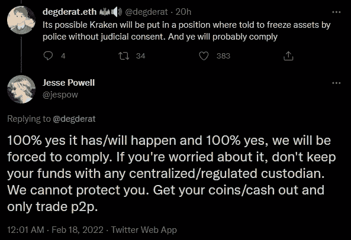
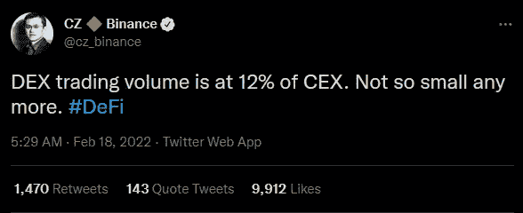
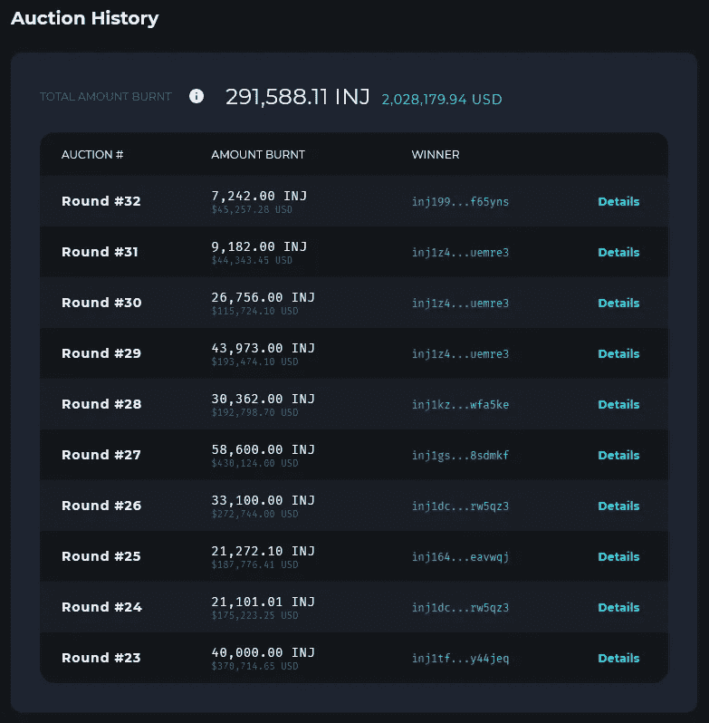
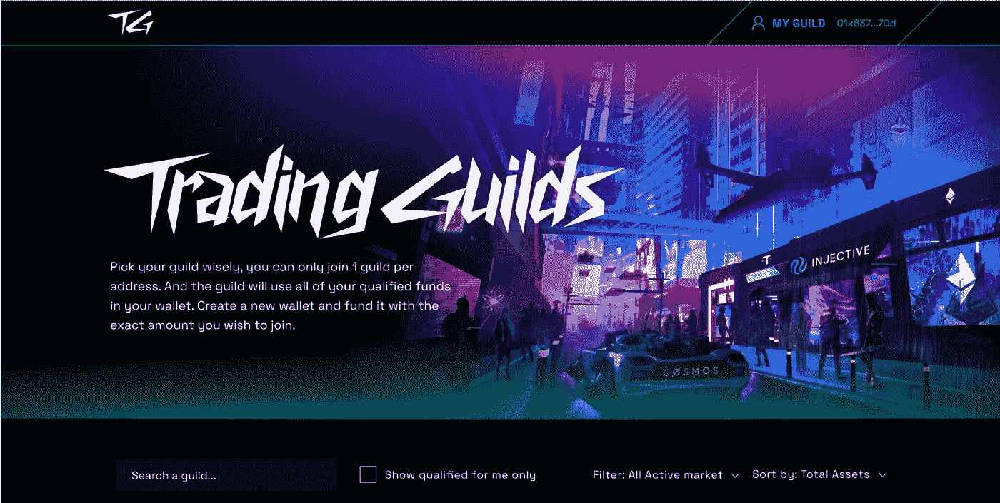
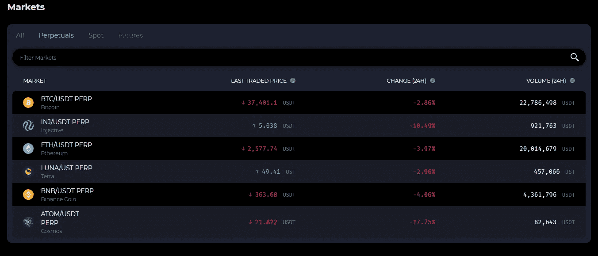
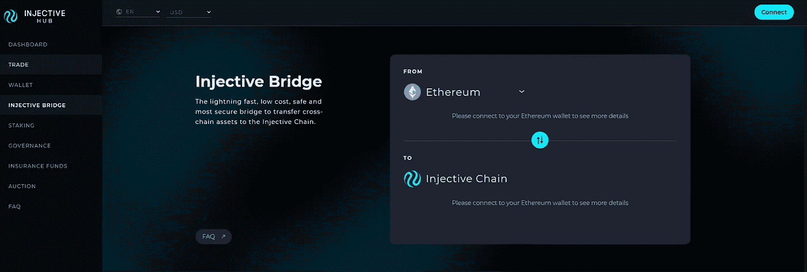
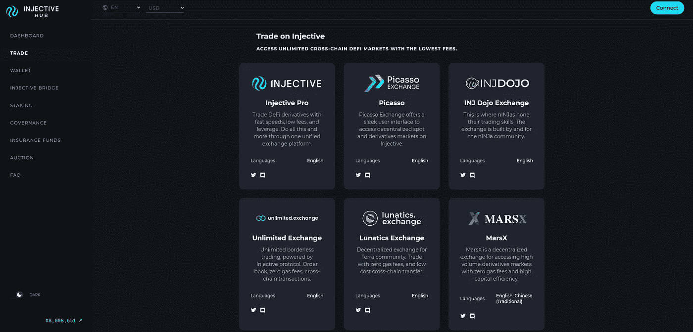
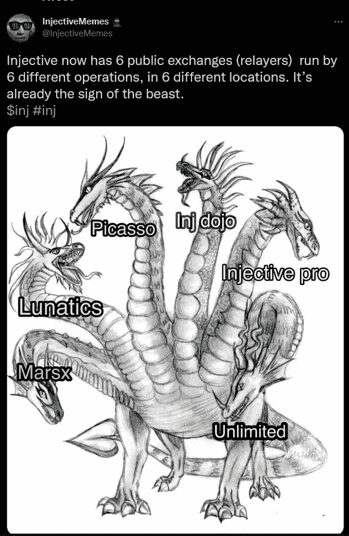
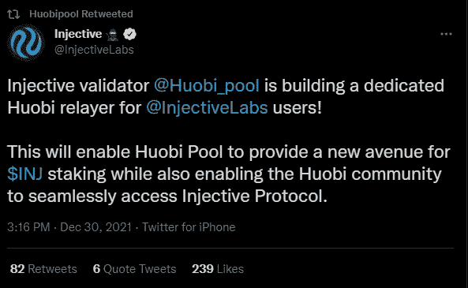
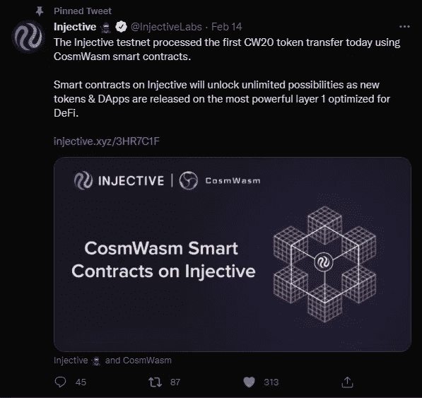

# 内射——为什么我们现在比以往任何时候都更需要去中心化的交易所

> 原文：<https://medium.com/coinmonks/injective-why-we-need-decentralised-exchanges-now-more-than-ever-ef955f030538?source=collection_archive---------13----------------------->

在我开始之前，请允许我自我介绍，我是一名忠诚的内射社区成员，我写这些文章的唯一目的是帮助教育我现有的#nINJa bros 和内射社区的新成员。因此，尽管我确实希望每个人都理解分散化交易所的优势，但我不是法律或财务顾问！请自行研究！

这篇文章将讨论为什么我们需要去中心化的交易所，以及与一年前相比，它们是如何取得惊人的进步的。

# 集中交易所(CEX)

由于拥有最大份额的流动性，交易所目前是交易者的首选平台。他们有大量的市场进行交易，并提供巨大的激励，如推荐项目。

现代 cex 使用**连续双向拍卖(CDA)** ，订单一到达交易所就进行处理。然后，每份订单会立即在另一面填写，或者放入订单簿，等待匹配的订单来填写。

使用 CDA 处理订单非常重视速度，因为高波动性的市场允许套利机会。高频交易者(hft)利用微波塔(见下图)和 FPGAs 等技术拥有纳秒(十亿分之一秒)的连接速度。这让它们比做市商更有优势，做市商必须反过来大举投资以跟上高频交易。这意味着 mm 必须提高他们的交易费用，以允许他们在技术上的投资，这将继续影响零售交易商。你可以在[https://blog . injective protocol . com/injective-exchange-upgrade-a-novel-order-matching-mechanism/](https://blog.injectiveprotocol.com/injective-exchange-upgrade-a-novel-order-matching-mechanism/)了解更多关于 CDA 如何工作的信息。

[https://arstechnica.com/information-technology/2016/11/private-microwave-networks-financial-hft/](https://arstechnica.com/information-technology/2016/11/private-microwave-networks-financial-hft/)

通过控制你的私人钥匙，集中交易也可以作为你资产的保管人。俗话说，“**不是你的钥匙，不是你的钱包**”，意思是你在中央交易所拥有的任何加密硬币/令牌实际上都不是你的。火上浇油的是，最近的事件涉及加拿大政府冻结向自由车队领导的当地 gofundme 运动捐款的个人的加密资产和个人银行账户，这些人抗议结束新冠肺炎的封锁，这表明你的资金在集中交易所实际上是多么不安全，因为我们当地的“神”可以随时迫使 cex 冻结账户。

[https://www.youtube.com/watch?v=_4I9Rz_g6pU](https://www.youtube.com/watch?v=_4I9Rz_g6pU)

北海巨妖交易所的首席执行官 Jesse Powell 在推特上回应说:

[https://twitter.com/jespow/status/1494462097161220104](https://twitter.com/jespow/status/1494462097161220104)

现在，如果一家受欢迎的交易所的首席执行官承认，如果政府来敲门，他们无能为力，那么是时候寻找一种替代解决方案，为我们提供交易完全受我们控制的资产的机会。

那么，我所说的这个解决方案是什么？**分散式交易所** (DEX)。

# 分散式交易所

DEX 是一种加密货币交易所，它以分散的方式运行，没有任何形式的中央机构。dex 不需要第三方来存储您的资金，使您能够始终保持对您的私钥的控制。

早期分散交易所的最大问题是，与集中交易所相比，它们的流动性较差。然而；币安首席执行官 CZ 最近在推特上写道:

[https://twitter.com/cz_binance/status/1494544602400890883](https://twitter.com/cz_binance/status/1494544602400890883)

这显示了 dex 在缩小差距方面取得了多大的进步，并且在当前的采用率下，差距只会越来越小。这也显示了 CEX 车主对采用 dex 的乐观程度。

最初，对做市商的需求和缓慢的区块链速度使得创建订单簿模式变得困难，直到 **Uniswap** 通过使用**自动做市商** (AMM)模式开创了去中心化的交易所行业。虽然这是一种非常简单有效的交易方式，但由于以太坊区块链的缓慢性能，前跑(类似于集中交易中的高频交易的概念)一直是一个主要问题，因为未决交易在网络中是可见的，这给了前跑掠夺者在未决交易处理之前执行交易的机会，方法是支付更高的汽油费，然后在相同的未决交易处理后出售获利。最重要的是，任何人都可以创建一个游泳池，这使得它更容易受到地毯拉。处理交易也非常昂贵，因为去年汽油费飙升，Uniswap 互换汽油费在 100 美元至 400 美元之间

幸运的是，自从采用 Uniswap 和有了更高的 TPS 以来，区块链技术已经有了迅速的改进；更便宜的天然气费用允许创建一个订单簿模型 DEX 的可能性，有这么多可用的交易，你只需要看看币安孵化的项目，Injective。

# 内射的

Injective 是一个定制的可互操作的第一层协议，用于构建强大的 exchange、DeFi、derivatives 和 Web3 应用。Injective 是使用 Cosmos SDK 创建的，能够在保持闪电般速度的同时实现即时交易终结。当通过任何一个注射继电器的前端交易时，没有汽油费

## 完全去中心化的第一层区块链

Injective 使用频繁的批量拍卖(FBA ),这消除了我上面提到的掠夺性抢先交易，同时使做市商能够以更低的利差提供更高的流动性。如果想了解更多关于 FBA 的知识，请看这里:[https://blog . injective protocol . com/injective-exchange-upgrade-a-novel-order-matching-mechanism/](https://blog.injectiveprotocol.com/injective-exchange-upgrade-a-novel-order-matching-mechanism/)。

市场列表、升级和链的变化通过治理完全分散，有了这样一个强大、活跃和诚实的社区，我们已经看到了杰出的贡献，包括以下方面:

*   禁止在交易所进行清洗交易，这会给有机交易者带来更多的回报
*   同意重组 Astro 激励机制以吸引更多的交易者
*   增加接受者的奖励，以鼓励更多的制造商从书中获得订单
*   启动新市场(现货和永久)
*   充当“看门人”,应对 scamcoin 列表的任何威胁

## 令牌组学

*   **最大供应量** : 1 亿
*   **目前供应量**(撰写本文时):48655554
*   **令牌实用程序**:支付交易的汽油费，100 美元 INJ 到‘忍者名单’(即时推出一个关于 dex 的市场)，在拍卖中很大

内射记号组学确实是一种现象。每 7 天，累积交易费用的 60%被拍卖以换取 INJ，其中拍卖获胜者的 INJ 代币被烧毁并停止供应。

Current Burn Total: [https://hub.injective.network/auction](https://hub.injective.network/auction)

这意味着，随着交易量的增加，更多的价值被累积到拍卖中，这反过来要求拍卖参与者给出更高的 INJ 出价。Uniswap 目前每天的交易量约为 15 亿美元。如果 Injective 在 7 天内以 5 美元的当前代币价格进行 24 小时交易，并假设每个市场的平均交易费用为 0.15%(做市商+接受者):

(0.0015*1，500，000，000*0.6)/5 = **每 7 天烧掉 270，000 INJ** 代币，每年烧掉 14，000，000 INJ 代币，供应量的 14%！(如果交易量继续以这种速度增长，价格也保持不变)

然而，重要的是要注意，上述计算只是推测性的，因为交易量没有达到我提到的高点，尽管这并不意味着交易所永远不会达到这些流动性水平，因为下一节提到的激励措施目前正在酝酿中。

## 改善流动性的激励措施

**交易协会**—交易是一种耐心和技巧的游戏，并不是每个人都具备。因此，大多数投资者更喜欢长期投资 HODL。然而，交易公会为加密投资者提供了将他们的资金授予交易公会以代表他们执行交易的机会。这并不意味着你授权的交易行会拥有你的资产，但可以代表你进行交易。

Injective’s reveal of Trading Guilds interface — [https://twitter.com/InjectiveLabs/status/1492310636684062726](https://twitter.com/InjectiveLabs/status/1492310636684062726)

**更多市场** —目前在 Injective 上有 6 个永久市场，这意味着有很大的增长空间！许多顶级液体对仍将被列出，你可以放心，因为它们很快就会出现。

[https://injdojo.exchange/](https://injdojo.exchange/)

**更多的桥梁** —在互操作性方面，Injective 表现得比其他 orderbook dex 都好，因为它将在未来带来更多的桥梁，如 AVAX、BNB 和 DOT 等等。目前，您可以通过以太坊桥将代币桥接至多个 IBC 桥接链，包括 Cosmoshub、Terra、Osmosis、Chihuahua 和 Juno(很快)。

[https://hub.injective.network/bridge](https://hub.injective.network/bridge)

**在 CLOB** 中革命性地采用 AMM 模型——这仍处于研发阶段，但它涉及实施 AMM 模型，为 Injective 的订单簿模型 dex 提供流动性。我不知道它将如何工作，但如果成功执行，那么它将真正是革命性的，因为你可以为投资者提供流动性池，同时让用户以非常类似于 Uniswap 的方式进行交易。

## 继电器机构

内射的突出特征之一是延迟机制。这意味着，任何人都可以通过自己的前端托管交易所，并共享每个市场的订单，而不是像许多流行的 dex 那样通过一个直接的 UI 进行交易。这使得中继站可以根据自己的喜好过滤市场，并受益于以下优势:

*   所有费用的 60%被拍卖掉，当用户在他们的前端交易时，转播商得到 40%的费用
*   使用 40%的费用举办竞赛/奖励。最近发布的[https://injdojo.exchange/](https://injdojo.exchange/)在发布时提供 40%的交易费退款，这在 Injective 社区中非常受欢迎，因为它与交易完美结合并获得奖励。
*   从前端筛选可用市场，以符合当地法规，并为美国等国家/地区启用 KYC。这意味着中继器可以对其前端进行任何更改，而不需要任何链上更改。

[https://hub.injective.network/trade](https://hub.injective.network/trade)

[https://twitter.com/InjectiveMemes/status/1494399893674336258](https://twitter.com/InjectiveMemes/status/1494399893674336258)

因此，如果我们重温我前面提到的 CEXs 由于政府压力被迫冻结账户，Injective 将允许流行的 CEXs，如币安；北海巨妖；而比特币基地有机会在内射自身上建立中继。想象一下，如果这些交易所中的任何一家决定这么做，并带来哪怕一小部分的 CEX 交易量，那该有多糟糕！

为了证明机构继电器不只是一个神话，Huobi(一家亚洲加密货币交易所)最近宣布，他们将为注射用户建立一个专门的继电器。

[https://twitter.com/InjectiveLabs/status/1493261134807379977](https://twitter.com/InjectiveLabs/status/1476572904787783681)

## dAPPs

由于内射链是专门为 DeFi 应用而构建的，因此您可以在其上构建许多不同类型的 dAPPs。Injective 最近宣布了最近使用 CosmWasm 智能合约成功转让第一个 CW20 令牌的过程。

[https://twitter.com/InjectiveLabs/status/1493261134807379977](https://twitter.com/InjectiveLabs/status/1493261134807379977)

独特的 orderbook 模型对于构建在内射链之上的 dAPPs(如赌博应用程序)非常有吸引力。事实上，一个体育博彩 dAPP 正在建设中:[https://www.getfrontrunner.com/](https://www.getfrontrunner.com/)。

具体到体育博彩(预计 2028 年总价值将达到 1402.6 亿美元，[)https://www . Bloomberg . com/press-releases/2021-10-19/sports-betting-market-size-worth-140260 亿-by-2028-grand-view-research-Inc](https://www.bloomberg.com/press-releases/2021-10-19/sports-betting-market-size-worth-140-26-billion-by-2028-grand-view-research-inc))，learner 允许用户在各种体育运动中为团队/个人下注或下注，包括:

*   NBA —篮球
*   NFL——美式足球
*   超级联赛——足球
*   UFC——综合武术
*   还有更多！

[网站](https://injectiveprotocol.com/) | [电报](https://t.me/joininjective) | [不和](https://discord.gg/injective) | [博客](https://blog.injectiveprotocol.com/) | [推特](https://www.twitter.com/@InjectiveLabs) | [学习](https://blog.injectiveprotocol.com/tag/learn/) | [Youtube](https://www.youtube.com/channel/UCN99m0dicoMjNmJV9mxioqQ) | [脸书](https://www.facebook.com/injectiveprotocol)|[LinkedIn](https://www.linkedin.com/company/injective-protocol/)|[Reddit](https://www.reddit.com/r/injective/)|[insta gram](https://www.instagram.com/injectivelabs/)|[微博](https://weibo.com/7452104340/profile?rightmod=1&wvr=6&mod=personnumber&is_all=1&ssl_rnd=1612829152.4355) | [轨道快讯](http://eepurl.com/hcrjwP)

> *加入 Coinmonks* [*电报频道*](https://t.me/coincodecap) *和* [*Youtube 频道*](https://www.youtube.com/c/coinmonks/videos) *了解加密交易和投资*

# 另外，阅读

*   [3 商业评论](/coinmonks/3commas-review-an-excellent-crypto-trading-bot-2020-1313a58bec92) | [Pionex 评论](https://coincodecap.com/pionex-review-exchange-with-crypto-trading-bot) | [Coinrule 评论](/coinmonks/coinrule-review-2021-a-beginner-friendly-crypto-trading-bot-daf0504848ba)
*   [莱杰 vs n 格拉夫](/coinmonks/ledger-vs-ngrave-zero-7e40f0c1d694) | [莱杰纳诺 s vs x](/coinmonks/ledger-nano-s-vs-x-battery-hardware-price-storage-59a6663fe3b0) | [币安评论](/coinmonks/binance-review-ee10d3bf3b6e)
*   [Bybit Exchange 审查](/coinmonks/bybit-exchange-review-dbd570019b71) | [Bityard 审查](https://coincodecap.com/bityard-reivew) | [Jet-Bot 审查](https://coincodecap.com/jet-bot-review)
*   [3 commas vs crypto hopper](/coinmonks/3commas-vs-pionex-vs-cryptohopper-best-crypto-bot-6a98d2baa203)|[赚取加密利息](/coinmonks/earn-crypto-interest-b10b810fdda3)
*   最好的比特币[硬件钱包](/coinmonks/hardware-wallets-dfa1211730c6) | [BitBox02 回顾](/coinmonks/bitbox02-review-your-swiss-bitcoin-hardware-wallet-c36c88fff29)
*   [BlockFi vs Celsius](/coinmonks/blockfi-vs-celsius-vs-hodlnaut-8a1cc8c26630)|[Hodlnaut 点评](/coinmonks/hodlnaut-review-best-way-to-hodl-is-to-earn-interest-on-your-bitcoin-6658a8c19edf) | [KuCoin 点评](https://coincodecap.com/kucoin-review)
*   [Bitsgap 审查](/coinmonks/bitsgap-review-a-crypto-trading-bot-that-makes-easy-money-a5d88a336df2) | [Quadency 审查](/coinmonks/quadency-review-a-crypto-trading-automation-platform-3068eaa374e1) | [Bitbns 审查](/coinmonks/bitbns-review-38256a07e161)
*   [密码本交易平台](/coinmonks/top-10-crypto-copy-trading-platforms-for-beginners-d0c37c7d698c) | [Coinmama 审核](/coinmonks/coinmama-review-ace5641bde6e)