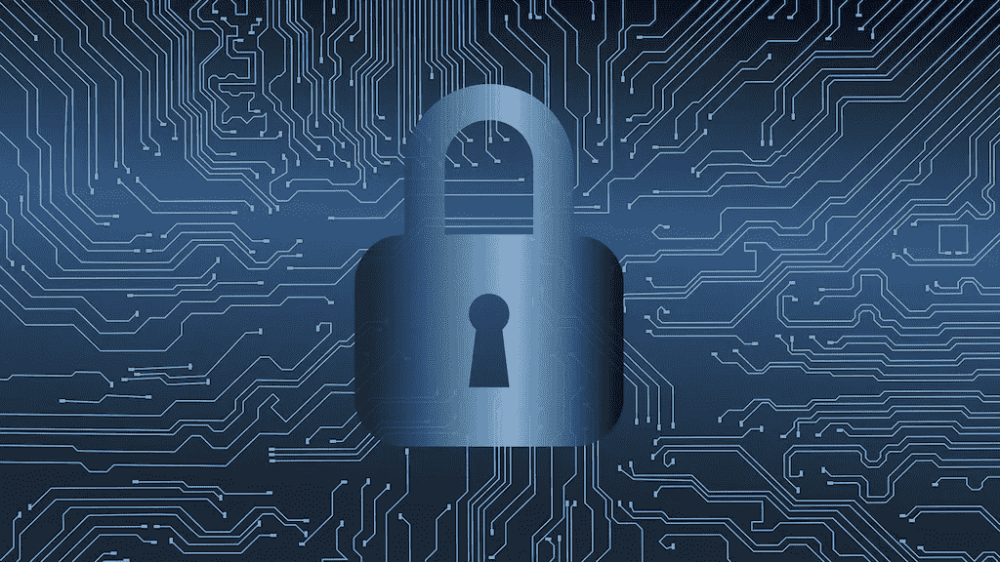
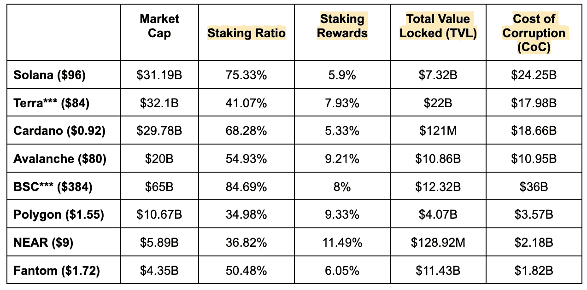

# 不稳定的

> 原文：<https://medium.com/coinmonks/insecure-2b813c6060dc?source=collection_archive---------22----------------------->

## 区块链安全现状探析

# 为什么安全很重要？

在许多方面，区块链网络就像虚拟金库，在网络空间中储存着数十亿甚至数万亿美元。这方面最明显的例子是比特币区块链，目前它的价值约为 8150 亿美元，比当今地球上除 5 家最富有的公司(苹果、微软、谷歌、亚马逊和特斯拉)之外的所有公司都更有价值。然而，除此之外，在一个支付渠道和数字网络(如上述公司拥有的)几乎完全由私人所有和运营的世界里，区块链代表了真正有价值的*公有*数字网络的罕见例子。

现在，与美元等非数字货币不同，比特币和其他加密资产不能从其网络中提取，也不能存储在床垫下或实体银行或金库中。您当然可以使用某种形式的冷存储来离线存储您的私钥，但是无法回避这样一个事实，即这些数字资产最终受到其底层网络的保护。无论您的密钥有多安全，如果网络本身受到危害，您就有风险。

***那么这一切是什么意思呢？***

最根本的是，这意味着区块链作为一个行业和技术平台将难以实现主流采用，除非能够证明这些网络比现任者和替代者更安全。这意味着，如果普通人、公司或政府不能相信他们的数字资产不会被窃取、克隆或以其他方式泄露 crypto 的大部分宏伟愿景就会土崩瓦解。这种“信任最小化”技术的最大悖论是，对于大多数人来说，实际上存在一个基于信任的巨大准入壁垒，尤其是当我们考虑到人们对区块链网络的技术功能实际上了解得如此之少时。

我们应该记住，虽然我们希望区块链至少像传统网络一样安全，但实际上门槛应该更高一些。即使在今天这个孤立的、封闭的互联网公司和私有数字网络的世界里，安全仍然是一个大问题。你将很难找出一个有价值的实体没有被黑客攻击或以某种方式入侵，无论是脸书、阿里巴巴、微软还是美国政府。信息时代(幸运或不幸取决于你问的是谁)也变成了网络战争和隐私死亡的时代。这就是为什么当务之急是，我们这些希望看到这个行业在未来许多年里发展壮大的人要尽我们所能来加强区块链安全的现实和认知。这关系到太多了。

# 我们如何衡量和定义安全性？

考虑区块链领域的安全风险有几种不同的方式。让我们仔细看看其中的几个:

***集权风险***

集中化通常不被视为安全问题，因为区块链行业的许多人经常引用[三难框架](/certik/the-blockchain-trilemma-decentralized-scalable-and-secure-e9d8c41a87b3)(集中化、安全性&可扩展性)，该框架将安全性和集中化视为独立的问题。这种思维模式忽略了一点，即与集权相关的许多风险从根本上讲是关于财产、权利和自由的安全问题。例如，拥有一个庞大的中央集权政府的大部分问题是，这些利益可能会被单方面攫取或限制，而没有任何形式的正当程序或责任(例如，美国政府在 1934 年宣布美国公民持有黄金为非法)。区块链生态系统中更常见的一个例子是集中式节点验证器的问题。许多比特币的批评者和怀疑者(正确地)指出，一小撮串通实体拥有和运营的大部分采矿权可能对比特币区块链的*安全*构成严重威胁。

集中化的另一个严重问题是*单点故障的概念*。这里的想法不是关于腐败的中央集权行为者，而是关于*降低外部攻击的成本*，从而激励他们。为了说明这在实践中可能如何工作，让我们考虑一个例子:*美国经济。*如果我们必须在美国经济中找出一个*单点故障*，我们可能会选择银行业，或者更具体地说，一些被广泛认为“太大而不能倒的遗留金融机构希望攻击经济的对手可能会看到这里，他们知道尽管经济是多么复杂和多面的，但损害一个中心重要节点可能会使整个网络瘫痪。

***智能合约 bug&错误***

大多数人可能会同意智能合约的出现是区块链网络最不可思议和最具创新性的使用案例之一，但是大多数人也可能同意它们代表了一种新的独特的攻击载体。仅在 2022 年的前两个月，我们已经看到了有史以来第二大 DeFi 黑客攻击——其中 12 万 wETH(价值约 3 . 75 亿美元)从 Wormhole(一种连接生态系统中许多最受欢迎的链的跨链桥接协议)中被盗。随着事件的尘埃落定和事件报告的进行，很明显，这实际上是由于智能合同的利用。

现在，我们不会进入各种智能合约攻击的技术领域，也不会知道它们究竟是如何发生的，但重要的是要理解，这些合约中的错误和漏洞可以被利用*而不会危及底层区块链协议的安全*。理解这一点也很重要，这可能是当今行业中*最普遍的问题*，因为几乎任何人都可以将任何类型的智能合同部署到任何区块链网络，不管代码有多糟糕。许多项目设立了巨额的*漏洞奖金*，实质上是向能够识别并向核心团队标记潜在漏洞的开发人员提供补偿(有时是数百万美元)，希望激励人们将他们的黑客天赋用于有益的事业。

***腐败节点&验证器***

有些人可能会认为这个问题应该归入*集中化风险*的范畴，这不一定是错误的，但我认为它值得作为一个独立和独特的问题来探讨。如果你已经在区块链呆了一段时间，你可能听说过这个术语 [*51%攻击*](https://www.coindesk.com/learn/what-is-a-51-attack/#:~:text=A%2051%25%20attack%2C%20also%20known,power%20from%20a%20third%20party.)——本质上指的是一个人或一群人获得超过 50%的区块链[哈希力量](https://www.coindesk.com/tech/2021/02/05/what-does-hashrate-mean-and-why-does-it-matter/)的控制权的情况。这使得这些人可以从事恶意行为，例如停止新的交易或撤销已完成的交易(也称为*双重消费*)。51%攻击通常用于指比特币和比特币矿工，但类似的概念也适用于像 Solana 或 Terra 及其网络验证器这样的证据链。*在这里讨论的所有风险中，这种安全风险可以说是最糟糕的*也是最有害的，主要是因为它会导致潜在区块链的变化，而这些变化很可能会导致*广泛的信心和投资的严重和突然的崩溃*。一个极端的例子是比特币区块链在 51%的攻击中被破坏，黑客进行了双重消费，从而彻底破坏了比特币作为一种根本稀缺和不可腐蚀的资产的信念。

理解这种攻击的可能性或可行性的最常见的方法之一是量化控制 51%的网络散列能力需要多少成本。许多人认为比特币目前代表着区块链安全的巅峰，部分原因是这个数字估计有数十亿美元(根据最近的价格走势，大约在 50 亿美元到 150 亿美元之间)。很明显，世界上能够获得数十亿美元流动资本的实体数量非常有限，能够转移这些资金或用于购买采矿硬件而不被任何人注意或追踪的实体就更少了。然而，这些经济学的另一面是，比特币区块链目前价值约 8150 亿美元，这意味着寻求参与 51%攻击的黑客基本上要花费几十亿美元来窃取几千亿美元。不错的交易！

# 当前的景观

在挖掘区块链安全的*现状*时，更值得专注于这个问题的 ***腐败节点&验证者*** 。尽管这个问题很重要，但它显然没有像这篇文章中提到的其他两个安全风险那样被讨论或充分理解，尤其是在比特币生态系统的背景之外。

在最近一篇关于链间安全性的文章中，Cosmos Hub 的负责人 Billy Rennekamp 提供了一个粗略的框架来评估和理解区块链的安全性。虽然 [*工作证明*](https://www.investopedia.com/terms/p/proof-work.asp) 像比特币一样的区块链容易受到 *51%攻击*， [Tendermint consensus](https://tendermint.com/) (在宇宙生态系统中使用)的构建使得各种攻击需要黑客获得比⅓或⅔更多的所有赌注令牌(基于攻击的种类)。将积累网络股份的⅔所需的代币数量乘以代币的当前价格，就得到 Rennekamp 所说的腐败成本(CoC)。他接着指出，“……价值链上锁定的总价值(TVL)必须低于腐败成本，这一点很重要，*否则价值链就应该被认为是不安全的*。”

我决定采用这个粗略的模型，并将其外推至整个利益链的生态系统，看看我是否会发现任何有趣的东西。我查看了 8 大利益链，并使用⅔(更具挑战性的)数字来计算每条链的腐败成本。

********* *Indicates that the chain utilizes Tendermint Consensus. Data is as of 2/28/22.*

索拉纳和 BSC 在这方面明显脱颖而出，最明显的是它们相对较高的赌注比率和相对于锁定总价值的安全腐败成本。至少可以说，SOL 总供应量的 75%以上被用于确保供应链的安全，这一事实令人印象深刻，尤其是考虑到 SOL 的 DeFi 生态系统是多么强大。由于下注回报低于 6%，下注 SOL 与在其他地方赚取收益的潜在机会成本绝对不小，然而许多人似乎还是下注了。

Terra 和 Fantom 也很突出，但理由并不充分。在过去的一年中，这两个链在不同的点上看到了它们 DeFi 生态系统的抛物线增长，但是它们没有看到它们的赌注比率(以及 CoC)的成比例增长。在 Terra 的 220 亿美元 TVL 中，超过 110 亿美元由 Anchor protocol 持有，Anchor protocol 是一个连锁货币市场，用户可以在 UST stablecoins 上赚取 20%的 APY。仅 UST 的市值在 2021 年期间就从不到 2 亿美元增长到超过 100 亿美元，成为 Terra DeFi 生态系统中无可争议的主要增长驱动力。另一方面，随着许多备受期待的 DeFi 应用程序上线，Fantom 的 TVL 从 2021 年 10 月的不到 2B 美元上升到 2022 年 1 月底的超过 120 亿美元。使用这个非常粗略的*腐败成本*框架，Fantom 是上述 8 个链中最不安全的，其 TVL 几乎是腐败成本的 10 倍，是整个市值的 2 倍。

这些链的其余部分或者具有大致等于其 CoC 的 tvl(雪崩&多边形),或者简单地看起来是安全的，主要是因为没有强健的 DeFi 生态系统(NEAR & Cardano ),因此 tvl 较小。

***这一切是什么意思？***

这意味着区块链目前的安全状况有些不稳定和不可持续。很多人都在谈论加密价格的“极端”波动性，但对于这些基础链的安全性如何受到价格波动和抛售压力的实时影响，以及这些价格波动和抛售压力在某些时候不可避免地进入加密市场，人们的理解却较少。负面价格行为，接着是脱手和抛售，接着是更多负面价格行为，导致螺旋式下降，这不符合*可持续*证券的最佳利益。除此之外，随着稳定可卡因越来越受欢迎，用户在 USDC、USDT 或 UST 寻找避风港，而不是“完全套现”，通常情况下，市场提款对可卡因的影响可能比 TVL 更大。简而言之，当前围绕区块链安全的经济激励根本不够好。

幸运的是…这个领域最聪明的头脑已经推出了一些令人难以置信的创新和令人兴奋的替代方案。

# 激动人心的未来解决方案

***液体打桩***

其核心是，流动赌注的重点是解决激励问题，当加密用户必须在从赌注奖励或参与 DeFi 中赚取收益之间做出选择时，就会出现激励问题。理想情况下，大多数用户会下注他们的硬币，但当你在一个新的 DEX 上可以从产量农业中获得 1000%的 APY，而下注只能获得 6%时，后者对大多数人来说就没有吸引力了。流动赌注允许用户做的是利用他们的赌注资产，以便他们可以在 DeFi 中使用，同时仍然用于帮助保护链。像 [Lido](https://lido.fi/) 这样受欢迎的服务为 ETH、LUNA、SOL 和 KSM 提供流动赌注——你所要做的就是存入你的资产(比如说 LUNA ),然后你会收到一个合成衍生资产(比如说 bLUNA ),它可以像任何其他流动资产一样在 DeFi 中交易和使用——同时仍然可以获得赌注奖励！

***超流体打桩***

超流桩是一种全新的桩解决方案，目前仅在宇宙生态系统固有的[渗透*链间指数*](https://app.osmosis.zone/) 上可用。正如你可能已经从它的名字中猜到的那样，这一概念将*液体赌注*的理念向前推进了一步，允许用户从锁定在他们的 [LP 位置](https://www.gemini.com/cryptopedia/what-is-a-liquidity-pool-crypto-market-liquidity)的代币上赚取赌注奖励。例如，如果我将我的资产存入渗透系统的$ATOM/$OSMO 流动性池，除了从向 DEX 提供流动性中获得的奖励之外，我实际上还可以从我的$OSMO 中获得赌注奖励。虽然这个功能还很新，但它代表了安全创新领域的一个开端。

***共享安全***

像超流体赌注一样，最有趣的共享安全创新目前主要在宇宙生态系统中开发和利用。这里的主要思想是允许拥有自己的验证器的主权区块链通过为不同链运行多个节点的验证器来相互共享安全性。就 Cosmos 而言，宏伟的愿景是生态系统内的链能够通过它们的[区块链间通信协议](https://www.coinbase.com/cloud/discover/dev-foundations/ibc-protocol#:~:text=The%20Cosmos%20ecosystem%20has%20a,protocol%20(IBC)%20was%20created.)(通常称为 IBC)相互共享安全性。这不仅在生态系统内围绕安全性产生了网络效应，还降低了新链上线的门槛。激励(质量)验证者来帮助保护你的链是非常困难和昂贵的，尤其是当市场上充满了利益链的证据时。

*一个不太为人所知但仍然令人兴奋的解决方案是租赁股权证明(LPoS ),它由 [Octopus Network](https://oct.network/) 使用，是在 NEAR 协议上构建[专用区块链](https://www.figment.io/resources/smart-contracts-vs-application-specific-blockchains)的基础。这种模式的独特之处在于，它将区块链证券视为一种可以租赁的资本或抵押品。希望利用 Octopus 网络实现安全的区块链可以简单地支付他们认为需要的安全费用，这与像 Polkadot 或其他 L1 这样的模式形成了鲜明的对比，在这些模式中，安全租赁不是一个选项，就是远没有那么灵活，也远没有那么昂贵。LPoS 模型对 Octopus Network 也特别有效，因为它们不是一个链，而是一组在 NEAR 上运行的智能合约，这意味着建立在其上的链不需要通过不可持续的通货膨胀率与它的赌注回报(它为 0)竞争。*

## ***最终想法***

*最终，毫无疑问，在保护区块链网络免受各种攻击方面，还有大量工作要做。从错误的代码，到中央集权，再到反向赌注激励，这些网络中的大多数还没有准备好成为世界上事实上的金融轨道。然而，这并不意味着他们永远不会准备好。现在，crypto 和区块链终于永久性地进入了主流，不可避免的是，越来越多的脑力和财力将被投入到从各种角度解决这些问题上——随着 Cosmos Interchain Security 的推出，有望成为一种催化剂，并建立一个新的行业标准。毫无疑问，在这个过程中会有更多令人痛苦的黑客攻击和损失，但是建立真正安全和公众拥有的数字网络的最终目标已经在望。*

***消息来源***

*[**https://braiins . com/blog/how-mud-it-cost-to-51-attack-bit coin**](https://braiins.com/blog/how-much-would-it-cost-to-51-attack-bitcoin)*

*[**https://extropy-io . medium . com/solanas-wormhole-hack-postal-analysis-3b 68 b 9 e 88 e 13**](https://extropy-io.medium.com/solanas-wormhole-hack-post-mortem-analysis-3b68b9e88e13)*

*[**https://coin telegraph . com/news/wormhole-hack-illustrated-danger-of-defi-cross-chain-bridges**](https://cointelegraph.com/news/wormhole-hack-illustrates-danger-of-defi-cross-chain-bridges)*

*[**https://defillama.com/**](https://defillama.com/)*

*[https://www.stakingrewards.com/T21](https://www.stakingrewards.com/)*

*[**https://wallet.keplr.app/#/dashboard**](https://wallet.keplr.app/#/dashboard)*

*[**https://station.terra.money/**](https://station.terra.money/)*

*[https://github . com/Octopus-network/papers/blob/main/Octopus % 20 network % 20 white % 20 paper . pdf](https://github.com/octopus-network/papers/blob/main/Octopus%20Network%20White%20Paper.pdf)*

*[**https://medium . com/osmosis-community-updates/osmosis-superfluid-staking-FAQ-a7b 49797 CB 72**](/osmosis-community-updates/osmosis-superfluid-staking-faq-a7b49797cb72)*