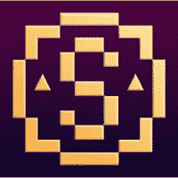
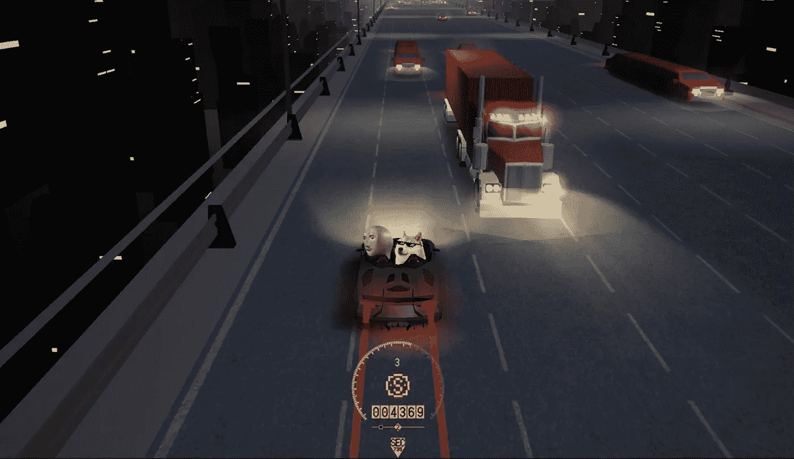
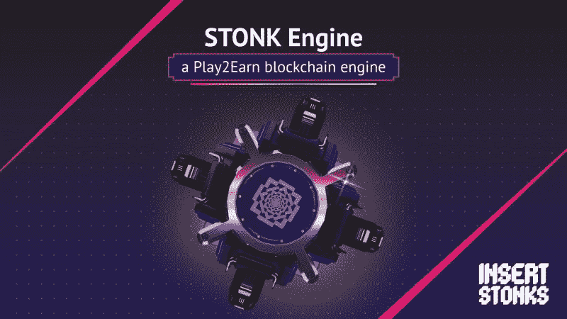
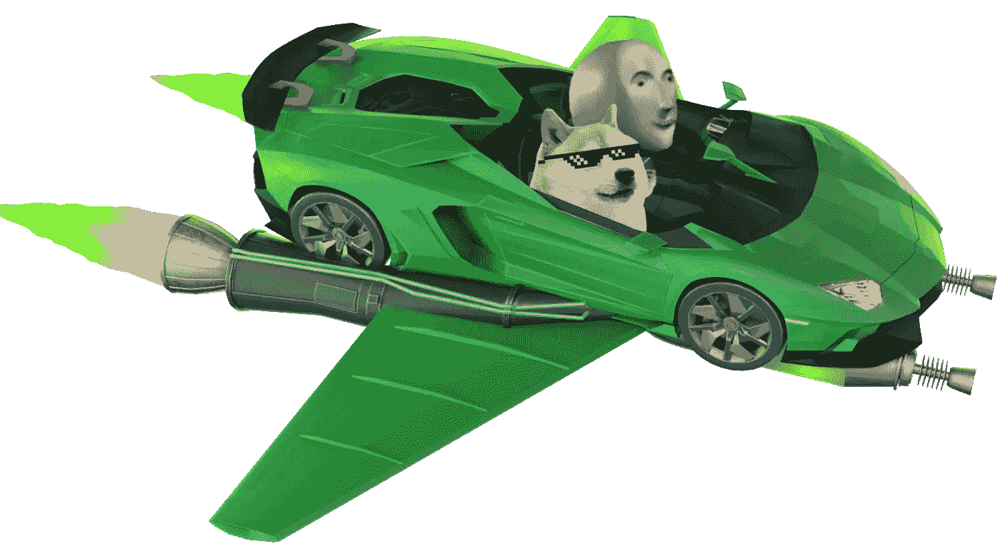
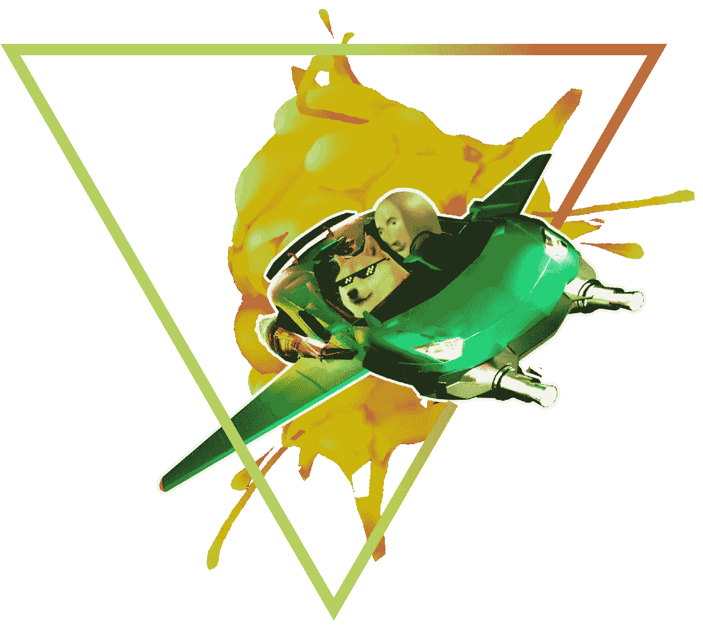

# 插入 Stonk，去中心化和数字游戏的未来

> 原文：<https://medium.com/coinmonks/insert-stonk-the-future-of-decentralized-and-digital-gaming-be1ad6e7e31?source=collection_archive---------45----------------------->

Source: Insert Stonks | LinkedIn

ameFi 指的是博彩业的金融监管放松，是“游戏”和“金融”两个词的混合。2020 年，区块链游戏业务创造了 3.21 亿美元的收入，4190 万游戏玩家拥有数字资产或加密货币。 [Insert Stonks](https://insertstonk.io/) 旨在帮助游戏企业和整个游戏社区。统计数据显示，现在地球上大约有 25 亿游戏玩家，他们每年花费数十亿小时玩游戏。 [Insert Stonks](https://insertstonk.io/) 汇集了一群来自游戏、技术、营销和区块链行业的专家，他们正在为游戏提供一个通用的金融系统，使游戏经济和支付变得简单。**本文旨在传达**[**Insert Stonks**](https://insertstonk.io/)**在游戏行业中的作用，以及它打算如何革新 GameFi**

根据统计数据，视频游戏业务预计将从 2021 年的 1780 亿美元增长到 2025 年的 2688 亿美元，四年内增长 66%。仅在 2021 年第三季度，Axie Infinity 就创造了 20.8 亿美元的收入。有潜力创造更强大、更有利可图的游戏经济来迎合各种各样的玩家和开发者——这种经济可能会成为病毒式的成功的 P2E 模式——这个行业仅仅触及了表面。 [Insert Stonks](https://insertstonk.io/) 的目标是增加游戏创作者的收入，同时也让游戏玩家在做他们喜欢的事情时赚到真金白银。通过区块链令牌化，游戏玩家可以获得数字资产的实际所有权，并为他们的时间和专业知识获得补偿。

# 月球之路(R2M)

***……招牌技能型游戏发明***

Prototype image of R2M gaming console. Source: [insertstonks.io](https://www.insertstonks.io/)

# R2M 是索拉纳网络的第一个基于技能的赛车 P2E 游戏。这是一个纯粹的冒险经历，让玩家加入 Doge 和 Stonks 先生的旅程，在太空中发现人类的新家(展示 STONK 引擎的可能性)。

STONK Engine 是一款面向游戏开发者的软件即服务(SaaS) API 和软件开发工具包(SDK)平台。它是链不可知的，因为它根据特定开发人员想要使用的 SDK 连接到不同的区块链。

Source: [Insert Stonk](https://www.insertstonks.io/)

R2M 玩家可以选择他们最喜欢的加密货币，并和斯通克先生一起乘坐兰博。你走得越远越好，避开泰斯拉、鲸鱼和 SEC 车辆，同时收集 STNX 代币以备后用。该池由当天的获胜高分赢得！这是你利用自己的技能登上月球的独一无二的机会。

为了促进参与和刺激， [Insert Stonk](https://insertstonk.io/) 与 WenLamboNFT 合作，将他们的热门 NFT 汽车带到了 CROSS-CHAIN。 [Insert Stonk](https://insertstonk.io/) 是为独立和移动游戏创作者开发的，他们希望通过 P2E 提高游戏收入，但既没有预算也不了解区块链，不像其他区块链技术那样为游戏构建只有大型游戏工作室才能负担得起的独特解决方案。

> 现在，拥有 WenLambo 资产的游戏玩家和开发者可以用他们的 NFT 汽车玩 Insert Stonk 游戏了。在合适的 R2M 竞技场上，NFT 汽车公司将提高汽车的最大速度，允许非凡的加速提升和其他性能能力等。

Insert Stonk Lambo Spacecraft. Source: [Insert Stonk](https://www.insertstonks.io/)

> 在这个游戏经济中使用的代币是 ISRM。要耕种 ISRM，玩家首先要在霍皮乌姆购买一块地产。持有的 NFT 数量越多，收益率越高。有了这个，你甚至可以开始一个街头帮派，通过租赁 NFT 和教你的船员为你赚钱来产生可行的被动收入。你也可以在你的车库里“拉皮条”你的车辆和化身

即将在 [Insert Stonk](https://insertstonk.io/) 生态系统上发布的其他游戏包括:

> **我的博物馆，**
> 
> **太空卡特尔，**
> 
> **Petent 等等。**

第一届区块链 P2E 游戏产生了巨大的兴趣，参与度和盈利能力，尽管对缺乏密码交易，基本游戏原则和设计经验的公众来说有很大的障碍。 [Insert Stonks](https://insertstonk.io) 是由游戏玩家为游戏玩家创造的，它使用 Web 3.0 在玩家、开发者和投资者之间架起桥梁，从而提高游戏盈利能力，同时让游戏玩家赚到真金白银。

*关注* [***插入 Stonks***](https://insertstonk.io) *社交媒体及时更新:*

[*不和*](https://discord.gg/C4sUmhfG) *，* [*插入乱石推特*](https://twitter.com/InsertStonks) *，* [*电报*](https://t.me/InsertStonks) *和* [*R2M 推特*](https://twitter.com/realRoad2Moon)

[*WenLamboNFT*](https://wenlambo.one/)*；* [*不和*](https://discord.gg/sP7PBzd4)

*待更新有***:*[*推特*](https://twitter.com/cryptoruppted?t=4ub4-ZJ9_wYVU2oRaUVGoA&s=09) *，*[*Youtube*](https://youtube.com/channel/UCpfNrZ6rS2Upp65iQLW67DA)*，* [*电报*](https://t.me/cryptoruppted)*

> *加入 Coinmonks [电报频道](https://t.me/coincodecap)和 [Youtube 频道](https://www.youtube.com/c/coinmonks/videos)了解加密交易和投资*

# *另外，阅读*

*   *[如何在 FTX 交易所交易期货](https://coincodecap.com/ftx-futures-trading) | [OKEx vs 币安](https://coincodecap.com/okex-vs-binance)*
*   *[CoinLoan 评论](https://coincodecap.com/coinloan-review) | [YouHodler 评论](/coinmonks/youhodler-4-easy-ways-to-make-money-98969b9689f2) | [BlockFi 评论](https://coincodecap.com/blockfi-review)*
*   *[XT.COM 评论](https://coincodecap.com/profittradingapp-for-binance)币安评论 |*
*   *[SmithBot 评论](https://coincodecap.com/smithbot-review) | [4 款最佳免费开源交易机器人](https://coincodecap.com/free-open-source-trading-bots)*
*   *[比特币基地僵尸程序](/coinmonks/coinbase-bots-ac6359e897f3) | [AscendEX 审查](/coinmonks/ascendex-review-53e829cf75fa) | [OKEx 交易僵尸程序](/coinmonks/okex-trading-bots-234920f61e60)*