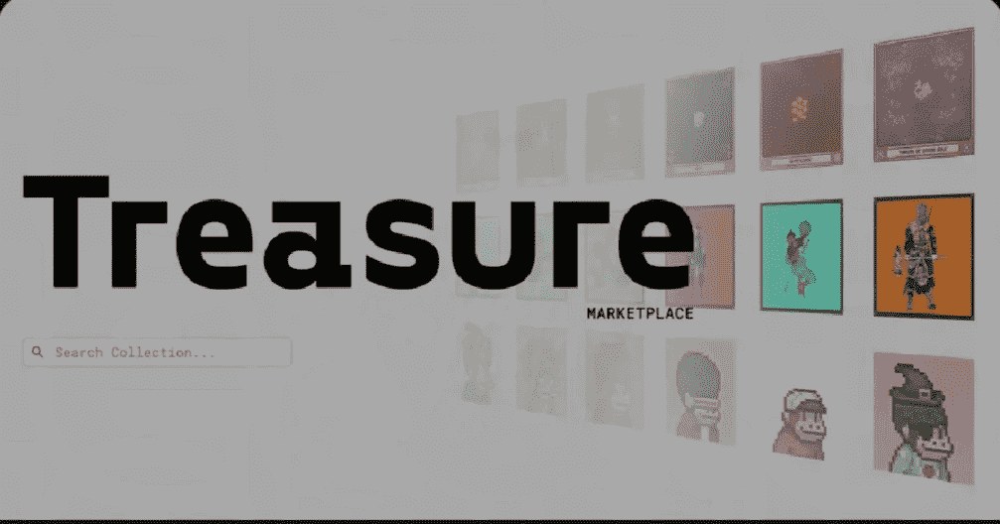

# 宝藏生态系统内部

> 原文：<https://medium.com/coinmonks/inside-the-treasure-ecosystem-d0da72cf0b27?source=collection_archive---------38----------------------->

在以太坊智能合约的长期可扩展性问题的解决方案中，被称为 [**ARBITRUM**](https://arbitrum.io/) 的第二层解决方案被设计为在速度和可扩展性方面增强以太坊智能合约。
解决方案:Arbitrum 是一种独特的技术，被称为乐观汇总。
将这种可扩展性的使命带到 NFT 生态系统中，**宝岛**就此形成，也就有了我们今天的谈话。

一个由利益攸关的魔法持有者管理的独特社区管理着项目的决策。这个社区根据书面故事和资源建立并引导新的元宇宙项目。
该 DAO 已经开始在 NFT 生态系统中建立分散的竞争对手，并通过在 [**Arbitrum 上建立顶级的 NFT 生态系统来成为 NFT 生态系统的巨头。**](https://arbitrum.io/)

**ARBITRUM 上的分散市场**

[**宝藏**](https://docs.treasure.lol/about-treasure/readme) 是一个为元宇宙项目打造的分散式 NFT 生态系统，由社区公平驱动。事实上，几乎所有的团队成员都来自社区。

为了完成**宝岛**任务， [**宝地**](https://www.treasure.lol/) 在各自的元经文中利用**$魔法**展开。
宝岛鼓励社区与团队共同建设，利用 it 资源创造自己的故事。他们还通过**$魔法**代币获得奖励，代币是**宝藏**生态系统的燃料。

**$MAGIC** 这是宝藏 NFT 生态系统的唯一货币，包括市场交易。DAO 通过$MAGIC emissions 开发和发展新项目。

**线程，未完待续..………..随着国库道卷的更新**

如需更多宝刀更新，请关注！！！

在[中跳跃**宝刀碎碎念。**](https://twitter.com/Treasure_DAO)

在[中跳跃**宝藏不和谐**](https://discord.gg/sK2CzHzSkD) **。**

> 加入 Coinmonks [电报频道](https://t.me/coincodecap)和 [Youtube 频道](https://www.youtube.com/c/coinmonks/videos)了解加密交易和投资

# 另外，阅读

*   [币安 vs FTX](https://coincodecap.com/binance-vs-ftx) | [最佳(SOL)索拉纳钱包](https://coincodecap.com/solana-wallets)
*   [比诺莫评论](https://coincodecap.com/binomo-review) | [斯多葛派 vs 3Commas vs TradeSanta](https://coincodecap.com/stoic-vs-3commas-vs-tradesanta)
*   [Capital.com 评论](https://coincodecap.com/capital-com-review) | [香港的加密借贷平台](https://coincodecap.com/crypto-lending-hong-kong)
*   [如何在 Uniswap 上交换加密？](https://coincodecap.com/swap-crypto-on-uniswap) | [A-Ads 审查](https://coincodecap.com/a-ads-review)
*   [WazirX vs coin dcx vs bit bns](/coinmonks/wazirx-vs-coindcx-vs-bitbns-149f4f19a2f1)|[block fi vs coin loan vs Nexo](/coinmonks/blockfi-vs-coinloan-vs-nexo-cb624635230d)