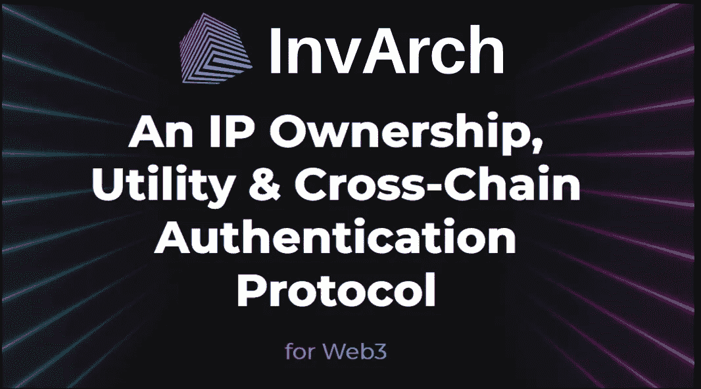

# 来自 InvArch 白皮书第 1/3 部分的见解

> 原文：<https://medium.com/coinmonks/insights-from-the-invarch-whitepaper-part-1-3-4e05d333370a?source=collection_archive---------32----------------------->

## 简介—从 IP over NFTs 到 IPFs

白皮书是一个加密项目发布的文档，为投资者提供有关其概念、愿景和路线图的技术信息。2022 年对因瓦奇来说是至关重要的一年，因为这一年因瓦奇开始制造积木并向世界证明其潜力。随着白皮书的发布，InvArch 为其未来奠定了重要的基石。

## 新的 InvArch 白皮书

新的 InvArch 白皮书于 2022 年 1 月 21 日发布。这是一份复杂而成熟的文件。在过去的几个月里，因瓦奇捕捉到了概念和哲学上的变化，这些变化已经变得非常明显。
本文介绍了利用区块链技术允许个人标记和存储其知识产权(IP)的协议愿景。

## 知识产权

知识产权(IP)是理解 InvArch 及其白皮书的基本概念。对知识产权的标准解释是智力创造，如发明、文学作品和艺术作品。也就是说，知识产权可以是任何东西，从 JPEG、音频文件、蓝图、商业秘密、源代码、项目草图、视频、一段音乐，到由大量相互依赖的文件组成的计算机程序。只要 IP 存在或者能够以文件和/或文件夹的形式存在，就可以使用 InvArch 对其进行标记化。该团队希望 IP 令牌化的障碍尽可能低，过程尽可能平稳！

## 从 NFTs 上的 IP 到 IPFs 和 IPS

不可替代代币(NFT)是不具备可替代性的加密货币。它们用于表示不可改变的记录和独特项目所有权的证明，如数字艺术、房地产和实物商品。
因瓦奇运用了 NFT 令人激动的力量，并将其应用于艺术之外的领域；该协议允许用户以 NFTs 的形式标记和存储任何知识产权文件，现在称为知识产权文件(IPFs)。
与 IP 文件相比，有两种不同的直接查看 NFT 的方法。首先，IP 文件以一种分散、不可信和透明的方式得到身份验证和主动保护。其次，由于 Web3 中已经存在大量的 NFT，InvArch 也可以在 NFT 标准中实现，作为支持这些标准的核心托盘。同样的 NFTs，增加了一层基于哈希的标识符&底层的新功能。同样的 NFTs，增加了一层基于哈希的标识符&底层的新功能。通过这种方式，InvArch 可以直接通过与其他链的模块集成来扩展其本地 IP 技术，并为预先存在的 NFT 提供资产认证。InvArch 旨在与 NFT 项目共存，但不仅仅被视为另一个项目。

因此，IPF 是以经过认证的 NFT 形式存储的任何文件类型的 IP，具有绝对的可组合性、真正的互操作性和无限制的实用性。它们证明了数字文件的存在和真实性(与所有权相比)，保护了资产的唯一性，并优化了其管理权限。

最后，一个或多个 IPF 可以一起存储在可互换和绑定的集合中，称为知识产权集合(IPSs)。IPSs 实现了任何文件类型之间的绝对可组合性。IPSs 可以比作 NFT 收藏；InvArch 为 IP 文件提供了一个类似的分组系统；但是，随着限制的放宽和功能的扩展。

访问因瓦赫官方渠道:
[**网站**](https://invarch.network/)】[**推特**](https://twitter.com/InvArchNetwork)**不和**】[**亚社会**](https://app.subsocial.network/5857)】[**中社会**](https://invarch.medium.com/)[**电报**](https://t.me/InvArch)[**Github**](https://github.com/Invarch)】

> 加入 Coinmonks [电报频道](https://t.me/coincodecap)和 [Youtube 频道](https://www.youtube.com/c/coinmonks/videos)了解加密交易和投资

# 另外，阅读

*   [如何购买瑞波(XRP)](https://coincodecap.com/buy-ripple-india) | [非洲最好的加密交易所](https://coincodecap.com/crypto-exchange-africa)
*   [非洲最佳加密交易所](https://coincodecap.com/crypto-exchange-africa) | [胡交易所评论](https://coincodecap.com/hoo-exchange-review)
*   [eToro vs robin hood](https://coincodecap.com/etoro-robinhood)|[MoonXBT vs Bybit vs Bityard](https://coincodecap.com/bybit-bityard-moonxbt)
*   [交易信号是什么？](https://coincodecap.com/trading-signal) | [Bitstamp vs 比特币基地](https://coincodecap.com/bitstamp-coinbase)
*   [ProfitFarmers 回顾](https://coincodecap.com/profitfarmers-review) | [如何使用 Cornix Trading Bot](https://coincodecap.com/cornix-trading-bot)
*   [如何在势不可挡的域名上购买域名？](https://coincodecap.com/buy-domain-on-unstoppable-domains)