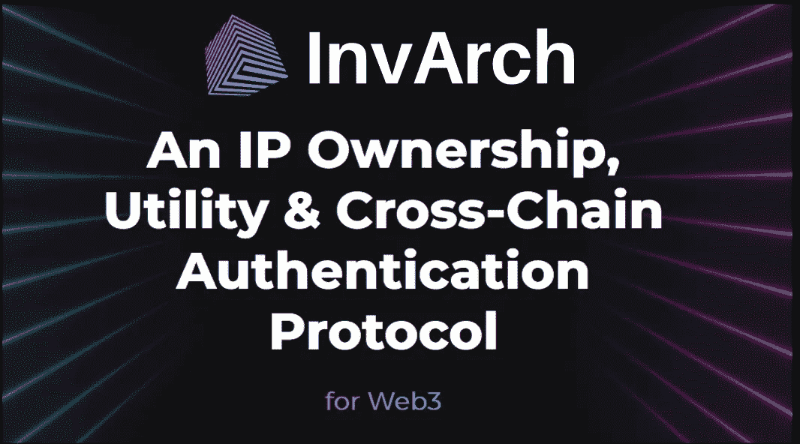

# 来自 InvArch 白皮书第 2/3 部分的见解

> 原文：<https://medium.com/coinmonks/insights-from-the-invarch-whitepaper-part-2-3-fb3d2cc51b94?source=collection_archive---------33----------------------->

## 思想与技术之间的桥梁

[在这篇文章的介绍部分](/@Cap_0438/insights-from-the-invarch-whitepaper-part-1-3-4e05d333370a)，我们看到了 InvArch 为革命性开发提供的基础架构的第一批元素:
InvArch 是一种协议，它使用区块链技术使个人能够将其知识产权(IP)标记化、认证和存储为知识产权文件(IPF)，并将这些 IPF 组合成称为 IP 集的集合。该协议的创新继续与可替换，可编程和可定制的 IP 令牌(IPT)绑定到 IP 集。因此，IP 集和 IPF 可以利用 ipt，类似于 dApps 和智能合约与其实用工具令牌的交互方式。

## 思想和技术之间的桥梁

本文介绍的知识产权资产新技术是所谓的 INV4 协议的一部分，in v4 协议代表发明、参与、投资和投资协议。这些都将由 Inv-ARCH 统一管理。因此，因瓦赫希望成为一座“拱门”，一座连接思想和技术、创造力和执行力的桥梁。这种联系将加速创新，并允许个人利用他们的想法为每个人创造一个更美好的世界，一次一个想法！那是因瓦奇的设想！

## 新技术和新概念

然后，白皮书的最终草案介绍了我们也需要熟悉的新技术和新概念。其中最本质的可能就是智能 IP 或者智能 IP 契约。
**智能知识产权或智能知识产权合同**将知识产权文件(IPF)的用例与智能合同功能相结合。智能 IP 是指知识产权文件(IP 文件)在 InvArch 上存储程序，在满足一定条件时自动执行。智能 IP 合同优化了各方或用户之间不可信的结果，因此所有参与者都可以立即确定结果，而无需任何第三方的参与或时间损失。
借助 IP 智能合约功能，前景一片光明。结合它们的可组合性和分离特性，它们有潜力引领由社区拥有和管理的去中心化 IP 技术。这种潜力可用于链上知识产权融资机制、流动性和合成知识产权令牌，为分配足够广泛的配额打开大门。换句话说，它允许不同的用例以及期望的社区规模，比如在 Dao 的构造中。InvArch 联合创始人 Gabriel Facco de Arruda 曾经说过，通过 InvArch，任何事情都可以成为一个 DAO，一个去中心化的自治组织。实现这一目标后，因瓦奇就能以决定性的方式为融入世界经济做出贡献。
**术语 IP 副本、桥接 IP、包装 IP 代表子资产。**在这种情况下，知识产权被整体或部分复制，以实现某些功能并与其他知识产权协作，同时保证原始 IPF 的原创性和真实性。这也不仅仅是关于安全性或利润潜力，而是关于合作和发展。换句话说，它是关于所有受保护的开源软件:音乐、代码、艺术、元宇宙作品、大多数专利/可申请专利的想法和发明。

所有这些奇妙的机制使因瓦奇独一无二；它成为世界上第一个真正兼容的平台——从各方面来说都是如此。因此，InvArch 不仅在思想和技术之间，或者在发明和资本之间架起了一座桥梁，而且也许最重要的桥梁是从一个思想到另一个思想的桥梁:优秀思想之间的合作。想法是我们最丰富的自然资源，可以说是我们最强大的，讽刺的是，也是我们最无用的。除非给他们一个可以茁壮成长、受到保护并用于合作的环境，否则大多数想法都会消亡。但是现在，让我们想象一下，如果世界上的天才们真正地相互合作，会有什么样的结果。InvArch 希望让个人能够使用它的想法并合作，为每个人创造一个更美好的世界，这确实是一个很好的观点。

[也请阅读第 3 部分](/@Cap_0438/insights-from-the-invarch-whitepaper-part-3-3-d4ad10a15cf7)

访问因瓦赫官方渠道:
[**网站**](https://invarch.network/)[**推特**](https://twitter.com/InvArchNetwork)[**不和**](https://discord.gg/J5Qwcb7tbN)】[**子社会**](https://app.subsocial.network/5857)】[**中**](https://invarch.medium.com/)[**电报**](https://t.me/InvArch)[**Github**](https://github.com/Invarch)

> 加入 Coinmonks [电报频道](https://t.me/coincodecap)和 [Youtube 频道](https://www.youtube.com/c/coinmonks/videos)了解加密交易和投资

# 另外，阅读

*   [10 本关于加密的最佳书籍](https://coincodecap.com/best-crypto-books) | [英国 5 个最佳加密机器人](https://coincodecap.com/uk-trading-bots)
*   [ko only 点评](https://coincodecap.com/koinly-review) | [Binaryx 点评](https://coincodecap.com/binaryx-review)|[Hodlnaut vs CakeDefi](https://coincodecap.com/hodlnaut-vs-cakedefi-vs-celsius)
*   [MoonXBT vs Bybit vs 币安](https://coincodecap.com/bybit-binance-moonxbt) | [硬件钱包](/coinmonks/hardware-wallets-dfa1211730c6)
*   [火币交易机器人](https://coincodecap.com/huobi-trading-bot) | [如何购买 ADA](https://coincodecap.com/buy-ada-cardano) | [Geco。一次复习](https://coincodecap.com/geco-one-review)
*   [币安 vs 比特邮票](https://coincodecap.com/binance-vs-bitstamp) | [比特熊猫 vs 比特币基地 vs Coinsbit](https://coincodecap.com/bitpanda-coinbase-coinsbit)