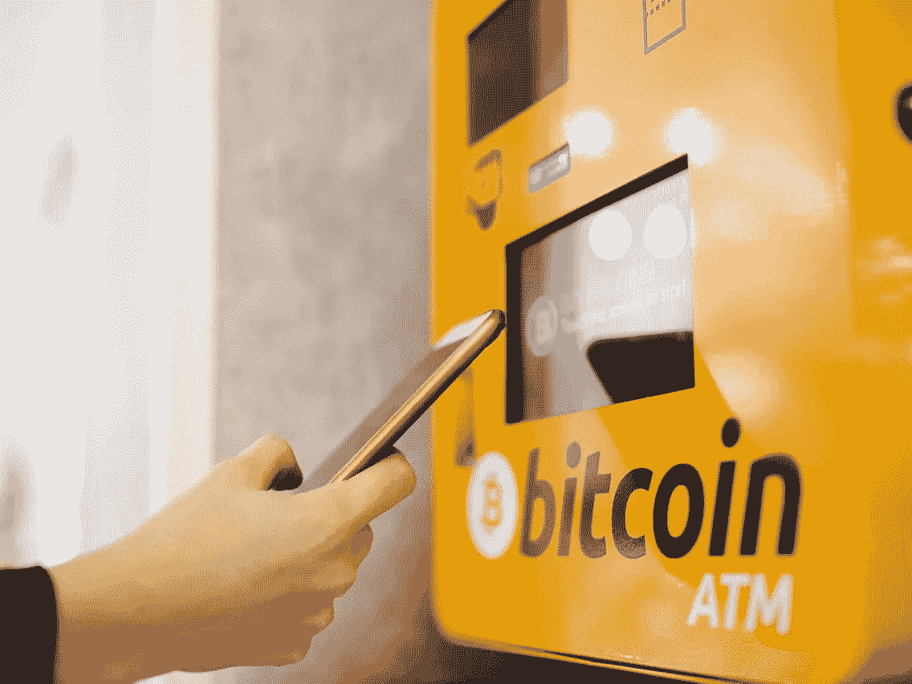
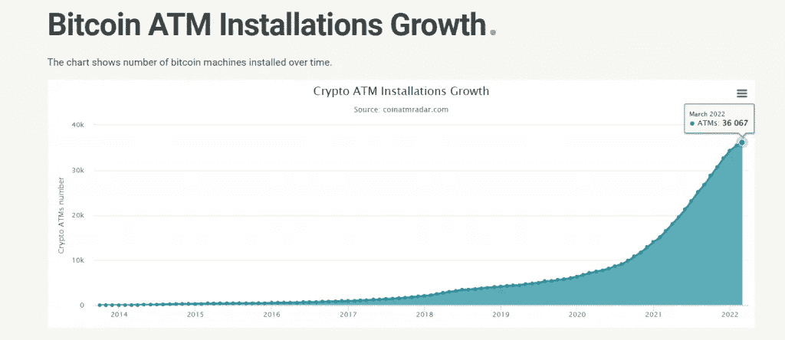
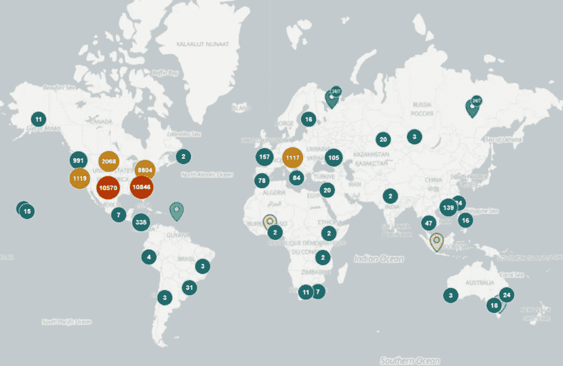

# 2022 年初，比特币自动取款机的安装速度首次放缓

> 原文：<https://medium.com/coinmonks/installations-of-bitcoin-atms-slow-in-early-2022-a-first-3d3e89fdb27c?source=collection_archive---------85----------------------->

**Visit our website:-** [**https://bitcoinsupports.com/**](https://bitcoinsupports.com/)

2022 年前两个月，全球建立了 1817 台加密自动取款机。去年同期，安装了 2435 台加密自动取款机。在过去的六个月里，比特币(BTC)已经达到了许多里程碑，包括在萨尔瓦多的广泛采用，创下 69，000 美元的历史新高，以及比以往任何时候都高的网络散列率。然而，与前一年相比，前两个月全球比特币 ATM 安装量有史以来首次放缓。

根据 Coin ATM Radar 的数据，今年前两个月安装的比特币 ATM 数量通常会逐年攀升。然而今年，这种模式被打破了。

**Visit our website:-** [**https://bitcoinsupports.com/**](https://bitcoinsupports.com/)

2022 年前两个月，全球共部署了 1817 台加密自动取款机。去年同期安装了 2435 台加密自动取款机，比今年多了 618 台。

2020 年这一时间段仅安装了 760 台 ATM，远远超过 2019 年安装的 250 台 ATM。

缺乏新兴司法管辖区的参与是当前低迷的主要原因之一。2022 年安装了 1，689 台新的加密 ATM，仅美国就占全球加密 ATM 安装总数的 93%。然而，在欧洲，比特币自动取款机的数量在前两个月减少了一台，总数为 1397 台。在撰写本文时，北美安装了 34，284 台加密 ATM，占加密 ATM 安装总数的 95%以上。

**Visit our website:-** [**https://bitcoinsupports.com/**](https://bitcoinsupports.com/)

目前，有 36，067 台自动取款机在运行。尽管今年开局不利，但加密 ATM 的部署预计将会增加，萨尔瓦多计划安装 1500 台比特币 ATM。随着现有的加密友好国家在安装新的加密和比特币自动取款机方面达到饱和，除非更多政府加大努力促进加密的采用，否则将很难保持上升趋势。

旅游业的大幅增长是萨尔瓦多接受比特币的首批有益成果之一。萨尔瓦多旅游部长莫雷纳·瓦尔迪兹(morena Valdez)2 月 22 日表示，自 2021 年 9 月比特币法律实施以来，该国旅游业增长了 30%以上。https://twitter.com/monicataher/status/1495973994306367490

据瓦尔迪兹称，萨尔瓦多旅游业的繁荣超过了政府的预测，游客人数从 110 万增加到 140 万。

**“我们本来预算 80 万美元的外汇，结果却多了 14 亿美元的外汇收入。”**

**访问我们的网站:-**[**https://bitcoinsupports.com/**](https://bitcoinsupports.com/)

**免责声明:以上为作者观点，不应视为投资建议。读者应该自己做研究。**

> 加入 Coinmonks [电报频道](https://t.me/coincodecap)和 [Youtube 频道](https://www.youtube.com/c/coinmonks/videos)了解加密交易和投资

# 另外，阅读

*   [CoinDCX 评论](/coinmonks/coindcx-review-8444db3621a2) | [加密保证金交易交易所](https://coincodecap.com/crypto-margin-trading-exchanges)
*   [红狗赌场评论](https://coincodecap.com/red-dog-casino-review) | [Swyftx 评论](https://coincodecap.com/swyftx-review) | [CoinGate 评论](https://coincodecap.com/coingate-review)
*   [Bookmap 评论](https://coincodecap.com/bookmap-review-2021-best-trading-software) | [美国 5 大最佳加密交易所](https://coincodecap.com/crypto-exchange-usa)
*   [如何在 FTX 交易所交易期货](https://coincodecap.com/ftx-futures-trading) | [OKEx vs 币安](https://coincodecap.com/okex-vs-binance)
*   [CoinLoan 评论](https://coincodecap.com/coinloan-review) | [YouHodler 评论](/coinmonks/youhodler-4-easy-ways-to-make-money-98969b9689f2) | [BlockFi 评论](https://coincodecap.com/blockfi-review)
*   [XT.COM 评论](https://coincodecap.com/profittradingapp-for-binance)币安评论 |
*   [SmithBot 评论](https://coincodecap.com/smithbot-review) | [4 款最佳免费开源交易机器人](https://coincodecap.com/free-open-source-trading-bots)
*   [比特币基地僵尸程序](/coinmonks/coinbase-bots-ac6359e897f3) | [AscendEX 审查](/coinmonks/ascendex-review-53e829cf75fa) | [OKEx 交易僵尸程序](/coinmonks/okex-trading-bots-234920f61e60)