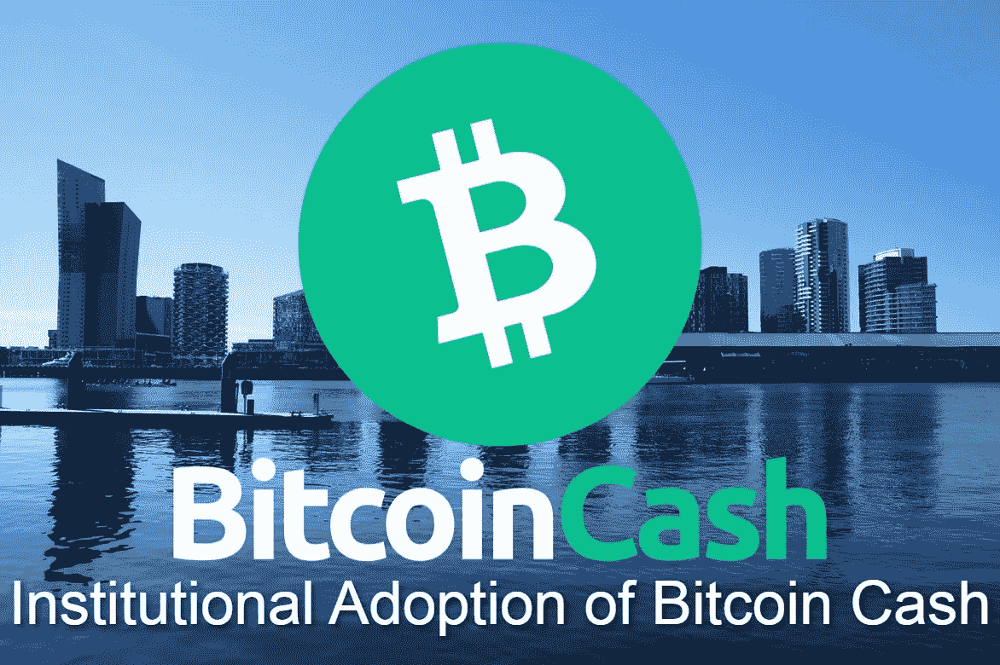
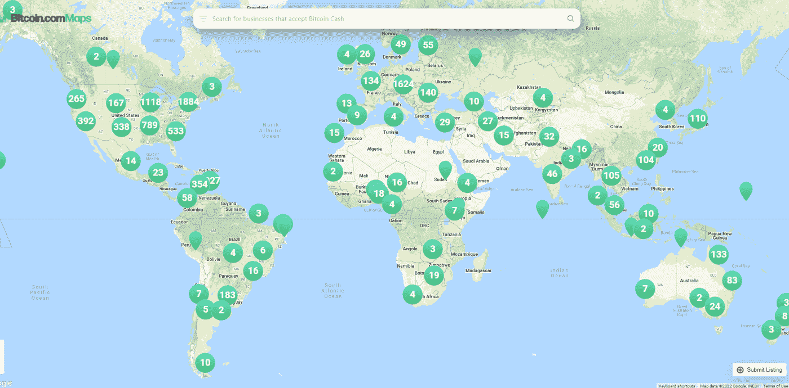
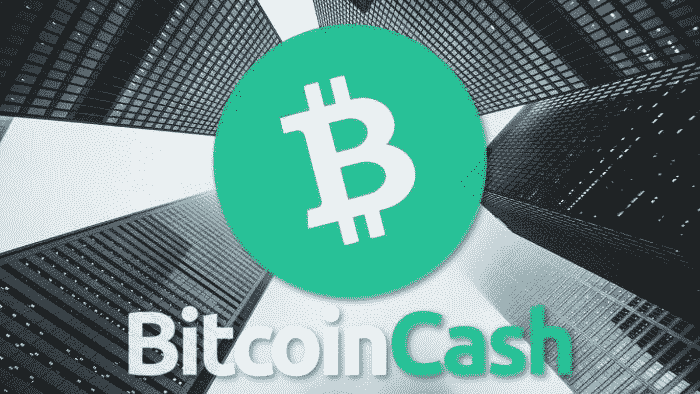

# 比特币现金的机构采用

> 原文：<https://medium.com/coinmonks/institutional-adoption-of-bitcoin-cash-7886b34034e?source=collection_archive---------6----------------------->

机构不看 YouTube，不在 Reddit 上搜索，也不关注 Twitter 影响者的金融建议。

机构基金根据定量分析来制定投资策略，识别某项资产或加密货币等资产类别的影响和潜力。

对加密货币的关注点是对**电子商务和商户采用**、**汇款**和**数字分散金融**的影响。作为一种加密货币，比特币现金现在正在扩展到所有这些服务:

机构的投资方不会购买股票或加密货币来大规模地将其用作产品。

2021 年是比特币现金采用率增长的杰出一年。价格行为实际上并不代表接受度的发展和增加，也不反映 BCH 网络效应的巨大扩张。

# 2021 年机构采用比特币现金

比特币(BTC)和以太坊是当今最受欢迎的加密货币。比特币现金失去了市场份额，市值跌至前 20 名以下，但这并不反映发展或链上和侧链的采用。

机构用专业的方法分析产品和资产，而不是采用统计 Twitter 虚假民意调查和社交媒体评论机器人的逻辑。

*   ***摩根大通&公司(美国):****(BCH—BTC—ETH—ETC)*
*   ***SBI 控股(日):****(BCH-XRP-BTC-ETH-LTC)*
*   ***乐天(日本):****(BCH——BTC——瑞士联邦理工大学)*
*   ***21 股(欧盟):*** *(BCH — BTC —瑞士联邦理工大学)*
*   ***互动券商(目前美国):****(BCH—BTC—ETH—LTC)*
*   ***AMC 影院*** *— Bitpay:(美国)*
*   ***PayPal(目前为美国&英国):****(BCH—BTC—ETH—LTC)*
*   ***Bancolombia(哥伦比亚):****(BCH—BTC—ETH—LTC)*

机构支持比特币现金，但 2020 年和 2021 年的大量投资分配在 BTC 和瑞士联邦理工学院。我们预料到了这一点，因为 BTC 和瑞士联邦理工学院的资产代表了华尔街对加密货币的看法，以及监管和整合传统金融的计划。

不过，BCH 一直是最佳选择，并为机构提供了一个独特的案例。

# 商家和电子商务的采用

[https://map.bitcoin.com/](https://map.bitcoin.com/)

比特币现金的目的是作为货币使用。这是一种数字形式的现金，特点是即时交易和微不足道的费用，低于一分钱。

当用现金支付时，交易需要几秒钟来打开钱包，将账单交给收银员，并接收零钱和收据。

比特币现金实现了和现金一样的速度。

十多年来，随着电子商务的蓬勃发展，网上购物越来越多。互联网利用了这种潜力，然而，传统的金融系统，由于其集中的程序而阻碍了商业的发展。

由于各种原因，使用电子商务进行交易通常会很困难:

*   设置电子银行可能需要数周时间才能激活
*   不得不处理 2 或 3 个密码来执行一次交易
*   数据泄露和内部人员
*   信任的要求。

用比特币现金支付更容易，只需要扫描二维码。

钱已经到了商店的账户，你购买的东西会尽快送到。

比特币现金没有一长串拒绝代码，而是提供了一个去中心化、无许可、防篡改和防审查的网络。

通过银行系统(POS 和电子商务)进行的交易有很大一部分会因为多种原因而被拒绝。

可能是手动数据输入错误、缺乏监督、POS 软件过时，甚至更糟:网络故障。银行网络甚至 VISA/Mastercard 故障、服务器错误，以及缺乏网络基础设施，集中式服务器无法适应日益增长的使用量。

集中式银行流程根本无法正常工作。到目前为止，银行支付网络在阻碍商业和创业方面发挥了作用，有时它甚至给企业带来了威胁其运营可行性的巨大问题。

**比特币现金全天候运行。**该网络强大而安全，由密码领域第二高的 PoW hashrate 提供支持。

# 国外汇款(2021 年为 5890 亿美元)和跨境交易

这是在国外工作的移民汇回中低收入国家的钱。

使用加密货币的汇款数量数据不容易检索，但 2021 年的总数接近 6000 亿美元(根据[世界银行](https://www.worldbank.org/en/news/press-release/2021/11/17/remittance-flows-register-robust-7-3-percent-growth-in-2021))。

中央当局正在监测这类交易的区块链或加密交易所，但是加密汇款的数量并不公开。

因此经常使用加密。我们经常会发现移居国外的人在他们的祖国之外生活和工作，并且不得不处理各种各样的机构、规章和费用，把钱汇回家。

比特币现金也用于汇款，因为这是随时随地汇款的最实用方式。

随着比特币现金的接受度不断上升，与 BCH 相关的汇款也将呈指数级增长。这个市场的潜力是巨大的。

任何对加密货币丝毫不感兴趣的人都会发现，比特币现金是汇钱回家的最佳选择，因为它是即时的，并降低了跨境交易的成本。

比特币现金(和其他加密货币一样)还没有被广泛采用。将比特币现金汇回家是一个即时的程序，只需要微不足道的费用(通常不到 0.01 美元)，但接收方将发现很难花这笔 BCH 来满足直接需求。

因此，接收方必须将 crypto 清算为 fiat，并从银行账户中提取资金来访问它们。目前所有不涉及 P2P 直接接受加密(如加密卡)的解决方案都有费用，并且可能不是即时的。随着加密货币的采用不断增加，这一程序将被取消。

随着商家对加密货币的采用越来越多(无论是 P2P 还是通过 BitPay 和 Gocrypto 等第三方处理器)，使用加密货币的外国汇款将会激增。

# 机构不会错过下一件大事

银行系统和传统金融处于半过时的模式。

你不是简单地在旧的金融体系中吸收加密货币，而是废除旧的，支持已经在推动金融进步和经济自由的东西。

比特币现金提供了可能的最佳方式，一种增强和支持商业的方式。机构不仅仅是银行，而是理解变化，希望成为任何革命的一部分。每个基金的目的都是不要错过下一件大事，比特币现金今天就提供了这个选项。

随着 smartBCH 侧链的开发，BCH 在 2021 年将业务扩展到新的有前途的领域。在 2022 年内，smartBCH 将进一步发展成为一个分散的、经济高效的、安全的和稳健的智能合同网络。

SmartBCH 是通往整个世界数字经济的门户，不像以太坊那样只为精英阶层设计。

比特币现金的侧链，具有智能合约(EVM 兼容)功能，专注于未来的数字经济。

BCH 和 smartBCH 提供了一个机构不能忽视的强有力的一揽子计划。

竞争只能靠宣传，赶不上 BCH 的发展。

Writing at the following websites: ● [ReadCash](https://read.cash/@Pantera) ● [NoiseCash](https://noise.cash/u/Pantera99) ● [Medium](/@panterabch) ● [Hive](https://hive.blog/@pantera1) ● [Steemit](https://steemit.com/@pantera1) ●[Vocal](https://vocal.media/authors/pantera) ● [Minds](https://www.minds.com/pantera99/) ● [Twitter](https://twitter.com/Panterabch) ● [LinkedIn](https://www.linkedin.com/in/panterabch/) ● [email](https://read.cash/@Pantera/localcryptos-p2p-exchange-is-now-offering-bitcoin-cash-trading-06637230#bad-link)

> **免责声明**:本内容中发布的所有材料均用于娱乐和教育目的，并且**遵守公平使用准则**。无意侵犯版权。如果您是或代表本文所用材料的版权所有者，并且对所述材料的使用有疑问，请发送[电子邮件](https://read.cash/@Pantera/cryptouknowns-battlegrounds-the-crypto-battle-royal-part-i-0ca762da#bad-link)。

***如果你喜欢这篇文章，别忘了订阅并点赞！***

*原载于*[*https://read . cash*](https://read.cash/@Pantera/institutional-adoption-of-bitcoin-cash-c10d9ca5)*。*

> 加入 Coinmonks [电报频道](https://t.me/coincodecap)和 [Youtube 频道](https://www.youtube.com/c/coinmonks/videos)了解加密交易和投资

## 另外，阅读

*   [币安交易机器人](/coinmonks/binance-trading-bots-d0d57bb62c4c) | [OKEx 评论](/coinmonks/okex-review-6b369304110f) | [Atani 评论](https://blog.coincodecap.com/atani-review)
*   [最佳加密交易信号电报](/coinmonks/best-crypto-signals-telegram-5785cdbc4b2b) | [MoonXBT 评论](/coinmonks/moonxbt-review-6e4ab26d037)
*   [如何在 Bitbns 上购买柴犬(SHIB)币？](https://blog.coincodecap.com/buy-shiba-bitbns) | [买弗洛基](https://blog.coincodecap.com/buy-floki-inu-token)
*   [CoinFLEX 评论](https://blog.coincodecap.com/coinflex-review) | [AEX 交易所评论](https://blog.coincodecap.com/aex-exchange-review) | [UPbit 评论](https://blog.coincodecap.com/upbit-review)
*   [十大最佳加密货币博客](https://blog.coincodecap.com/best-cryptocurrency-blogs) | [YouHodler 评论](https://blog.coincodecap.com/youhodler-review)
*   [AscendEx 保证金交易](https://blog.coincodecap.com/ascendex-margin-trading) | [Bitfinex 赌注](https://blog.coincodecap.com/bitfinex-staking)
*   [最好的卡达诺钱包](https://blog.coincodecap.com/best-cardano-wallets) | [Bingbon 副本交易](https://blog.coincodecap.com/bingbon-copy-trading)
*   [印度最佳 P2P 加密交易所](https://blog.coincodecap.com/p2p-crypto-exchanges-in-india) | [柴犬钱包](https://blog.coincodecap.com/baby-shiba-inu-wallets)
*   [八大加密附属计划](https://blog.coincodecap.com/crypto-affiliate-programs) | [eToro vs 比特币基地](https://blog.coincodecap.com/etoro-vs-coinbase)
*   [最佳以太坊钱包](https://blog.coincodecap.com/best-ethereum-wallets) | [电报上的加密货币机器人](https://blog.coincodecap.com/telegram-crypto-bots)