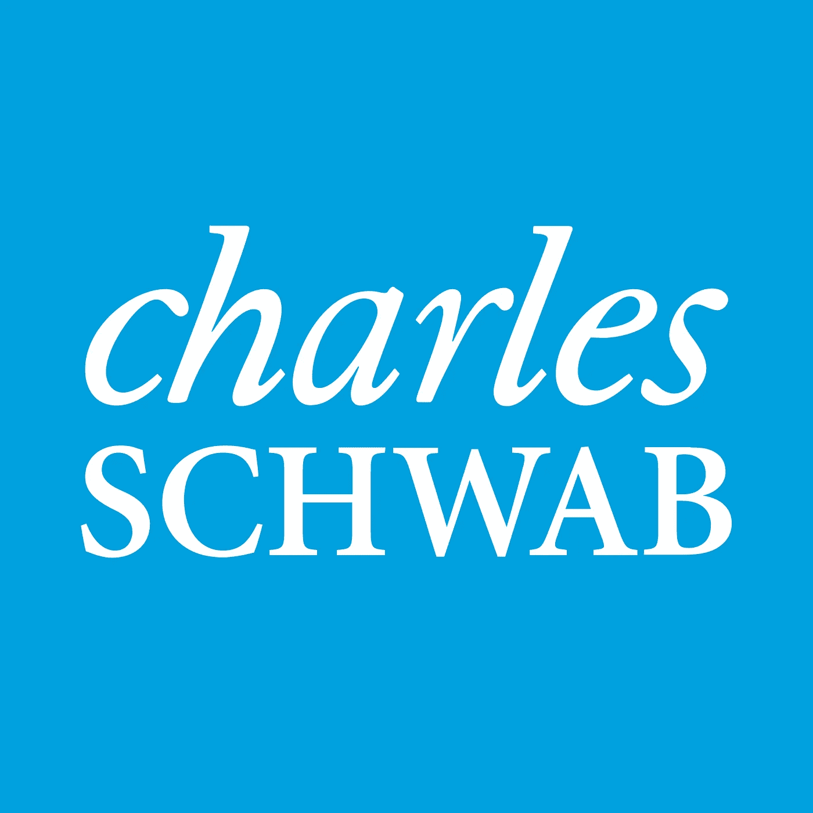
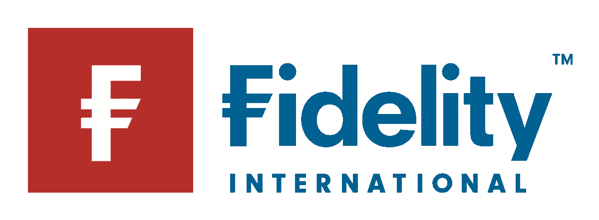
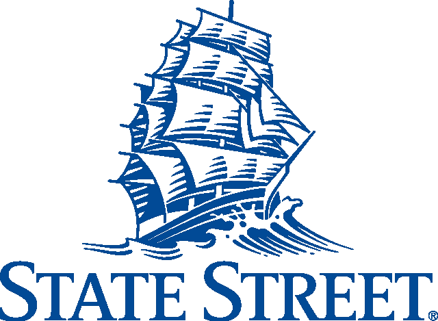
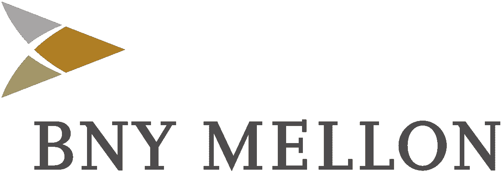

# 2022 年机构加密的采用

> 原文：<https://medium.com/coinmonks/institutional-crypto-adoption-in-2022-bf6b3d1ee842?source=collection_archive---------12----------------------->

source: cryptonews.com

# 介绍

一个新的经济正在形成。它的主题是去中心化，并使用区块链作为一种方法。加密货币是 Web3 之旅的重要组成部分，因为它们提供了一种激励结构和价值转移机制。

金融机构对加密货币的广泛接受将有助于以多种方式巩固和合法化 Web3 经济。随着数十亿美元可用于投资，加密货币的主要投资组合配置可能代表着许多数字资产的重大价值拐点。

那么，我们在旅程的这一点上处于什么位置呢？

# 主要资产经理

**贝莱德——10 万亿美元 AUM**

source: commons.wikimedia.org

**什么:** ETF，加密交易

**报道:** Q1 2022

今年 1 月，这家全球最大的资产管理公司申请创建一只与区块链相关的交易所交易基金。iShares 区块链和科技 ETF 将跟踪区块链和加密领域的公司，如加密矿工、加密交易所和专注于区块链技术开发的企业。

2 月中旬有报道称，贝莱德将通过综合投资管理平台“阿拉丁”向其客户提供加密交易。

**加密市场影响:潜在的高影响**

贝莱德的 iShares 区块链和科技 ETF 不太可能对加密市场产生重大影响，因为所有进入此类基金的机构资金都不会用于直接收购加密货币。这种 ETF 是一种持有多种资产的基金，在这种情况下，是指在加密和区块链领域运营的公司的股票。然而，它将为投资者对该领域的兴趣以及行业发展和投资回报率提供一个清晰的指标。鉴于积极的投资者情绪(和监管)，贝莱德可能会采取下一步措施，建立一只专门投资加密货币的加密基金。

贝莱德决定通过“阿拉丁”向客户提供加密交易，这将产生立竿见影的影响。贝莱德的金融软件工具“阿拉丁”是一个面向全球投资经理的中央处理系统。它现在被广泛应用于金融行业，管理着至少 21 万亿美元的资产。客户包括苹果、微软、谷歌，十大保险公司中的一半，主权财富基金如日本 1.5 万亿美元的政府养老基金，以及主要的基金管理公司如 Vanguard。

**查尔斯·施瓦布——7.5 万亿美元 AUM**

source: commons.wikimedia.org

**什么:** ETF

**报道:** Q1 2022

查尔斯·施瓦布已申请创建一只指数跟踪 ETF，该基金将投资于活跃于数字资产以及与区块链科技相关的商业业务的公司。根据他们的监管文件，嘉信加密经济 ETF 打算将至少 80%的净资产投资于嘉信加密经济指数的股票。

**加密市场影响:低**

与贝莱德一样，嘉信加密 ETF 不会直接投资于数字资产，因此对加密市场的影响可以忽略不计。

**富达国际-8120 亿美元 AUM &富达加拿大-1450 亿美元**

source: en.wikipedia.org

**什么:**实物支持的比特币基金

**报道:**2021 年第四季度/Q1 2022 年

富达国际(8120 亿美元 AUM)在 2 月份推出了实物比特币交易所交易产品 FBTC。它由富达数字资产提供的托管比特币提供 100%的实物支持，并在欧洲平台上交易。几个欧洲国家的专业投资者可以投资该基金。

富达加拿大公司(Fidelity Canada，1450 亿 AUM)推出了富达优势比特币(Fidelity Advantage Bitcoin)，该公司直接投资比特币，同时还提供富达内部存储能力的安全性。

**加密市场影响:低(短期)中到高(长期)**

富达国际推出的实物比特币 ETP 仅面向部分欧洲国家的专业资产管理公司和机构客户，包括德国、丹麦、芬兰、意大利、卢森堡、挪威、瑞典、瑞士、荷兰和英国。公众不允许投资该基金。

富达的优势比特币只能通过加拿大的经纪平台进行股票和 ETF 交易，在加拿大以外地区不可用，截至 2022 年 3 月，资产仅略高于 3200 万美元。

**旁注:**管理着 4.2 万亿美元资产的富达投资(Fidelity Investments)巨头，已经被美国证券交易委员会(sec)否决了一只现货比特币交易所交易基金。

**景顺欧洲——5000 亿美元 AUM**

source: wealthdfm.com

**什么:**实物支持的比特币基金

**已上报:**2021 年第四季度

景顺已经推出了实物比特币 ETP(BTIC ), 100%由持有的基础数字资产支持。比特币使用 Zodia 保管公司提供的机构级保管解决方案进行存储，Zodia 保管公司是一家总部位于英国的数字资产保管公司，在 FCA 注册。

**加密市场影响:低(短期)中(长期)**

景顺比特币 ETP 可以在瑞士和德国的交易所交易，并且只对专业投资者开放。截至 2022 年 3 月，比特币 ETP 拥有 1.18 亿美元的资产。拥有 1.61 万亿 AUM 的景顺美国公司(Invesco US)已被美国证券交易委员会(sec)拒绝发行现货比特币交易所交易基金。

**道富银行——4.1 万亿美元 AUM**

source: en.wikipedia.org

**什么:**保管

**报道:**2021 年第四季度

道富银行与加密基础设施提供商“Copper”合作，为其客户推出机构级数字资产托管服务。一旦获得监管机构的批准，该公司将为一些最“活跃”的加密货币提供托管服务，包括比特币、以太坊、Cardano、Solana 和 Polkadot。

**加密市场影响:低**

该公司将只提供其基础设施和经验，通过提供没有交易支持或现货加密 ETF 的加密托管服务，帮助客户在新的数字经济中过渡。

**高盛——2.1 万亿美元 AUM**

source: en.wikipedia.org

**什么:**以太坊基金，加密期权

**报道:** Q1 2022

根据修订后的表格 D 文件，“银河机构以太坊基金”于 2021 年 2 月推出，面向机构投资者的最低初始投资为 25 万美元。

最近在 2022 年 3 月，彭博报道称，高盛正在探索提供比特币和以太的场外双边期权和期货交易。

**加密市场影响:中(短期)高(长期)**

根据高盛(Goldman Sachs)提交给 SEC 的“银河机构以太坊基金”(Galaxy Institutional ether eum Fund)文件，28 名客户在提交文件时注册了该基金，投资资产总额超过 5000 万美元。随着监管更加清晰和加密技术的采用，以太坊基金可能会吸引高盛客户更多的投资。

此外，双边期权将允许定制交易，以便对冲基金等加密持有者能够对冲风险。

**摩根大通——3.1 万亿美元 AUM**

source: commons.wikimedia.org

**什么:**加密资金客户端访问

**报道:**2021 年第三季度

摩根大通开放了加密基金。该银行的私人客户现在可以使用由 gray、Osprey 和 NYDIG 提供的众多加密基金。

**加密市场影响:高(长期)**

这些基金包括 NYDIG 比特币基金、灰度比特币信托、比特币现金信托、以太坊信托和以太坊经典信托，以及鱼鹰比特币信托。这些资金都是直接收购加密货币，产生直接需求。然而，仍然有证据表明该银行对加密货币的犹豫，因为 JP 摩根顾问公司不允许建议灰度或鱼鹰基金，而只能回应客户的请求。

**BNY 梅隆大学——2.4 万亿美元 AUM**

source: en.wikipedia.org

**什么:**密码保管

**报道:** Q1 2022

BNY 梅隆银行正在建立一个新的部门，致力于为其客户提供数字资产的“综合服务”，这将涵盖传统的加密货币，并可能扩展到稳定货币。一旦推出，BNY 的客户将能够在由 Fireblocks 技术驱动的加密钱包中存储比特币和以太。

**加密市场影响:低**

BNY 梅隆银行将只提供允许传统和数字资产互操作的托管服务。目前，客户无法通过 BNY 梅隆银行投资加密货币的交易、ETF 或基金。

# 摘要

十大资产管理公司管理着超过 40 万亿美元的资产。当我们分析它们在加密应用方面的地位时，特别是交付将对加密市场产生重大影响的产品，如交易、现货 ETF、建立管理基金、咨询等，我们发现只有几个选项。

尽管大多数资产管理公司提供托管和非实物 ETF，但这些对加密市场没有直接影响。然而，这一趋势肯定在改变，尽管速度很慢。摩根大通(JP Morgan)和高盛(Goldman Sachs)已经慢慢为其客户推出了加密货币基金。尽管富达投资(AUM 4.2 万亿美元)和景顺投资(AUM 1.61 万亿美元)都被美国证券交易委员会(sec)否决了现货比特币交易所交易基金，但它们在欧洲和加拿大的较小补贴已成功推出现货加密交易所交易基金。

贝莱德通过“阿拉丁”向客户提供加密交易的决定尚未得到证实，但鉴于阿拉丁的用户在该平台上管理着 21 万亿美元的资产，这一决定有可能意义重大。

其他几家主要机构，如 Vanguard 和 Amundi，分别管理着 7.2 万亿美元和 2.18 万亿美元的资产，它们表示，加密资产极具投机性，目前已被排除在市场之外。

另一方面，其他一些人正在考虑投资或寻求间接投资。管理着 2.2 万亿美元资产的太平洋投资管理公司(PIMCO)表示，它打算投资加密货币，管理着 2.6 万亿美元资产的资本集团(Capital Group)购买了 Microstrategy 的公司股票，这是其资产负债表上比特币的最大持有人之一，使资本集团间接暴露了风险。

那么，这一切意味着什么呢？在我们看来，这是一个非常好的消息。这些期权的市场仍处于起步阶段，并一直由诸如 Genesis Global Trading、Galaxy Digital 和 GSR 等加密公司主导。受监管不确定性和内部合规程序的限制，大型华尔街银行在加密现货市场仍不活跃。在美国，还没有大型资产管理公司创建现货加密 ETF，也没有类似于 SPDR 或嘉信理财的标准普尔 500 的加密指数基金供公众投资。

需求显而易见，富达数字资产公司的调查显示，全球十分之七的机构投资者，包括顾问、家族理财室、养老金、对冲基金和捐赠基金，计划在未来五年内购买或投资数字资产。主要的机构采用是时间和耐心的问题。

*免责声明:本文包含的信息仅用于教育目的，并不构成 Wheatstones 的任何形式的建议或推荐，用户在做出(或避免做出)任何投资决定时也不打算依赖这些信息。*

> 加入 Coinmonks [电报频道](https://t.me/coincodecap)和 [Youtube 频道](https://www.youtube.com/c/coinmonks/videos)了解加密交易和投资

# 另外，阅读

*   [交易杠杆代币的最佳交易所](https://coincodecap.com/leveraged-token-exchanges) | [购买 Floki](https://coincodecap.com/buy-floki-inu-token)
*   [3 commas vs . Pionex vs . crypto hopper](https://coincodecap.com/3commas-vs-pionex-vs-cryptohopper)|[Bingbon Review](https://coincodecap.com/bingbon-review)
*   [加密复制交易平台](/coinmonks/top-10-crypto-copy-trading-platforms-for-beginners-d0c37c7d698c) | [如何在 WazirX 上购买比特币](/coinmonks/buy-bitcoin-on-wazirx-2d12b7989af1)
*   [硬币评论](https://coincodecap.com/coinloan-review)|[Crypto.com 评论](/coinmonks/crypto-com-review-f143dca1f74c)
*   [如何在加拿大购买加密货币？](https://coincodecap.com/how-to-buy-cryptocurrency-in-canada)
*   [无聊猿游艇俱乐部(BAYC)评论](https://coincodecap.com/bored-ape-yacht-club-bayc-review)
*   [5 款最佳加密交易终端](https://coincodecap.com/crypto-trading-terminals) | [最佳 DeFi 应用](https://coincodecap.com/best-defi-apps)