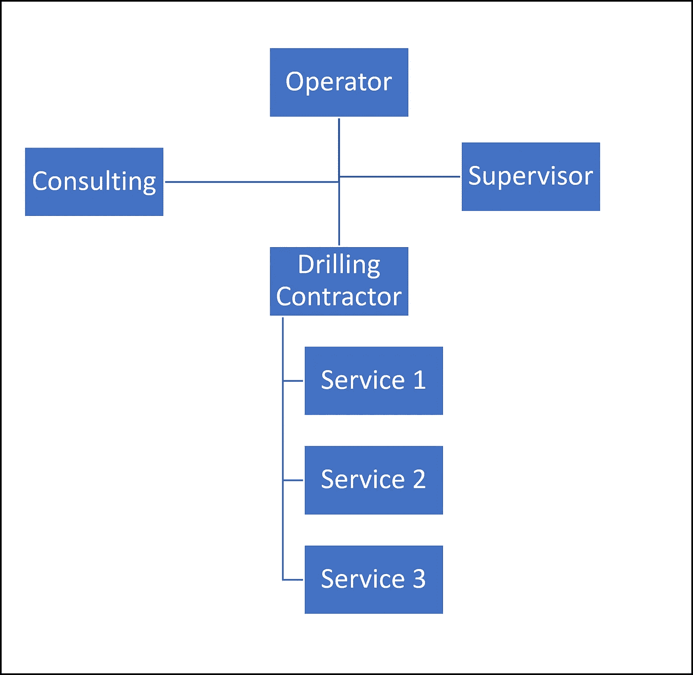

# 集成基于区块链的技术，提高钻井和建井自动化

> 原文：<https://medium.com/coinmonks/integration-of-blockchain-based-technologies-to-improve-drilling-and-well-construction-automation-30407b97156c?source=collection_archive---------13----------------------->

数字化正吸引着运营商和服务公司越来越多的关注，目的是提高油气生产的效率和盈利能力。没有对钻井参数、作业流程、钻机状况和井下工具的持续监控，现代钻井过程是不可能的。数字化工具和设施使我们能够获得数据流，实时远程监控过程，及时响应变化，防止事故和非生产时间。随后对信息的处理和分析提供了用于规划和制定战略决策的更准确的数据。

但是，尽管在过去几年中钻井过程的自动化和数字化有了大幅增长，但仍然存在缓慢的采用、显著的差距和误解，不允许完全无缝的数字化过程流。这些差距的例子包括钻机和设备的数字化不足、对流程的人为干预、手动数据输入和对先前记录数据的修改、受主观判断和合同条款和条件解释影响的相关方或利益攸关方之间的合同关系不完善，从而导致争议和随后的数据修改。

本文旨在概述在钻井作业的管理和决策过程中实施区块链技术的可能性。分散自治组织(DAO)与物联网(IoT)相结合，有助于提高钻井作业的自动化程度，并从资产中获取更多价值。本文试图将注意力转向实施区块链的挑战，并强调使用这一颠覆性技术的潜在风险。

TL；速度三角形定位法(dead reckoning)

# **简介**

尽管石油和天然气行业在过去十年中经历了动荡，而且由于新冠肺炎局势，石油需求出现了前所未有的短期下降，但全球预测显示，在未来 10-30 年内，石油需求将会非常强劲。满足这一需求的唯一方法是钻新井生产石油

石油和天然气生产井的钻探是油田开发阶段困难和复杂的作业之一。这是一项既危险又昂贵的活动。与此同时，钻一口合适的井也非常重要，因为它与石油生产相关，而一口性能不佳的井永远不会提供长期所需的采油速度。钻井和完井融合了许多不同的技术，如钻头、钻井马达、储层导航系统、测井和随钻测量、钻井液、完井等。

与其他高效技术一样，石油和天然气行业以及钻井服务应符合工业 4.0 的新行业标准，如以更低的成本获得更多收益、减少非生产时间、精简流程和提高质量。

# 钻井作业期间的挑战

钻井施工是一个循序渐进的过程，在作业者公司的保护下，将各种利益相关者及其设备、技术和服务结合在一起(图 1)。这一复杂系统中各方的关系基于合同的法律手续、适用法律、个人关系、通信工具、环境或疫情情况以及许多其他因素。这种等级类型的无组织治理结构有很多缺点，下面将讨论这些缺点。

Figure 1\. Hierarchy organization of drilling operation.

不同的激励措施
尽管所有活动都旨在根据技术要求条款钻探最好的油井，但每个分包商通常都有自己的激励措施和关键绩效指标(KPI):机械钻速(ROP)或工具在钻台以下的天数。大多数 KPI 的力量是快速钻取以最小化成本。尽管作业者对这一快速作业感到满意，但不应忘记，主要目标是钻一口“正确的”井，按照计划生产石油。如今，许多公司正从按天付费服务转向按绩效合同付费。但是这里出现了另一个问题，如何正确和诚实地测量这些 KPI，而不存在改变以隐藏错误的可能性。

**非生产时间** 层级组织的另一个缺点是解决争端的情况。例如，在运营期间与非生产时间(NPT)的争议中，通常客户是对的。如果出现不公平的情况，很难正确解决，因为钻井平台事件不会以不变的方式记录，并且可能会因有利于这个或那个分包商而被破坏。

**获取信息** 在钻井作业期间，每一方都创建自己的数据流和信息交换。信息是分散的，因此很难获取。例如，咨询公司通常在钻井过程中花费大量时间收集和验证所有需要的信息，以做出运营(修正井眼轨迹)或战略(开发或不开发储量)等重要决策。

**选择服务提供商** 运营商公司一直在寻找新的技术解决方案和工具，以改善和优化钻井流程。对于采购部门来说，选择一家有良好记录的供应商是一件令人头疼的事情。另一点是，一些服务公司可以为给定的任务提供超出规格的工具。从另一方面来说，采购部门可能倾向于偏袒，将工作授予那些重要操作工具不可靠的公司。解决方案和任务之间的不匹配是这个行业的一个大问题。

所有这些当前的挑战都有可能通过实施基于区块链的应用程序而得到加强。基于分布式分类账的相对新颖的技术允许为自治组织创建不同的产品，如分散数据库、智能合同和平台，在钻井和钻井施工过程中连接服务利益相关者、技术和工具。

# 分布式账本技术

**什么是分布式账本？**

分布式分类帐(或 DLT)是复制、共享和同步的数字数据库的共识，无需集中管理。分布式分类账的一个例子是区块链，它是一个不断增长的记录列表，称为块，使用加密技术链接在一起(图 2)。存储在每个块中的数据被验证并连接到前一个块。因此，区块链的主要优点是防止修改块数据，因为一旦记录，任何给定块中的数据都不能在不改变所有后续块的情况下被修改。所有交易或记录数据都存储在分布式区块链中。因此，区块链可以消除中央权威的影响。

分布式账本的第一个也是最受欢迎的应用是比特币。比特币是一种分散的数字货币，没有单一的管理员，可以在用户之间传送，不需要中介。

Figure 2\. Blockchain concept.

因为区块链主要是一个分散的数据库，但这项技术有几个非常令人兴奋的特点，这将改变我们的工作和沟通方式。

1) **放权**。区块链的去中心化增强了安全性，因为每个节点都持有数据库的副本。因此，如果任何恶意参与者想要更改数据，他将无法这样做，因为其他节点将拒绝他重写数据的请求。此外，黑客攻击不太现实，因为它应该同时针对所有节点。

2) **不变性**。区块链网络是不可变的，这意味着数据一旦写入，就不能以任何方式进行更改。

3) **透明度**。在当前的工业时代，透明度是一个相当大的问题。为了提高透明度，组织应用更多的规则和条例。但是中央集权的组织从来都不是 100%透明的。易于跟踪业务流程中的每一步。

4) **安全**。如果一个集中式网络受到攻击，很可能会影响整个系统。然而，如果分散系统的一个节点受到攻击，并不会破坏整个系统。

5) **信任**。区块链不是试图建立或维持信任，而是消除对信任的需求。分布式数据库通过设计变得可信，因为每一个事务和记录都要通过像工作证明这样的共识机制。

我们经常听到区块链可以解决任何行业的一切问题。但这有多真实呢？

世界经济论坛制定的一些准则可以帮助理解它在具体应用中是否真的需要区块链。

如果以下所有问题都有 4 个肯定答案，则应考虑进一步申请区块链，概括为四个要点:

*   利益相关者之间需要重建信任吗？
*   您需要分布式数据库来增加安全性和透明度吗？
*   您是否希望通过消除用户和数据之间的中间人解决方案来削减成本？
*   您需要一个没有停机时间的系统吗？

**石油天然气行业的区块链**

区块链早在十多年前就已开发，但油气行业在过去 2-3 年才开始实施和探索。区块链技术可用于石油和天然气价值链的所有阶段:上游、中游和下游。最近，区块链的新项目在石油和天然气行业迅速增加。下面讨论了 DLT 应用的短列表(Lakhanpal，v .，Samuel，R. 2018):

***商品交易*** 使用区块链，原油交易可以数字化。它可以帮助减少交易的结算时间，通过消除文书工作提高效率，增强安全性，提高透明度。

***智能合同*** oil&天然气合同非常复杂，有冗长的合同和协议。智能合同是一种自动化的计算机代码，可以携带任何协议的条款，并可以在满足预定条件时执行。当满足合同的标准时，所有权或付款将自动转移。智能合同可以显著减少文书工作，同时提高效率、付款速度和透明度。例如，当钻头钻出一定长度的地层时，这笔钱在没有人工干预的情况下向服务公司收取。

***供应链跟踪*** 使用区块链技术可以拥有可审计的记录，向利益相关者显示产品在每个增值步骤的状态。从仓库到钻机的钻机部件、套管和井下工具的可见性和可靠跟踪是商业价值的重要用例。加上物联网和区块链，一个完整的实时跟踪资产的数字化流程可以大大简化物流。

# 钻井自动化

如今，随着最新技术的进步，通过使用先进的监控系统，钻井活动得到了快速优化和自动化。许多工具都有计量器和传感器，它们记录实时数据并传输到服务器。井下工具、传感器和软件的网络被称为物联网(IoT ),使这些东西能够连接和交换数据。使用机器学习(ML)算法进行数据分析有助于改善决策过程，从而提高效率、增加经济效益并减少人工干预。

当某些事件或情况发生时，连接的机器和工具可以向钻机操作员发出警报，甚至根据这些数据按照其代码做出反应。最常见的应用之一是预测地面和井下工具故障。物联网结合 ML 算法可以最大化计划维修和更换之间的时间，以最小化 NPT (Temer。，E. at al2017).

在不久的将来，石油和天然气行业还可以考虑和开发更多其他用例:

*   监控钻井设备(马达、发动机、泵)的性能。
*   早期警报来自油井的不受控制的地层流，以最小化 HSE 风险。
*   通过建立机器对机器的通信，减少人工干预并记录所有钻井活动。
*   跟踪资产和人员

关于如何在钻井自动化中利用物联网的更多实例和想法如下所示。

1)钻机将记录所有作业活动，计算钻杆起下钻次数，在需要新钻杆时发出订单，钻头传达已经钻了多少英尺，旋转导向系统将与测井工具对话，以在正确的路径上导航钻头。使用 ML 算法可以预测工具故障或卡钻。

2)在规划期间可以使用实时信息的可用性，这有助于及时调动钻机上的设备和人员。

3)拥有钻井事件的分类账，便于客户寻找有合适经验的供应商，检查承包商的背景。当承包商可以在投标过程中轻松证明他们的经验和跟踪记录时。

物联网作为一个由互联设备和机械机器组成的系统，可以通过网络传输数据，看起来非常有前途和令人兴奋，能够解决不同领域的各种问题。但是当前的物联网解决方案实现存在一个隐患或陷阱。

今天，物联网系统依赖于集中式通信模型，如中央存储服务器。尽管彼此距离很近，但这些物联网设备必须通过互联网传输数据，并严重依赖于可能面临网络攻击风险的集中式存储解决方案。相反，让每个提供的服务拥有不同的独立数据库，其中只存储来自它自己的工具的数据会产生另一个问题——互操作性。任务是如何整合所有这些数据库，以便应用分析 ML 方法，并将数据转化为信息和洞察力。没有每个数据库的实时可访问性，机器对机器的通信是不可能的。

区块链技术将是解决物联网安全问题的补救措施之一，它提供了一种分散数据库解决方案，其中来自传感器、设备和工具的数据将在节点之间存储和分布(图 3)。

Figure 3\. Types of networks. (Left — centralized network, right — distributed network).

这种存储信息的分布式方式为钻井自动化提供了许多不同的机会。下一节将介绍区块链技术如何在钻井过程中重组利益相关者的组织。

# 分散自治组织

作业者和服务公司之间的合作在钻井作业中至关重要。沟通和信息交流的速度直接影响决策过程的效率。公司总是试图提高合作水平，寻找更有效的组织结构。区块链提供了一个可靠的、开放的和可编程的会计系统，导致了去中心化自治组织(DAO)的发明。

DAO 是开放的、自组织的网络，由激励和自执行代码协调，围绕共同的目标合作。DAO 是一个以分散方式自主运行的组织，其运作不需要一个中心方来为组织的发展做出决策。它建立在区块链的基础上，其中治理和规则以智能合同的形式编码。日常操作可以编程，并在满足特定条件时自动强制执行。

传统的自上而下的组织有许多管理层来协调流程。在这种结构中，信息和决策经常出现瓶颈。它也容易产生低效的官僚主义和繁文缛节。而 DAO 通过引入机器共识和智能契约来降低协作成本(图 4)。

在石油和天然气行业采用 DAO 类型的业务组织有几个优点，可以提高钻井服务的效率。下面讨论其中一些。

Figure 4\. Hierarchy (left) and Decentralized (right) types of Organization.

*分权治理:为每个服务公司提供平等的机会参与决策过程，以确定新钻井的技术方案。每一个创新的想法和建议都能得到整个组织的充分考虑。通过使用由主题钻井的实际石油产量支持的代币，适当的激励系统迫使所有利益相关者团结起来，围绕共同的目标工作，并为正确的任务使用正确的技术工具，并且具有成本效益。*

****高效率:*** 文书工作和官僚作风一直是自上而下组织中的一个挑战，大大减缓了流程。在 DAO 组织的情况下，所有的事务和通信都是快速的和面向单一目标的。引入由物联网传感器的信息触发的按性能支付智能合同，大大改善了销售的付款收集。*

**:作为建立在区块链之上的 DAO，每一笔财务交易、提案、决策都上传到分布式账本上，供所有利益相关者查看。采用共识系统还意味着每个利益相关者通过投票决定如何花费组织的资金并跟踪花费的金额。这可能是一种新型组织不再需要监督的情况。**

# **区块链技术当前面临的挑战**

**上面我们主要关注了区块链技术在钻井和建井各个领域的优势，现在我们想让读者注意阻碍广泛采用的各种挑战和瓶颈。**

**首先，钻机和所有相关的机器和工具必须配备传感器，以数字化所有操作过程。由于投资者不愿花费巨额资本支出，钻机的数字化进展缓慢。此外，成本并不是进一步发展的主要障碍，数字化有许多与数据测量、传输和存储的准确性相关的问题。**

**其次，钻机在钻井过程中会产生大量数据，现在称之为大数据。某些类型的数据与时间相关，并随着储层条件的变化而变化。由于复杂性和相关成本，将所有这些信息记录到区块链系统或其他类型的分布式分类账中是不明智的。**

**当条件可以很容易地写成“If-else”语句时，智能合同可能是简单协议的完美解决方案。钻井过程太复杂，有许多变量和条件，很难自动编码和执行。**

**区块链仍然处于早期发展阶段，许多事情必须被测试和证明。运营风险可能反映在:**

*   ****法律信任** —没有法律或监管框架。**
*   ****缺乏用户** —适应需要时间，很多公司持观望态度。**
*   ****数据质量** —区块链不能保证数据质量。**
*   ****技术** —缺乏相关的长期经验。**
*   ****安全** —智能合约漏洞等问题。**
*   ****专业**——区块链申请专业的不多。**

**所有上述实施 DLT 技术的挑战都是技术性的。此外，区块链是一项极具破坏性的技术，企业害怕这一特性。区块链是关于业务流程变化的。它代表了与传统做事方式的彻底转变。这甚至适用于已经经历了数字技术重大变革的行业。区块链把信任和权威放在一个分散的网络中，而不是一个强大的中央机构中。对大多数人来说，这种失控会让人非常不安。**

**上述挑战明确强调了技术改进的必要性。业界正忙于解决这些问题。如果我们能够解决这些问题，消除各种瓶颈，事情肯定会变得更加舒适，并引发大规模采用。**

# **结论**

**石油和天然气行业可以从使用区块链技术中获得巨大收益。分散自治组织的实现允许在所有利益相关者之间共享信任和实时信息。然而，我们应该指出，区块链技术仍然是新颖的，大多数项目是实验性的。要成为现成的解决方案，区块链应该经历密集的测试，修订和开箱即用的发展。**

**本文的目标是揭示这项技术背后的巨大潜力和机遇，并展示它如何改变行业目前的运营方式。作者希望鼓励石油和天然气行业专家研究这种颠覆性技术，并思考如何将其用于日常工作，以使能源市场在未来可持续发展。**

# **参考**

**1.卡德里，H. 2020。区块链在中游油气行业的应用。论文在沙特阿拉伯达兰举行的国际石油技术会议上发表。1 月 13 日至 15 日 IPTC-19937。[https://doi.org/10.2523/IPTC-19937-Abstract](https://doi.org/10.2523/IPTC-19937-Abstract)**

**2.拉坎帕尔诉塞缪尔案，R. 2018。在石油和天然气行业实施区块链技术:综述。在美国德克萨斯州达拉斯举行的美国石油工程师协会年度技术会议和展览会上发表的论文。九月。SPE-191750-女士[https://doi.org/10.2118/191750-MS](https://doi.org/10.2118/191750-MS)**

**3.拉汉帕尔诉塞缪尔案，R. 2021。面向生产版税管理的以隐私为中心的区块链解决方案。在 SPE 西部地区会议上提交的论文，虚拟。4 月 20 日至 22 日 https://doi.org/10.2118/200764-MS 女士**

**4.特梅尔。，E. at al2017.利用工业物联网 IIoT 实现井下工具的智能监控和预测性维护。论文在阿联酋阿布扎比国际石油展览会上发表。11 月 13 日至 16 日 https://doi.org/10.2118/188382-MS T2 女士**

**5.维拉，女，2020。利用区块链解锁油田开发。在美国石油工程师协会拉丁美洲和加勒比海石油工程会议上发表的论文。虚拟的。7 月 27 日至 30 日 https://doi.org/10.2118/199170-MS T4 女士**

**6.世界经济论坛，2018 年 4 月。白皮书《炒作之外的区块链》。[http://www3 . we forum . org/docs/48423 _ wheet _ block chain _ WP . pdf](http://www3.weforum.org/docs/48423_Whether_Blockchain_WP.pdf)**

> **加入 Coinmonks [电报频道](https://t.me/coincodecap)和 [Youtube 频道](https://www.youtube.com/c/coinmonks/videos)了解加密交易和投资**