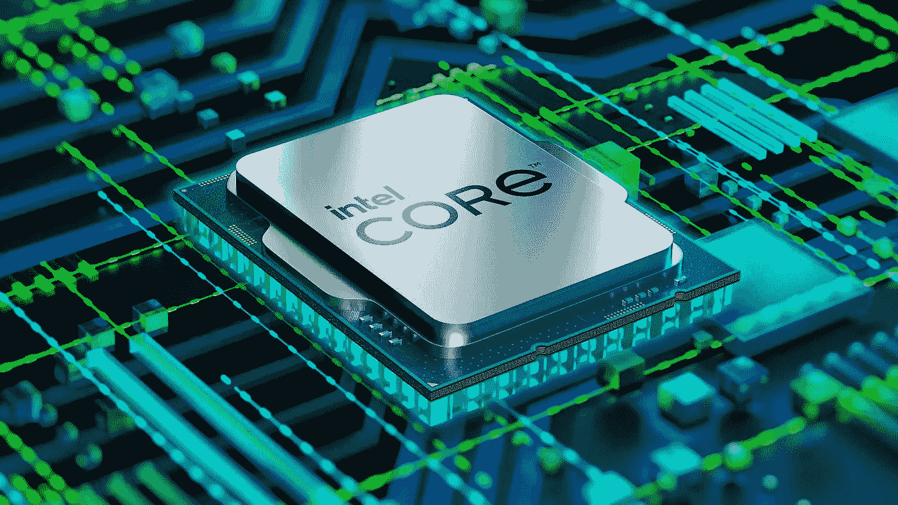

# 英特尔区块链芯片:新的密码挖掘革命即将开始

> 原文：<https://medium.com/coinmonks/intel-blockchain-chip-the-new-crypto-mining-revolution-is-about-to-begin-b14b5867b7f?source=collection_archive---------63----------------------->

## 随着其受欢迎程度和价值的增加，许多人开始转向加密货币。

随着加密货币越来越受欢迎，价值越来越高，许多人开始转向加密货币。因此，英特尔宣布为区块链应用(如 NFT 和比特币)开发新芯片也就不足为奇了