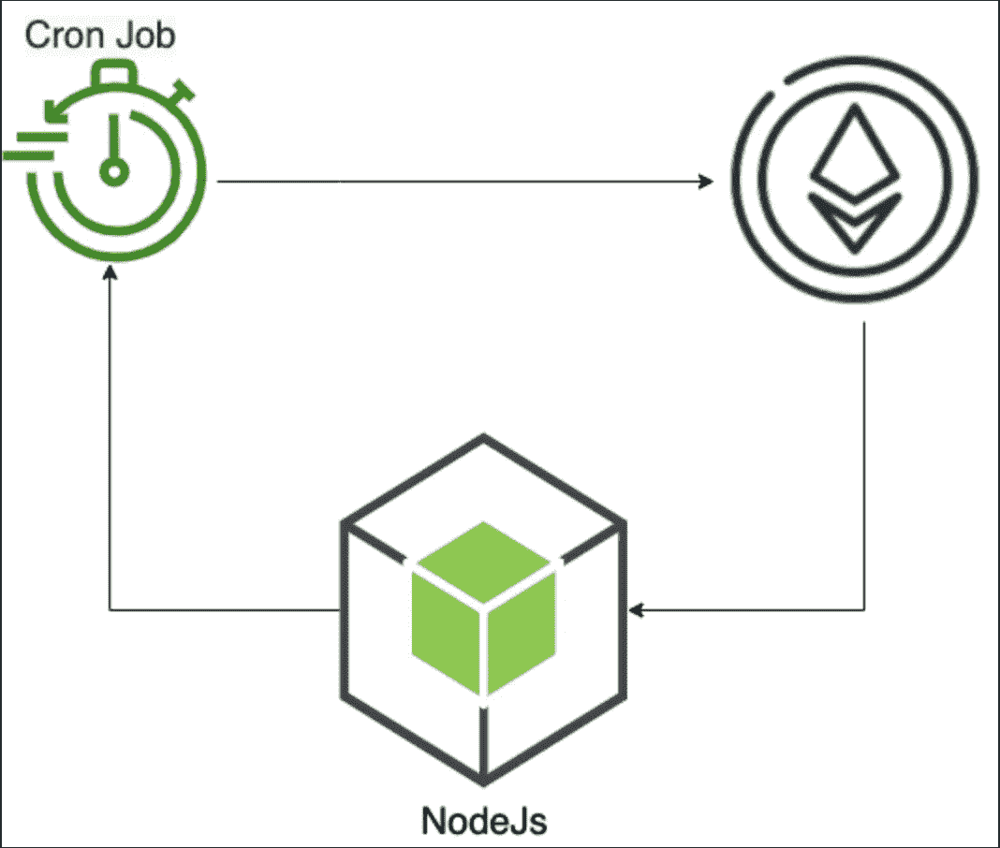

# 使用 NodeJs 与区块链交互:为您的智能合约创建一个 Crone 任务

> 原文：<https://medium.com/coinmonks/interact-with-blockchain-using-nodejs-create-a-crone-task-for-your-smart-contract-18db3b68fd38?source=collection_archive---------4----------------------->

本文将介绍如何从 NodeJs 服务器读取和执行事务。假设您想要在每天晚上 11:59 向用户发送 NFT，或者您想要在每周二从您的智能合同中打开销售。智能合约不能在未来帮助或粘贴，因为智能合约实时提交交易。ChainLink 通过 [Keepers](https://docs.chain.link/docs/chainlink-keepers/introduction/) 在一定条件下触发交易解决了这个问题。你必须支付一些链接(链接令牌)来使用他们的服务。本文将分享如何创建你的保管员来触发你的智能合约交易。



# 预先请求

1.  已经熟悉 Nodejs 了。
2.  了解基本的可靠性。

# 我们到底要做什么？

我们将创建一个 Node.js 服务器，每天从区块链读取数据，并依赖于这些数据。服务器将执行一些区块链事务。

**步骤:**

1.  创建一个 Node.js 服务器来与智能合约进行交互。
2.  创建一个查询函数来检查事务是否需要执行。(来自 Node.js 服务器)
3.  提交事务以向用户发送 NFTs。(来自 Node.js 服务器)
4.  创建一个 crone 任务来调度执行。
5.  使用 pm2 运行服务器(我会详细解释)。

## 创建 Nodejs 服务器

首先，我将初始化服务器

```
yarn init -y
```

我需要添加六个包:

*   `@truffle/contract`和`@truffle/hdwallet-provider`与智能合约交互。查询并提交交易。
*   `web3`创建一个提供商并连接到区块链网络。
*   `dotenv`将私钥和 RPC URL 添加到环境变量中。
*   `node-cron`安排亲信的任务。
*   `pm2`管理部署期间的生产流程。

```
yarn add @truffle/contract @truffle/hdwallet-provider dotenv node-cron pm2 web3
```

然后创建`index.js`文件(在服务器目录中)

```
touch index.js
```

并将运行脚本添加到`package.json`

```
"scripts": {    
   "dev": "node index.js" 
 },
```

返回到`index.js`文件

导入`truffle`和`web3`包以连接到区块链。

```
"use strict";
const Contract = require("@truffle/contract");
const WalletProvider = require("@truffle/hdwallet-provider");
const Web3 = require("web3");
```

导入 crone 任务包、Dotenv 和文件系统包以上传智能合同 [abi](https://docs.soliditylang.org/en/v0.8.13/abi-spec.html)

```
const cron = require("node-cron"); 
const path = require("path");
const fs = require("fs");
```

导入所有包后，运行

```
yarn start
```

为了确保一切正常，创建一个`.env`文件

```
nano .env
```

并添加以下变量

```
RPC_URL=https://data-seed-prebsc-1-s1.binance.org:8545/
CONTRACT_ADDRESS=<Add Contract Address here>
PRIVATE_KEY=<Add Private Key here>
```

对于`RPV_URL`，我将使用币安[智能链](https://www.youtube.com/watch?v=iJDoc0kvXLc)配合工作。你可以添加任何你想要的区块链。env 文件已经可以使用了，我们可以初始化提供者并开始进行 [JSON-RPC](https://ethereum.org/en/developers/docs/apis/json-rpc/) 调用。

让我们将环境变量添加到`index.js`文件中

```
require("dotenv").config();const RPC_URL = process.env.RPC_URL;
const contractAddress = process.env.CONTRACT_ADDRESS;
```

然后初始化提供程序。

```
const web3 = new Web3(new Web3.providers.HttpProvider(RPC_URL));
```

创建执行函数

```
const execute = async () => {}
```

上传智能合同 abi

```
// Inside the execute function
const abiPath = path.resolve("abi/stake.json");  
const rawData = fs.readFileSync(abiPath);  
const contractAbi = JSON.parse(rawData);
```

现在，我们可以在创建 abi JSON 对象之后创建智能合约实例。

```
// After contractAbi variable
const contract = Contract({ abi: contractAbi });  
const provider = new WalletProvider(process.env.PRIVATE_KEY, RPC_URL);  
contract.setProvider(provider);  
const contractInstance = await contract.at(contractAddress);
```

仅此而已。现在，我们准备好与区块链互动。

**示例**
从区块链中读取/查询数据，您需要做的一切

```
const result = await contractInstance.functionName(<parameters>)
```

写数据和提交事务(同上，但是需要指定`from`属性)

```
await contractInstance.functionName(<parameters>,{
from:   web3.eth.accounts.privateKeyToAccount(process.env.PRIVATE_KEY)              .address
})
```

**返回我们的代码**

我们需要做的最后一件事是初始化 crone 任务。

在我们的例子中，我们希望 crone 任务每天在 23:59 执行，所以它应该是这样的(您可以查看[文档](https://www.npmjs.com/package/node-cron)

```
// 59 for minutes
// 23 for hours
cron.schedule("59 23 * * *", async () => {
// Code go here
})
```

检查我们是否需要执行任务

```
// inside cron task callbackconst isTaskNeedToBeExecuted = 
          await contractInstance.checkIfTaskNeedToBeExecuted();
```

如果它返回 true，那么我们将提交事务

```
if(isTaskNeedToBeExecuted){await contractInstance.performTask({ from:       web3.eth.accounts.privateKeyToAccount(process.env.PRIVATE_KEY)              .address});}
```

运行此服务器一段特定时间后，可能会出现一些异常，如呼叫超时。您的钱包没有足够的资金来支付油费、s 或智能合同本身的任何错误。所以我们需要用`try/catch`包装代码，代码应该是这样的

```
cron.schedule('59 23 * * *', async () => {try {const isTaskNeedToBeExecuted = await contractInstance.checkIfTaskNeedToBeExecuted()if (isTaskNeedToBeExecuted) {await contractInstance.performTask({from: web3.eth.accounts.privateKeyToAccount(process.env.PRIVATE_KEY).address,})}} catch (error) {console.error(error)}})
```

仅此而已。现在代码已经可以部署了。你可以点击查看完整的源代码[。](https://gist.github.com/yehia67/75e0f18d5eee51a93520d402b62ef3e1)

## 部署代码

最后一步是代码部署。首先，您需要向您的`package.json`文件添加一个部署脚本

```
"scripts": {    
      "dev": "node index.js",    
      "deploy": "pm2 start index.js"  
},
```

我将使用 [pm2](https://www.npmjs.com/package/pm2) 进行部署。这是一个轻量级的进程管理器。我推荐它，因为它以一种很好的方式管理日志。您可以查看文档，或者在部署后使用它来查看所有日志。

```
pm2 logs
```

您可以在任何云平台上部署代码。服务器不需要任何容量，所以你的 [AWS 免费层](https://docs.aws.amazon.com/AWSEC2/latest/UserGuide/concepts.html)会很好而且是免费的！

> 加入 Coinmonks [电报频道](https://t.me/coincodecap)和 [Youtube 频道](https://www.youtube.com/c/coinmonks/videos)了解加密交易和投资

# 另外，阅读

*   [3 商业评论](/coinmonks/3commas-review-an-excellent-crypto-trading-bot-2020-1313a58bec92) | [Pionex 评论](https://coincodecap.com/pionex-review-exchange-with-crypto-trading-bot) | [Coinrule 评论](/coinmonks/coinrule-review-2021-a-beginner-friendly-crypto-trading-bot-daf0504848ba)
*   [莱杰 vs n rave](/coinmonks/ledger-vs-ngrave-zero-7e40f0c1d694)|[莱杰 nano s vs x](/coinmonks/ledger-nano-s-vs-x-battery-hardware-price-storage-59a6663fe3b0) | [币安评论](/coinmonks/binance-review-ee10d3bf3b6e)
*   [Bybit Exchange 审查](/coinmonks/bybit-exchange-review-dbd570019b71) | [Bityard 审查](https://coincodecap.com/bityard-reivew) | [Jet-Bot 审查](https://coincodecap.com/jet-bot-review)
*   [3 commas vs crypto hopper](/coinmonks/3commas-vs-pionex-vs-cryptohopper-best-crypto-bot-6a98d2baa203)|[赚取加密利息](/coinmonks/earn-crypto-interest-b10b810fdda3)
*   最好的比特币[硬件钱包](/coinmonks/hardware-wallets-dfa1211730c6) | [BitBox02 回顾](/coinmonks/bitbox02-review-your-swiss-bitcoin-hardware-wallet-c36c88fff29)
*   [BlockFi vs 摄氏度](/coinmonks/blockfi-vs-celsius-vs-hodlnaut-8a1cc8c26630) | [Hodlnaut 审核](/coinmonks/hodlnaut-review-best-way-to-hodl-is-to-earn-interest-on-your-bitcoin-6658a8c19edf) | [KuCoin 审核](https://coincodecap.com/kucoin-review)
*   [Bitsgap 审查](/coinmonks/bitsgap-review-a-crypto-trading-bot-that-makes-easy-money-a5d88a336df2) | [Quadency 审查](/coinmonks/quadency-review-a-crypto-trading-automation-platform-3068eaa374e1) | [Bitbns 审查](/coinmonks/bitbns-review-38256a07e161)