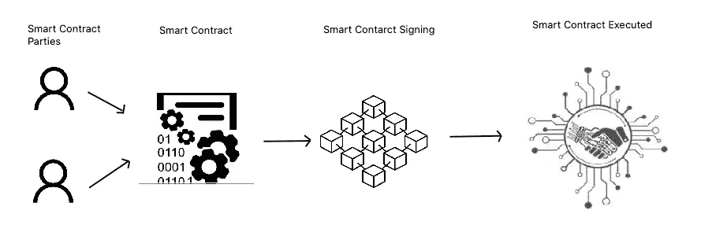
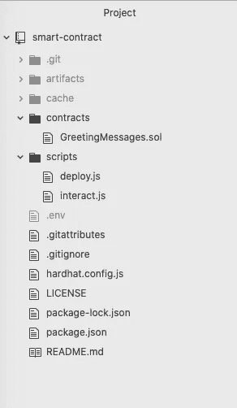
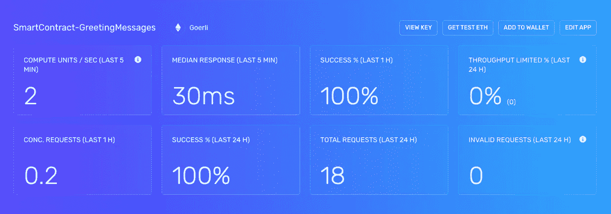
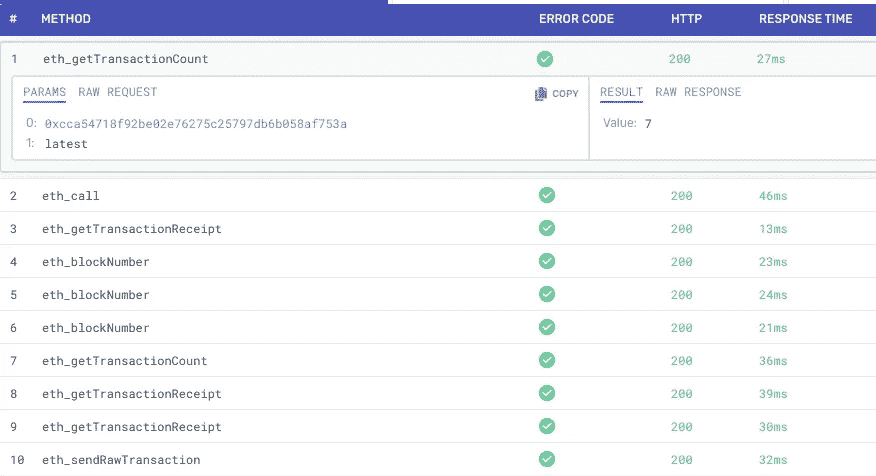

# 使用 Hardhat 与区块链上部署的智能合约进行交互

> 原文：<https://medium.com/coinmonks/interacting-with-your-deployed-smart-contract-on-blockchain-using-hardhat-bf14767bc0a5?source=collection_archive---------9----------------------->

我们将学习如何使用安全帽、炼金术和元面具与我们部署的 solidity 智能合同进行交互。

这是我们之前工作[的下一个阶段](/@hemantjuyal/creating-and-deploying-a-smart-contract-on-a-blockchain-c97e9edcc065)，在这里我们学习了如何通过 Solidity、MetaMask、Hardhat 和 Alchemy 在区块链上创建和部署智能合约。

如果你还没有浏览过[上一篇文章](/@hemantjuyal/creating-and-deploying-a-smart-contract-on-a-blockchain-c97e9edcc065)，那么请参考以下内容

[](/@hemantjuyal/creating-and-deploying-a-smart-contract-on-a-blockchain-c97e9edcc065) [## 在区块链上创建和部署智能合约

### 我将用一种简单的方式介绍什么是智能合约，以及如何创建一个智能合约，并使用…

medium.com](/@hemantjuyal/creating-and-deploying-a-smart-contract-on-a-blockchain-c97e9edcc065) 

区块链中一个典型的智能合同流程可以描述为



Smart Contract: A typical Smart Contract flow on Blockchain

# 智能合同项目设置

如果您之前没有进行项目设置，请参考[智能合约项目设置](/@hemantjuyal/creating-and-deploying-a-smart-contract-on-a-blockchain-c97e9edcc065#112c)部分，因为我们将浏览项目文件以与我们部署的智能合约进行交互。

作为快速复习，我们的项目有以下结构，其中`GreetingMessages.sol`是我们的可靠性代码，有我们的智能合同逻辑，`scripts`文件夹有`deploy.js`文件，通过它我们在`Goreli Test Network`上部署我们的合同



Smart Contract: [Github](https://github.com/hemantjuyal/smart-contract) project set-up

**更新中。环境配置**我们在合同部署过程中创建了`[.env](/@hemantjuyal/creating-and-deploying-a-smart-contract-on-a-blockchain-c97e9edcc065#d848)` [文件](/@hemantjuyal/creating-and-deploying-a-smart-contract-on-a-blockchain-c97e9edcc065#d848)，并且拥有部署智能合同所需的项目配置。

现在，为了与我们的智能合同进行交互，智能合同将通过添加我们在[之前的文章部分](/@hemantjuyal/creating-and-deploying-a-smart-contract-on-a-blockchain-c97e9edcc065#3327)中获得的`CONTRACT_ADDRESS`配置来更新我们的`[.env](/@hemantjuyal/creating-and-deploying-a-smart-contract-on-a-blockchain-c97e9edcc065#d848)` [文件](/@hemantjuyal/creating-and-deploying-a-smart-contract-on-a-blockchain-c97e9edcc065#d848)。

```
#.env file configuration for interacting our Smart ContractAPI_URL = Copy HTTP value from your Alchemy app key details section
API_KEY = Copy API_KEY value from your Alchemy app key details section
PRIVATE_KEY = Your MetaMask wallet private key
CONTRACT_ADDRESS = We got this address at the time our Smart Contract was deployed in previous step
```

> 注意:如果您忘记了我们将从哪里获得环境配置#1、#2 和#3，那么请参考[之前的步骤](/@hemantjuyal/creating-and-deploying-a-smart-contract-on-a-blockchain-c97e9edcc065#d848)作为快速复习

完全配置和更新。env 文件看起来会像这样

Smart Contract: .env file configuration

# 与您的智能合同互动

让我们进入下一步，看看如何与我们部署的合同进行交互。导航到`scripts\interact.js`文件，您会发现代码如下

您可以看到，我们正在使用在[之前的步骤](/@hemantjuyal/creating-and-deploying-a-smart-contract-on-a-blockchain-c97e9edcc065#d848)中已经完成的`.env`配置来分配局部变量。我们的交互机制非常简单，我们获取在契约部署时提供的问候消息，然后通过传递新值来更新问候消息，并显示我们的契约返回的更新消息。

运行命令与您的合同进行交互

```
npx hardhat run scripts/interact.js
```

成功执行后，您将得到如下输出

```
The message is: Hello and Welcome
Updating the message…
The new message is: Hola y bienvenido
```

恭喜你！！！我们已经成功地交互了我们的智能合同。现在是大声呼喊和真正庆祝的时候了；-)


Smart Contract: Interaction successful and now it’s time for big celebration

# 使用炼金术获得洞察力

Alchemy 提供了一个非常好的分析仪表板，它以交易的形式覆盖了所有与智能合同相关的部署和交互细节。您可以查看计算单位、响应时间、所有请求级别的详细信息，以便获得非常好的洞察力。

这是我们在之前的[帖子](/@hemantjuyal/creating-and-deploying-a-smart-contract-on-a-blockchain-c97e9edcc065#bd47)中创建的`SmartContract-GreetingMessages`应用仪表板



Smart Contract: App Insights through Alchemy Dashboard



Smart Contract: App Requests Insights through Alchemy Dashboard

我将在其他博客文章中介绍 Alchemy 平台的细节，包括智能合同应用 insights dashboard，因为这本身是一个非常大的主题，值得详细介绍。

> 图片来源:派拉蒙电影公司和莱昂纳多迪卡普里奥。

> **词汇:**
> 
> 区块链:区块链是一种分布式账本(形式),具有不断增长的以加密方式链接在一起的区块(或记录)列表。来自[维基百科](https://en.wikipedia.org/wiki/Blockchain)
> 
> 天然气:天然气是 EVM 内用于计算交易费的记账单位，交易费是指交易发送方必须向在区块链中包含交易的矿商支付的 ETH 金额。来自[维基百科](https://en.wikipedia.org/wiki/Ethereum#:~:text=Gas%20is%20a%20unit%20of,the%20transaction%20in%20the%20blockchain.)
> 
> Solidity: Solidity 是一种面向对象的编程语言，用于在区块链平台上实现智能合约。受 C++、JavaScript、Python 的影响。
> 
> Hardhat: Hardhat 是一个开发环境，用于编译、部署、测试和调试基于以太坊的软件。
> 
> Alchemy: Alchemy 为区块链公司开发和销售工具和基础设施服务。Alchemy 拥有广泛的产品，提供了一个强大的区块链开发平台，提供了一套开发工具。
> 
> 元掩码:元掩码是一个加密钱包，允许用户存储和交换以太和其他以太相关的令牌。

# 其他推荐文章

[](/@hemantjuyal/how-to-create-and-sell-your-nft-on-opensea-in-real-without-gas-fee-in-10-mins-801d7e40ab17) [## 如何在 10 分钟内在 OpenSea 上创建和销售你的 NFT 而不用付汽油费

### 相信我…我会让它变得简单明了…创建您的 NFT 并在现实中销售它非常容易…

medium.com/@hemantjuyal](/@hemantjuyal/how-to-create-and-sell-your-nft-on-opensea-in-real-without-gas-fee-in-10-mins-801d7e40ab17) [](/@hemantjuyal/how-i-did-my-first-crypto-mining-successfully-d3d041dc6117) [## 我是如何成功完成第一次加密挖掘的

### 要成功挖掘加密货币，请遵循以下步骤。第一步是安装 Monero 钱包。第二步是安装 XMRig…

medium.com/@hemantjuyal](/@hemantjuyal/how-i-did-my-first-crypto-mining-successfully-d3d041dc6117) [](/@hemantjuyal/creating-and-deploying-a-smart-contract-on-a-blockchain-c97e9edcc065) [## 在区块链上创建和部署智能合约

### 我将用一种简单的方式介绍什么是智能合约，以及如何创建一个智能合约，并使用…

medium.com/@hemantjuyal](/@hemantjuyal/creating-and-deploying-a-smart-contract-on-a-blockchain-c97e9edcc065) [](/@hemantjuyal/publish-and-verify-your-smart-contract-for-its-authenticity-on-etherscan-758cf8304793) [## 在 Etherscan 上发布并验证您的智能合同的真实性

### 我们将学习如何在 Etherscan 上验证我们部署的 solidity 智能合同的真实性。

medium.com/@hemantjuyal](/@hemantjuyal/publish-and-verify-your-smart-contract-for-its-authenticity-on-etherscan-758cf8304793) 

> 加入 Coinmonks [电报频道](https://t.me/coincodecap)和 [Youtube 频道](https://www.youtube.com/c/coinmonks/videos)了解加密交易和投资

# 另外，阅读

*   [如何匿名购买比特币](https://coincodecap.com/buy-bitcoin-anonymously) | [比特币现金钱包](https://coincodecap.com/bitcoin-cash-wallets)
*   [币安 vs FTX](https://coincodecap.com/binance-vs-ftx) | [最佳(SOL)索拉纳钱包](https://coincodecap.com/solana-wallets)
*   [比诺莫评论](https://coincodecap.com/binomo-review) | [斯多葛派 vs 3Commas vs TradeSanta](https://coincodecap.com/stoic-vs-3commas-vs-tradesanta)
*   [Capital.com 评论](https://coincodecap.com/capital-com-review) | [香港的加密借贷平台](https://coincodecap.com/crypto-lending-hong-kong)
*   如何在 Uniswap 上交换加密？ | [A-Ads 审查](https://coincodecap.com/a-ads-review)